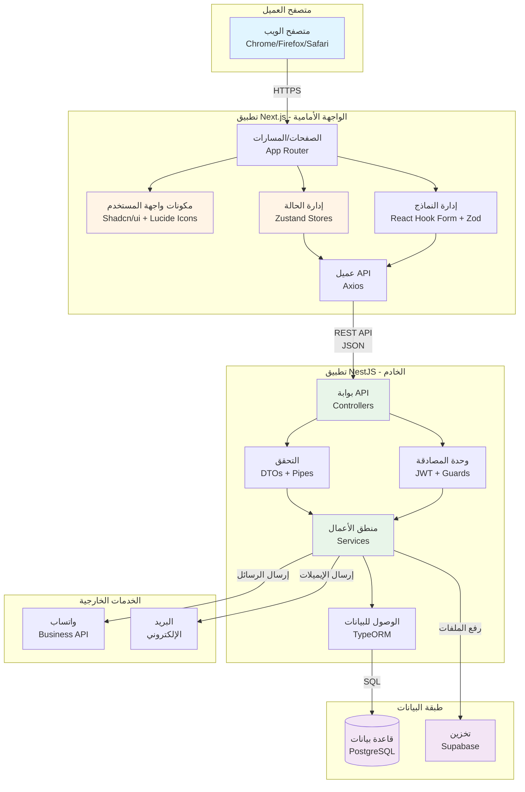
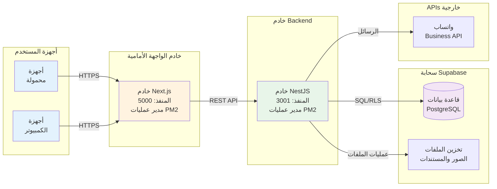
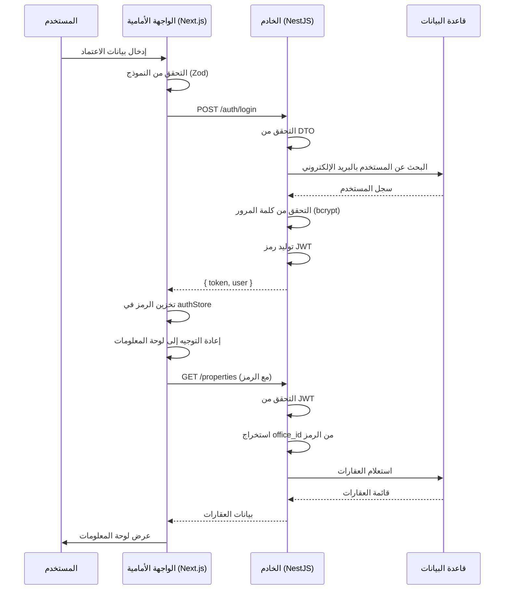
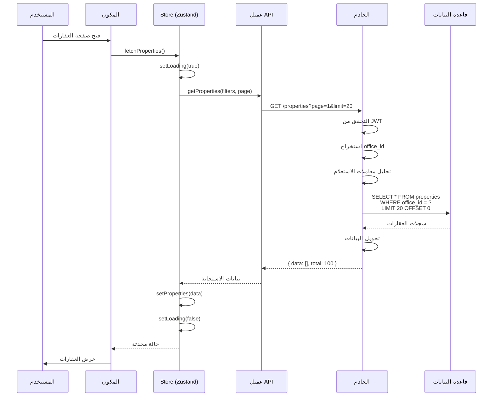
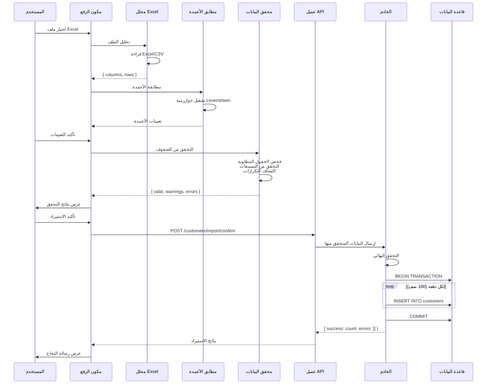

# وثيقة تصميم البنية المعمارية (ADD)

## نظام إدارة العقارات

**الإصدار:** 1.0  
**التاريخ:** 8 نوفمبر 2025  
**تم الإعداد بواسطة:** فريق كبار مهندسي البرمجيات

---

## جدول المحتويات

1. [المقدمة](#1-المقدمة)
   - 1.1 [الغرض](#11-الغرض)
   - 1.2 [النطاق](#12-النطاق)
   - 1.3 [الجمهور المستهدف](#13-الجمهور-المستهدف)
2. [الأهداف المعمارية](#2-الأهداف-المعمارية)
   - 2.1 [قابلية التوسع](#21-قابلية-التوسع)
   - 2.2 [الأمان](#22-الأمان)
   - 2.3 [الأداء](#23-الأداء)
   - 2.4 [قابلية الصيانة](#24-قابلية-الصيانة)
   - 2.5 [الموثوقية](#25-الموثوقية)
   - 2.6 [قابلية الاستخدام](#26-قابلية-الاستخدام)
3. [نظرة عامة على النظام](#3-نظرة-عامة-على-النظام)
   - 3.1 [نمط البنية](#31-نمط-البنية)
   - 3.2 [البنية عالية المستوى](#32-البنية-عالية-المستوى)
   - 3.3 [مخطط المكونات](#33-مخطط-المكونات)
   - 3.4 [بنية النشر](#34-بنية-النشر)
4. [تفصيل المكونات](#4-تفصيل-المكونات)
   - 4.1 [الواجهة الأمامية (Next.js)](#41-الواجهة-الأمامية-nextjs)
   - 4.2 [الخادم (NestJS)](#42-الخادم-nestjs)
   - 4.3 [قاعدة البيانات (PostgreSQL)](#43-قاعدة-البيانات-postgresql)
   - 4.4 [الخدمات الخارجية](#44-الخدمات-الخارجية)
5. [تدفق البيانات](#5-تدفق-البيانات)
   - 5.1 [تدفق المصادقة](#51-تدفق-المصادقة)
   - 5.2 [استرجاع قائمة العقارات](#52-استرجاع-قائمة-العقارات)
   - 5.3 [تدفق استيراد Excel](#53-تدفق-استيراد-excel)
6. [المجموعة التقنية](#6-المجموعة-التقنية)
   - 6.1 [تقنيات الواجهة الأمامية](#61-تقنيات-الواجهة-الأمامية)
   - 6.2 [تقنيات الخادم](#62-تقنيات-الخادم)
   - 6.3 [قاعدة البيانات والتخزين](#63-قاعدة-البيانات-والتخزين)
   - 6.4 [أدوات التطوير](#64-أدوات-التطوير)
7. [أنماط التصميم](#7-أنماط-التصميم)
8. [بنية الأمان](#8-بنية-الأمان)
9. [بنية API](#9-بنية-api)
10. [إدارة الحالة](#10-إدارة-الحالة)
11. [هيكل الملفات](#11-هيكل-الملفات)

---

## 1. المقدمة

### 1.1 الغرض

توفر وثيقة تصميم البنية المعمارية (ADD) نظرة عامة شاملة للتصميم المعماري لـ **نظام إدارة العقارات**. تصف الوثيقة:

- هيكل البنية المعمارية وتنظيم النظام
- القرارات المعمارية الرئيسية والمبررات
- تفاعلات المكونات وتدفقات البيانات
- المجموعة التقنية وأنماط التصميم
- اعتبارات الأمان والأداء

تخدم هذه الوثيقة كمخطط تقني لـ:
- فرق التطوير التي تنفذ النظام
- القادة التقنيين الذين يتخذون القرارات المعمارية
- فرق DevOps التي تنشر وتصون النظام
- فرق الأمان التي تراجع البنية
- أعضاء الفريق الجدد الذين يفهمون النظام

### 1.2 النطاق

تغطي هذه الوثيقة التصميم المعماري لنظام إدارة العقارات الكامل، بما في ذلك:

- **بنية الواجهة الأمامية:** تطبيق العميل القائم على Next.js
- **بنية الخادم:** خادم API من NestJS
- **بنية قاعدة البيانات:** طبقة استمرارية البيانات PostgreSQL
- **بنية التكامل:** تكاملات الخدمات الخارجية
- **بنية النشر:** بنية النشر الإنتاجية

تركز الوثيقة على:
- بنية النظام عالية المستوى
- مسؤوليات المكونات وتفاعلاتها
- أنماط تدفق البيانات
- اختيارات التقنية وتبريرها
- أنماط ومبادئ التصميم الرئيسية

### 1.3 الجمهور المستهدف

هذه الوثيقة مخصصة لـ:
- **مهندسو البرمجيات:** فهم القرارات المعمارية
- **المطورون الكبار:** تنفيذ الميزات المعقدة
- **مهندسو DevOps:** نشر وتوسيع النظام
- **مهندسو الأمان:** مراجعة بنية الأمان
- **المديرون التقنيون:** اتخاذ قرارات التقنية
- **ضمان الجودة:** فهم بنية النظام للاختبار

---

## 2. الأهداف المعمارية

صممت البنية لتحقيق الأهداف الرئيسية التالية:

### 2.1 قابلية التوسع

**الهدف:** دعم قاعدة مستخدمين متنامية وحجم بيانات دون تغييرات معمارية.

**الاستراتيجيات:**
- **التوسع الأفقي:** يمكن للخادم التوسع بإضافة نسخ خادم أكثر
- **تحسين قاعدة البيانات:** استعلامات مفهرسة وتجميع الاتصالات
- **تصميم عديم الحالة:** خدمات الخادم عديمة الحالة لسهولة التوسع
- **استراتيجية التخزين المؤقت:** تخزين مؤقت من جانب العميل مع Zustand
- **الترقيم:** جميع نقاط القائمة تدعم الترقيم للتعامل مع مجموعات البيانات الكبيرة
- **المعالجة الدفعية:** استيراد Excel يعالج البيانات على دفعات (100 صف)

**المقاييس المستهدفة:**
- دعم 100+ مستخدم متزامن في البداية
- معالجة 10,000+ سجل عقار بكفاءة
- معالجة ملفات Excel بـ 1,000+ صف خلال 10 ثوانٍ
- وقت استجابة API يبقى مستقرًا تحت الحمل

### 2.2 الأمان

**الهدف:** حماية البيانات الحساسة ومنع الوصول غير المصرح به.

**الاستراتيجيات:**
- **المصادقة:** مصادقة الرمز المميز القائمة على JWT
- **التفويض:** التحكم في الوصول القائم على الأدوار (RBAC)
- **تشفير البيانات:** HTTPS لجميع الاتصالات، اتصالات قاعدة بيانات مشفرة
- **التحقق من الإدخال:** التحقق من جانب الخادم باستخدام class-validator
- **منع حقن SQL:** TypeORM مع استعلامات معلمية
- **منع XSS:** حماية XSS المدمجة في React
- **حماية CSRF:** حراس CSRF في NestJS
- **عزل تعدد المستأجرين:** أمان مستوى الصف (RLS) في قاعدة البيانات
- **أمان كلمة المرور:** تشفير Bcrypt بـ 10+ جولات
- **تحديد المعدل:** تحديد معدل API لمنع الإساءة

**طبقات الأمان:**
- طبقة الشبكة (HTTPS، جدار الحماية)
- طبقة التطبيق (المصادقة، التفويض)
- طبقة قاعدة البيانات (RLS، اتصالات مشفرة)
- طبقة الكود (التحقق من الإدخال، التعقيم)

### 2.3 الأداء

**الهدف:** تقديم تجربة مستخدم سريعة ومتجاوبة.

**الاستراتيجيات:**
- **تحسين الواجهة الأمامية:**
  - تقسيم الكود والتحميل الكسول
  - تحسين الصور (WebP، الضغط)
  - حجم الحزمة الأدنى
  - التخزين المؤقت من جانب العميل مع Zustand
  - تحديثات واجهة المستخدم المتفائلة
- **تحسين الخادم:**
  - استعلامات قاعدة بيانات فعالة مع فهارس
  - تجميع الاتصالات (100 اتصال)
  - Async/await للعمليات غير المانعة
  - عمليات مجمعة لاستيراد البيانات
- **تحسين قاعدة البيانات:**
  - فهرسة مناسبة على الأعمدة المستعلمة بشكل متكرر
  - تحسين الاستعلام
  - عبارات محضرة
  - فهارس المفاتيح الأجنبية

**المقاييس المستهدفة:**
- وقت استجابة API: < 2 ثانية (النسبة المئوية 95)
- وقت تحميل الصفحة: < 3 ثوانٍ (First Contentful Paint)
- وقت استعلام قاعدة البيانات: < 100 مللي ثانية (متوسط)
- معالجة Excel: 100 صف/ثانية

### 2.4 قابلية الصيانة

**الهدف:** سهولة الفهم والتعديل والتوسيع في قاعدة الكود.

**الاستراتيجيات:**
- **TypeScript:** أمان النوع عبر الواجهة الأمامية والخادم
- **بنية معيارية:** فصل واضح للمخاوف
- **أنماط متسقة:** أنماط كود موحدة
- **التوثيق:** تعليقات مضمنة، توثيق API (Swagger)
- **أدوات جودة الكود:** ESLint، Prettier لتنسيق الكود
- **التحكم في الإصدار:** Git مع رسائل التزام ذات مغزى
- **الاختبار:** اختبارات الوحدة للمكونات الحرجة
- **اصطلاحات التسمية:** تسمية واضحة ووصفية

**المبادئ:**
- DRY (لا تكرر نفسك)
- مبادئ SOLID
- ممارسات الكود النظيف
- فصل المخاوف
- مبدأ المسؤولية الواحدة

### 2.5 الموثوقية

**الهدف:** ضمان توفر النظام وسلامة البيانات.

**الاستراتيجيات:**
- **معالجة الأخطاء:** معالجة شاملة للأخطاء في جميع الطبقات
- **التحقق من البيانات:** طبقات تحقق متعددة (واجهة أمامية، خادم، قاعدة بيانات)
- **إدارة المعاملات:** معاملات قاعدة البيانات للعمليات الحرجة
- **استراتيجية النسخ الاحتياطي:** نسخ احتياطية يومية آلية عبر Supabase
- **التسجيل:** تسجيل منظم لتصحيح الأخطاء والمراقبة
- **فحوصات الصحة:** نقاط فحص صحة API
- **التدهور اللطيف:** يستمر النظام بوظائف مخفضة عند حدوث أعطال جزئية

**المقاييس المستهدفة:**
- وقت تشغيل النظام: 99.5٪ شهريًا
- النسخ الاحتياطي للبيانات: يوميًا مع الاحتفاظ لمدة 7 أيام
- متوسط الوقت للاستعادة (MTTR): < 4 ساعات
- صفر فقدان بيانات للمعاملات الملتزمة

### 2.6 قابلية الاستخدام

**الهدف:** توفير واجهة مستخدم بديهية ويمكن الوصول إليها.

**الاستراتيجيات:**
- **تصميم متجاوب:** يعمل على جميع الأجهزة (الهاتف المحمول، الجهاز اللوحي، سطح المكتب)
- **دعم RTL:** دعم كامل للغة العربية (من اليمين إلى اليسار)
- **إمكانية الوصول:** اعتبارات امتثال WCAG 2.1 AA
- **ملاحظات المستخدم:** حالات التحميل، رسائل النجاح/الخطأ
- **تنقل بديهي:** بنية قائمة واضحة ومسارات التنقل
- **واجهة مستخدم متسقة:** مكتبة مكونات Shadcn/ui
- **التحسين التقدمي:** الوظائف الأساسية تعمل، الميزات المحسنة تضيف قيمة

---

## 3. نظرة عامة على النظام

### 3.1 نمط البنية

يتبع نظام إدارة العقارات **بنية العميل-الخادم** مع اتصال **RESTful API**:

**نوع البنية:** بنية ثلاثية الطبقات
- **طبقة العرض:** الواجهة الأمامية Next.js (قائمة على React)
- **طبقة التطبيق:** الخادم NestJS (قائمة على Node.js)
- **طبقة البيانات:** قاعدة بيانات PostgreSQL (عبر Supabase)

**الخصائص الرئيسية:**
- **فصل المخاوف:** حدود واضحة بين الطبقات
- **تصميم API أولاً:** الخادم يعرض نقاط نهاية RESTful API
- **خادم عديم الحالة:** كل طلب يحتوي على جميع المعلومات اللازمة
- **العرض من جانب العميل (CSR) مع قدرة SSR:** Next.js يوفر المرونة
- **تعدد المستأجرين:** عزل البيانات القائم على المكتب باستخدام RLS

### 3.2 البنية عالية المستوى

```
┌─────────────────────────────────────────────────────────────┐
│                      طبقة العميل                             │
│  ┌──────────────────────────────────────────────────────┐  │
│  │      متصفحات الويب (Chrome، Firefox، Safari)         │  │
│  └──────────────────────────────────────────────────────┘  │
└─────────────────────────────────────────────────────────────┘
                            │
                            │ HTTPS
                            ▼
┌─────────────────────────────────────────────────────────────┐
│                     طبقة العرض                               │
│  ┌──────────────────────────────────────────────────────┐  │
│  │          الواجهة الأمامية Next.js (المنفذ 5000)       │  │
│  │  • مكونات React (Shadcn/ui)                         │  │
│  │  • إدارة الحالة (Zustand)                            │  │
│  │  • التوجيه من جانب العميل                            │  │
│  │  • التحقق من النماذج (Zod + React Hook Form)       │  │
│  └──────────────────────────────────────────────────────┘  │
└─────────────────────────────────────────────────────────────┘
                            │
                            │ REST API (JSON)
                            │ JWT Token
                            ▼
┌─────────────────────────────────────────────────────────────┐
│                    طبقة التطبيق                              │
│  ┌──────────────────────────────────────────────────────┐  │
│  │            الخادم NestJS (المنفذ 3001)               │  │
│  │  • وحدات التحكم (معالجات المسار)                     │  │
│  │  • الخدمات (منطق الأعمال)                            │  │
│  │  • الحراس (المصادقة/التفويض)                         │  │
│  │  • الأنابيب (التحقق)                                  │  │
│  │  • المعترضات (التسجيل، التحويل)                      │  │
│  └──────────────────────────────────────────────────────┘  │
└─────────────────────────────────────────────────────────────┘
                            │
                            │ TypeORM
                            │ استعلامات SQL
                            ▼
┌─────────────────────────────────────────────────────────────┐
│                      طبقة البيانات                           │
│  ┌──────────────────────────────────────────────────────┐  │
│  │      قاعدة بيانات PostgreSQL (عبر Supabase)          │  │
│  │  • الجداول (العقارات، العملاء، المواعيد، إلخ)       │  │
│  │  • الفهارس                                            │  │
│  │  • أمان مستوى الصف (RLS)                             │  │
│  │  • المفاتيح الأجنبية والقيود                         │  │
│  └──────────────────────────────────────────────────────┘  │
└─────────────────────────────────────────────────────────────┘
                            │
                            │
                            ▼
┌─────────────────────────────────────────────────────────────┐
│                   الخدمات الخارجية                           │
│  • تخزين Supabase (الملفات والصور)                         │
│  • WhatsApp Business API (الإشعارات)                       │
│  • خدمة البريد الإلكتروني (SMTP)                            │
└─────────────────────────────────────────────────────────────┘
```

### 3.3 مخطط المكونات



### 3.4 بنية النشر



---

## 4. تفصيل المكونات

### 4.1 الواجهة الأمامية (Next.js)

#### 4.1.1 نظرة عامة

بُنيت الواجهة الأمامية باستخدام **Next.js 14** مع **App Router**، مستفيدة من أحدث ميزات React 18. توفر تجربة تطبيق صفحة واحدة (SPA) حديثة ومتجاوبة مع قدرات العرض من جانب الخادم (SSR).

#### 4.1.2 المسؤوليات

**المسؤوليات الأساسية:**
- **عرض واجهة المستخدم:** عرض جميع مكونات وصفحات واجهة المستخدم
- **معالجة إدخال المستخدم:** التقاط والتحقق من تفاعلات المستخدم
- **إدارة الحالة:** إدارة حالة التطبيق والمكون
- **اتصال API:** إرسال الطلبات إلى الخادم ومعالجة الاستجابات
- **التوجيه من جانب العميل:** التنقل بين الصفحات دون إعادة تحميل كاملة
- **عرض البيانات:** تنسيق وعرض البيانات للمستخدمين
- **الملاحظات في الوقت الفعلي:** عرض حالات التحميل والأخطاء ورسائل النجاح
- **معالجة الملفات:** معالجة تحليل Excel/CSV من جانب العميل
- **توليد PDF:** توليد الفواتير والتقارير باستخدام jsPDF

**المسؤوليات الثانوية:**
- التحقق من النماذج (جانب العميل)
- التخزين المؤقت للبيانات والتحديثات المتفائلة
- الترجمة (دعم RTL العربي)
- إدارة التخطيط المتجاوب
- ميزات إمكانية الوصول

#### 4.1.3 التقنيات الرئيسية

- **الإطار:** Next.js 14.2.0 (React 18.3.0)
- **اللغة:** TypeScript 5.9.3
- **التنسيق:** Tailwind CSS 3.4.0
- **مكونات واجهة المستخدم:** Radix UI primitives (Shadcn/ui)
- **إدارة الحالة:** Zustand 4.5.0
- **معالجة النماذج:** React Hook Form 7.50.0
- **التحقق:** Zod 3.22.0
- **عميل HTTP:** Axios 1.6.0
- **الرسوم البيانية:** Recharts 2.8.0
- **الأيقونات:** Lucide React 0.344.0
- **معالجة التاريخ:** date-fns 4.1.0
- **الإشعارات:** Sonner 1.4.0
- **معالجة Excel:** xlsx 0.18.5، papaparse 5.5.3
- **توليد PDF:** jsPDF 3.0.3، jspdf-autotable 5.0.2
- **تنزيل الملفات:** file-saver 2.0.5

### 4.2 الخادم (NestJS)

#### 4.2.1 نظرة عامة

بُني الخادم باستخدام **NestJS 10.3**، وهو إطار عمل Node.js تقدمي يستخدم TypeScript ويتبع أنماطًا معمارية مستوحاة من Angular. يوفر واجهة برمجة تطبيقات REST قوية وقابلة للتوسع للواجهة الأمامية.

#### 4.2.2 المسؤوليات

**المسؤوليات الأساسية:**
- **تنفيذ منطق الأعمال:** منطق التطبيق الأساسي
- **عرض نقاط نهاية API:** مسارات RESTful API
- **المصادقة والتفويض:** هوية المستخدم والتحكم في الوصول
- **التحقق من البيانات:** التحقق من الإدخال والتعقيم
- **عمليات قاعدة البيانات:** عمليات CRUD عبر TypeORM
- **معالجة الملفات:** استيراد/تصدير Excel، معالجة الصور
- **التكاملات الخارجية:** خدمات واتساب والبريد الإلكتروني
- **معالجة الأخطاء:** معالجة الاستثناءات المركزية
- **التسجيل:** تسجيل الطلب/الاستجابة
- **توثيق API:** توثيق Swagger/OpenAPI

**المسؤوليات الثانوية:**
- تحديد المعدل
- التخزين المؤقت للطلب (محتمل)
- معالجة وظائف الخلفية
- المهام المجدولة (مهام cron)
- فحوصات الصحة

#### 4.2.3 التقنيات الرئيسية

- **الإطار:** NestJS 10.3.0
- **بيئة التشغيل:** Node.js 18+
- **اللغة:** TypeScript 5.3.3
- **ORM:** TypeORM 0.3.27
- **مشغل قاعدة البيانات:** pg (PostgreSQL) 8.16.3
- **المصادقة:** JWT (passport-jwt 4.0.1)
- **التحقق:** class-validator 0.14.1، class-transformer 0.5.1
- **توثيق API:** Swagger 7.2.0
- **عميل HTTP:** Axios 1.6.5
- **رفع الملفات:** Multer 1.4.5
- **معالجة الصور:** Sharp 0.33.2
- **معالجة Excel:** xlsx 0.18.5
- **الأمان:** Helmet 7.1.0، Compression 1.7.4، Throttler 5.1.1

### 4.3 قاعدة البيانات (PostgreSQL)

#### 4.3.1 نظرة عامة

تستخدم طبقة قاعدة البيانات **PostgreSQL 14+** المستضافة على **Supabase**، مما يوفر قاعدة بيانات علائقية قوية متوافقة مع ACID مع ميزات متقدمة مثل أمان مستوى الصف (RLS) لتعدد المستأجرين.

#### 4.3.2 المسؤوليات

**المسؤوليات الأساسية:**
- **استمرارية البيانات:** تخزين جميع بيانات التطبيق
- **سلامة البيانات:** فرض القيود والعلاقات
- **تعدد المستأجرين:** عزل البيانات بين المكاتب باستخدام RLS
- **تحسين الاستعلام:** استرجاع سريع للبيانات من خلال الفهارس
- **الدعم المعاملي:** امتثال ACID للعمليات الحرجة
- **النسخ الاحتياطي والاستعادة:** نسخ احتياطية آلية واستعادة في الوقت المناسب

### 4.4 الخدمات الخارجية

#### 4.4.1 تخزين Supabase

**الغرض:** تخزين الملفات والصور

**الاستخدام:**
- صور العقارات
- مستندات العقود
- نسخ الهوية للعملاء
- صور الصيانة
- الصور الرمزية للملف الشخصي

#### 4.4.2 WhatsApp Business API

**الغرض:** التواصل مع العملاء

**الاستخدام:**
- تذكيرات الدفع
- تأكيدات المواعيد
- تحديثات الصيانة
- الرسائل التسويقية

---

## 5. تدفق البيانات

### 5.1 تدفق المصادقة



### 5.2 استرجاع قائمة العقارات



### 5.3 تدفق استيراد Excel



---

## 6. المجموعة التقنية

### 6.1 تقنيات الواجهة الأمامية

#### الإطار الأساسي
- **Next.js 14.2.0:** إطار React مع App Router
- **React 18.3.0:** مكتبة واجهة المستخدم مع ميزات متزامنة
- **TypeScript 5.9.3:** JavaScript مكتوب لسلامة الأنواع

#### واجهة المستخدم والتنسيق
- **Tailwind CSS 3.4.0:** إطار CSS utility-first
- **Radix UI:** مكونات أولية بدون تنسيق وقابلة للوصول
- **Lucide React 0.344.0:** مكتبة أيقونات (1000+ أيقونة)
- **Zustand 4.5.0:** إدارة حالة خفيفة الوزن

#### النماذج والتحقق
- **React Hook Form 7.50.0:** إدارة حالة النموذج
- **Zod 3.22.0:** التحقق من المخطط

#### جلب البيانات
- **Axios 1.6.0:** عميل HTTP

#### تصور البيانات
- **Recharts 2.8.0:** مكتبة الرسوم البيانية

#### معالجة الملفات
- **xlsx 0.18.5:** تحليل وتوليد Excel/CSV
- **papaparse 5.5.3:** محلل CSV
- **file-saver 2.0.5:** تنزيل الملفات من جانب العميل

#### توليد PDF
- **jspdf 3.0.3:** توليد PDF
- **jspdf-autotable 5.0.2:** جداول في PDFs

### 6.2 تقنيات الخادم

#### الإطار الأساسي
- **NestJS 10.3.0:** إطار Node.js تقدمي
- **Node.js 18+:** بيئة تشغيل JavaScript
- **TypeScript 5.3.3:** JavaScript آمن من حيث الأنواع

#### قاعدة البيانات و ORM
- **TypeORM 0.3.27:** مخطط كائني علائقي
- **pg 8.16.3:** مشغل PostgreSQL

#### المصادقة والأمان
- **@nestjs/jwt 10.2.0:** تنفيذ JWT
- **passport 0.7.0:** middleware للمصادقة
- **helmet 7.1.0:** رؤوس الأمان

#### التحقق
- **class-validator 0.14.1:** التحقق القائم على المزخرف
- **class-transformer 0.5.1:** تحويل الكائن

#### توثيق API
- **@nestjs/swagger 7.2.0:** OpenAPI/Swagger

### 6.3 قاعدة البيانات والتخزين

#### قاعدة البيانات
- **PostgreSQL 14+:** قاعدة بيانات علائقية
  - امتثال ACID
  - دعم JSON
  - البحث النصي الكامل
  - أمان مستوى الصف

#### الاستضافة
- **Supabase:** Backend-as-a-Service
  - PostgreSQL مُدار
  - الاشتراكات في الوقت الفعلي
  - Storage API
  - المصادقة

### 6.4 أدوات التطوير

#### التحكم في الإصدار
- **Git:** التحكم في المصدر
- **GitHub:** استضافة المستودع

#### إدارة الحزم
- **npm:** مدير الحزم

#### أدوات البناء
- **Next.js CLI:** بناء الواجهة الأمامية
- **NestJS CLI:** بناء الخادم
- **TypeScript Compiler:** فحص الأنواع

#### جودة الكود
- **ESLint:** فحص JavaScript/TypeScript
- **Prettier:** تنسيق الكود

---

## 7. أنماط التصميم

### 7.1 أنماط الواجهة الأمامية

#### 7.1.1 نمط تركيب المكون
- **الاستخدام:** بناء واجهات مستخدم معقدة من مكونات بسيطة

#### 7.1.2 نمط الحاوية/العارض
- **الحاوية:** تدير الحالة والمنطق (الصفحات)
- **العارض:** مكونات عرض نقية (المكونات)

### 7.2 أنماط الخادم

#### 7.2.1 نمط الوحدة
- **الاستخدام:** تنظيم الكود حسب الميزة
- **البنية:** وحدة > متحكم > خدمة > مستودع

#### 7.2.2 حقن التبعية
- **الاستخدام:** اقتران فضفاض بين المكونات

#### 7.2.3 نمط المستودع
- **الاستخدام:** تجريد الوصول إلى قاعدة البيانات

#### 7.2.4 نمط كائن نقل البيانات (DTO)
- **الاستخدام:** تحديد عقود البيانات

---

## 8. بنية الأمان

### 8.1 طبقات الأمان

```
┌─────────────────────────────────────────────────────┐
│              طبقة الشبكة                             │
│  • HTTPS/TLS 1.2+                                   │
│  • قواعد جدار الحماية                              │
│  • حماية DDoS                                       │
└─────────────────────────────────────────────────────┘
                        ↓
┌─────────────────────────────────────────────────────┐
│           طبقة التطبيق                              │
│  • مصادقة JWT                                      │
│  • التفويض القائم على الأدوار (RBAC)               │
│  • تحديد المعدل (100 طلب/دقيقة)                   │
│  • سياسة CORS                                      │
│  • رؤوس الأمان (Helmet)                            │
└─────────────────────────────────────────────────────┘
                        ↓
┌─────────────────────────────────────────────────────┐
│             طبقة منطق الأعمال                       │
│  • التحقق من الإدخال (class-validator)             │
│  • تعقيم المخرجات                                  │
│  • فرض قواعد الأعمال                               │
│  • تسجيل التدقيق                                   │
└─────────────────────────────────────────────────────┘
                        ↓
┌─────────────────────────────────────────────────────┐
│               طبقة الوصول للبيانات                  │
│  • منع حقن SQL (TypeORM)                           │
│  • عبارات محضرة                                    │
│  • أمان مستوى الصف (RLS)                           │
│  • اتصالات مشفرة                                   │
└─────────────────────────────────────────────────────┘
                        ↓
┌─────────────────────────────────────────────────────┐
│               طبقة قاعدة البيانات                    │
│  • مشفرة أثناء الراحة                              │
│  • نسخ احتياطية آلية                               │
│  • استعادة في الوقت المناسب                        │
│  • سجلات تدقيق الوصول                              │
└─────────────────────────────────────────────────────┘
```

---

## 9. بنية API

### 9.1 تصميم RESTful API

**عنوان URL الأساسي:** `https://api.example.com/v1`

**المبادئ:**
- عناوين URL موجهة بالموارد
- طرق HTTP لـ CRUD (GET، POST، PATCH، DELETE)
- تنسيق طلب/استجابة JSON
- استجابات خطأ متسقة
- نقاط نهاية ذات إصدارات

---

## 10. إدارة الحالة

### 10.1 بنية Zustand

**بنية المتجر:**
```typescript
interface AppStore {
  // المصادقة
  auth: {
    user: User | null
    token: string | null
    isAuthenticated: () => boolean
    login: (credentials) => Promise<void>
    logout: () => void
  }
  
  // العقارات
  properties: {
    data: Property[]
    filters: PropertyFilters
    currentPage: number
    totalCount: number
    isLoading: boolean
    error: string | null
    fetchProperties: () => Promise<void>
    createProperty: (data) => Promise<void>
    updateProperty: (id, data) => Promise<void>
    deleteProperty: (id) => Promise<void>
  }
}
```

---

## 11. هيكل الملفات

### 11.1 بنية Monorepo

```
/workspace/
├── Web/                          # تطبيق الواجهة الأمامية
│   ├── src/
│   │   ├── app/                  # صفحات Next.js (App Router)
│   │   ├── components/           # مكونات React
│   │   ├── store/                # متاجر Zustand
│   │   ├── lib/                  # الأدوات والمساعدات
│   │   └── types/                # تعريفات أنواع TypeScript
│   ├── public/                   # الأصول الثابتة
│   ├── package.json              # تبعيات الواجهة الأمامية
│   └── tsconfig.json             # تكوين TypeScript
│
├── api/                          # تطبيق الخادم
│   ├── src/
│   │   ├── properties/           # وحدة العقارات
│   │   ├── customers/            # وحدة العملاء
│   │   ├── appointments/         # وحدة المواعيد
│   │   ├── payments/             # وحدة المدفوعات
│   │   ├── auth/                 # المصادقة
│   │   ├── common/               # الكود المشترك
│   │   └── main.ts               # نقطة الدخول
│   ├── package.json              # تبعيات الخادم
│   └── tsconfig.json             # تكوين TypeScript
│
├── package.json                  # package.json الجذر
├── README.md                     # توثيق المشروع
├── supabase_schema.sql           # مخطط قاعدة البيانات
└── ecosystem.config.js           # تكوين PM2
```

---

**نهاية وثيقة تصميم البنية المعمارية**
