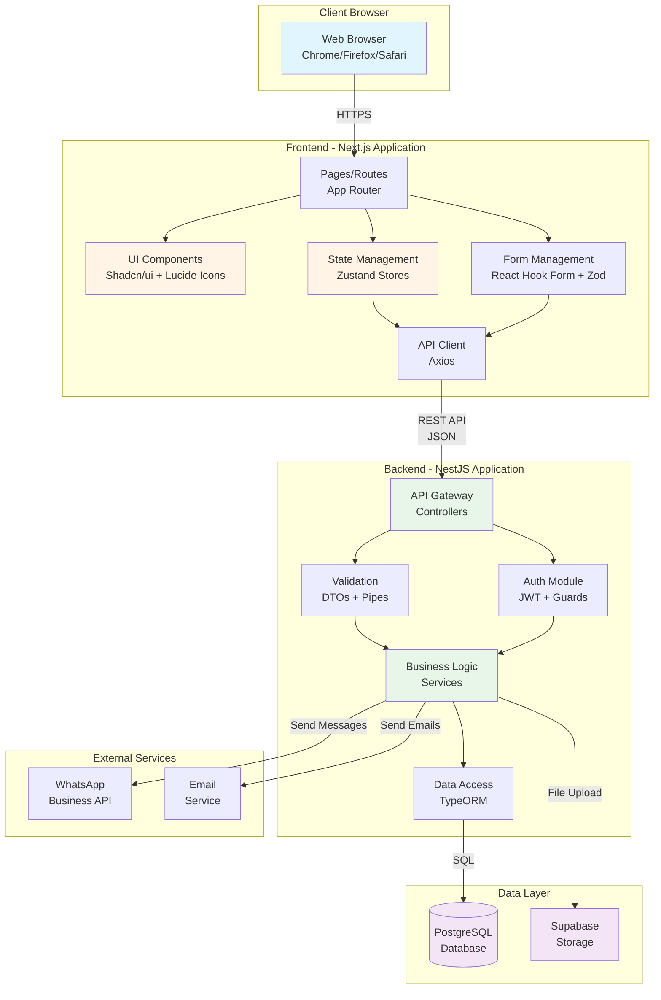
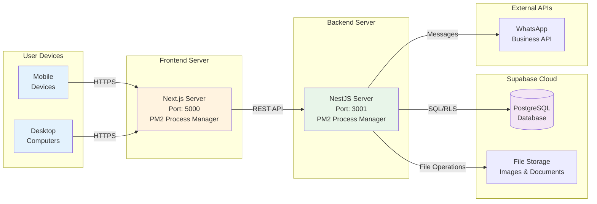
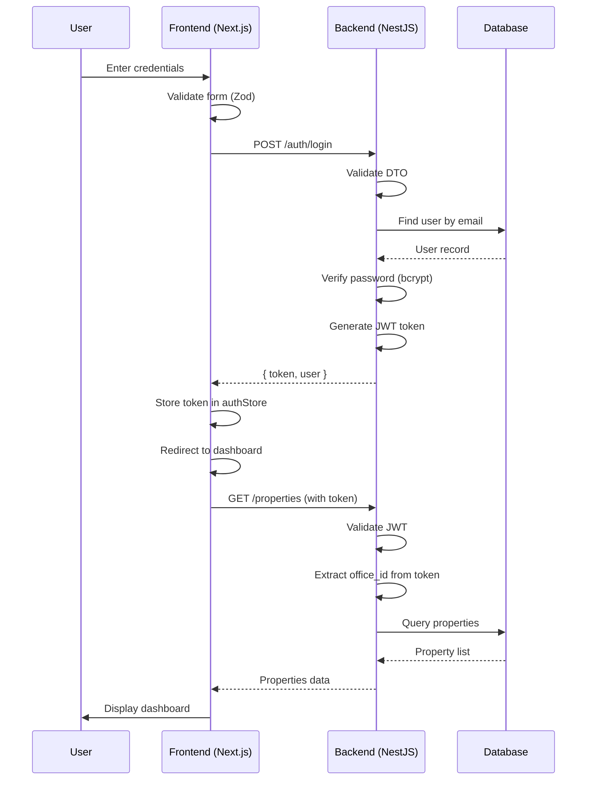
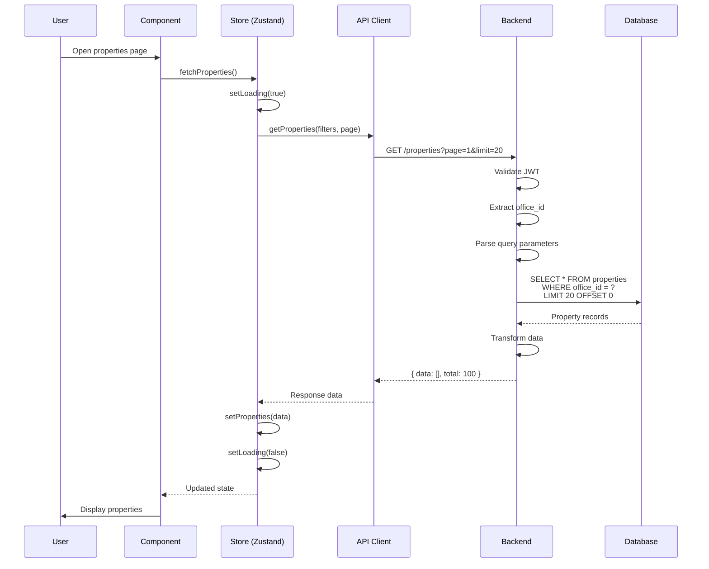
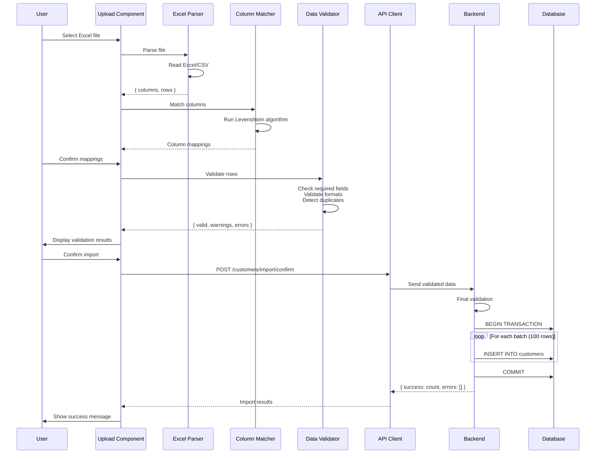

# Architecture Design Document (ADD)

## Property Management System (إداره العقارات)

**Version:** 1.0  
**Date:** November 8, 2025  
**Prepared By:** Senior Software Architect Team

---

## Table of Contents

1. [Introduction](#1-introduction)
   - 1.1 [Purpose](#11-purpose)
   - 1.2 [Scope](#12-scope)
   - 1.3 [Intended Audience](#13-intended-audience)
2. [Architectural Goals](#2-architectural-goals)
   - 2.1 [Scalability](#21-scalability)
   - 2.2 [Security](#22-security)
   - 2.3 [Performance](#23-performance)
   - 2.4 [Maintainability](#24-maintainability)
   - 2.5 [Reliability](#25-reliability)
   - 2.6 [Usability](#26-usability)
3. [System Overview](#3-system-overview)
   - 3.1 [Architecture Style](#31-architecture-style)
   - 3.2 [High-Level Architecture](#32-high-level-architecture)
   - 3.3 [Component Diagram](#33-component-diagram)
   - 3.4 [Deployment Architecture](#34-deployment-architecture)
4. [Component Breakdown](#4-component-breakdown)
   - 4.1 [Frontend (Next.js)](#41-frontend-nextjs)
   - 4.2 [Backend (NestJS)](#42-backend-nestjs)
   - 4.3 [Database (PostgreSQL)](#43-database-postgresql)
   - 4.4 [External Services](#44-external-services)
5. [Data Flow](#5-data-flow)
   - 5.1 [Authentication Flow](#51-authentication-flow)
   - 5.2 [Property List Retrieval](#52-property-list-retrieval)
   - 5.3 [Excel Import Flow](#53-excel-import-flow)
6. [Technology Stack](#6-technology-stack)
   - 6.1 [Frontend Technologies](#61-frontend-technologies)
   - 6.2 [Backend Technologies](#62-backend-technologies)
   - 6.3 [Database and Storage](#63-database-and-storage)
   - 6.4 [Development Tools](#64-development-tools)
7. [Design Patterns](#7-design-patterns)
8. [Security Architecture](#8-security-architecture)
9. [API Architecture](#9-api-architecture)
10. [State Management](#10-state-management)
11. [File Structure](#11-file-structure)

---

## 1. Introduction

### 1.1 Purpose

This Architecture Design Document (ADD) provides a comprehensive overview of the architectural design for the **Property Management System** (نظام إدارة العقارات). The document describes:

- The system's architectural structure and organization
- Key architectural decisions and rationale
- Component interactions and data flows
- Technology stack and design patterns
- Security and performance considerations

This document serves as a technical blueprint for:
- Development teams implementing the system
- Technical leads making architectural decisions
- DevOps teams deploying and maintaining the system
- Security teams reviewing the architecture
- New team members understanding the system

### 1.2 Scope

This document covers the architectural design of the complete Property Management System, including:

- **Frontend Architecture:** Next.js-based client application
- **Backend Architecture:** NestJS API server
- **Database Architecture:** PostgreSQL data persistence layer
- **Integration Architecture:** External service integrations
- **Deployment Architecture:** Production deployment structure

The document focuses on:
- High-level system architecture
- Component responsibilities and interactions
- Data flow patterns
- Technology choices and their justification
- Key design patterns and principles

### 1.3 Intended Audience

This document is intended for:
- **Software Architects:** Understanding architectural decisions
- **Senior Developers:** Implementing complex features
- **DevOps Engineers:** Deploying and scaling the system
- **Security Engineers:** Reviewing security architecture
- **Technical Managers:** Making technology decisions
- **Quality Assurance:** Understanding system structure for testing

---

## 2. Architectural Goals

The architecture is designed to achieve the following key goals:

### 2.1 Scalability

**Goal:** Support growing user base and data volume without architectural changes.

**Strategies:**
- **Horizontal Scaling:** Backend can scale by adding more server instances
- **Database Optimization:** Indexed queries and connection pooling
- **Stateless Design:** Backend services are stateless for easy scaling
- **Caching Strategy:** Client-side caching with Zustand, potential server-side caching
- **Pagination:** All list endpoints support pagination to handle large datasets
- **Batch Processing:** Excel import processes data in batches (100 rows)

**Target Metrics:**
- Support 100+ concurrent users initially
- Handle 10,000+ property records efficiently
- Process Excel files with 1,000+ rows within 10 seconds
- API response time remains stable under load

### 2.2 Security

**Goal:** Protect sensitive data and prevent unauthorized access.

**Strategies:**
- **Authentication:** JWT-based token authentication
- **Authorization:** Role-Based Access Control (RBAC)
- **Data Encryption:** HTTPS for all communications, encrypted database connections
- **Input Validation:** Server-side validation using class-validator
- **SQL Injection Prevention:** TypeORM with parameterized queries
- **XSS Prevention:** React's built-in XSS protection
- **CSRF Protection:** NestJS CSRF guards
- **Multi-tenancy Isolation:** Row-Level Security (RLS) in database
- **Password Security:** Bcrypt hashing with 10+ rounds
- **Rate Limiting:** API rate limiting to prevent abuse

**Security Layers:**
- Network layer (HTTPS, firewall)
- Application layer (authentication, authorization)
- Database layer (RLS, encrypted connections)
- Code layer (input validation, sanitization)

### 2.3 Performance

**Goal:** Deliver fast, responsive user experience.

**Strategies:**
- **Frontend Optimization:**
  - Code splitting and lazy loading
  - Image optimization (WebP, compression)
  - Minimal bundle size
  - Client-side caching with Zustand
  - Optimistic UI updates
- **Backend Optimization:**
  - Efficient database queries with indexes
  - Connection pooling (100 connections)
  - Async/await for non-blocking operations
  - Bulk operations for data import
- **Database Optimization:**
  - Proper indexing on frequently queried columns
  - Query optimization
  - Prepared statements
  - Foreign key indexes

**Target Metrics:**
- API response time: < 2 seconds (95th percentile)
- Page load time: < 3 seconds (First Contentful Paint)
- Database query time: < 100ms (average)
- Excel processing: 100 rows/second

### 2.4 Maintainability

**Goal:** Easy to understand, modify, and extend the codebase.

**Strategies:**
- **TypeScript:** Type safety across frontend and backend
- **Modular Architecture:** Clear separation of concerns
- **Consistent Patterns:** Standardized code patterns
- **Documentation:** Inline comments, API documentation (Swagger)
- **Code Quality Tools:** ESLint, Prettier for code formatting
- **Version Control:** Git with meaningful commit messages
- **Testing:** Unit tests for critical components
- **Naming Conventions:** Clear, descriptive naming

**Principles:**
- DRY (Don't Repeat Yourself)
- SOLID principles
- Clean Code practices
- Separation of Concerns
- Single Responsibility Principle

### 2.5 Reliability

**Goal:** Ensure system availability and data integrity.

**Strategies:**
- **Error Handling:** Comprehensive error handling at all layers
- **Data Validation:** Multiple validation layers (frontend, backend, database)
- **Transaction Management:** Database transactions for critical operations
- **Backup Strategy:** Automated daily backups via Supabase
- **Logging:** Structured logging for debugging and monitoring
- **Health Checks:** API health check endpoints
- **Graceful Degradation:** System continues with reduced functionality on partial failures

**Target Metrics:**
- System uptime: 99.5% monthly
- Data backup: Daily with 7-day retention
- Mean Time To Recovery (MTTR): < 4 hours
- Zero data loss for committed transactions

### 2.6 Usability

**Goal:** Provide intuitive, accessible user interface.

**Strategies:**
- **Responsive Design:** Works on all devices (mobile, tablet, desktop)
- **RTL Support:** Full support for Arabic language (right-to-left)
- **Accessibility:** WCAG 2.1 AA compliance considerations
- **User Feedback:** Loading states, success/error messages
- **Intuitive Navigation:** Clear menu structure and breadcrumbs
- **Consistent UI:** Shadcn/ui component library
- **Progressive Enhancement:** Core functionality works, enhanced features add value

---

## 3. System Overview

### 3.1 Architecture Style

The Property Management System follows a **Client-Server Architecture** with **RESTful API** communication:

**Architecture Type:** Three-Tier Architecture
- **Presentation Tier:** Next.js frontend (React-based)
- **Application Tier:** NestJS backend (Node.js-based)
- **Data Tier:** PostgreSQL database (via Supabase)

**Key Characteristics:**
- **Separation of Concerns:** Clear boundaries between layers
- **API-First Design:** Backend exposes RESTful API endpoints
- **Stateless Backend:** Each request contains all necessary information
- **Client-Side Rendering (CSR) with SSR Capability:** Next.js provides flexibility
- **Multi-Tenancy:** Office-based data isolation using RLS

### 3.2 High-Level Architecture

```
┌─────────────────────────────────────────────────────────────┐
│                        Client Layer                          │
│  ┌──────────────────────────────────────────────────────┐  │
│  │         Web Browsers (Chrome, Firefox, Safari)        │  │
│  └──────────────────────────────────────────────────────┘  │
└─────────────────────────────────────────────────────────────┘
                            │
                            │ HTTPS
                            ▼
┌─────────────────────────────────────────────────────────────┐
│                   Presentation Layer                         │
│  ┌──────────────────────────────────────────────────────┐  │
│  │              Next.js Frontend (Port 5000)             │  │
│  │  • React Components (Shadcn/ui)                       │  │
│  │  • State Management (Zustand)                         │  │
│  │  • Client-Side Routing                                │  │
│  │  • Form Validation (Zod + React Hook Form)           │  │
│  └──────────────────────────────────────────────────────┘  │
└─────────────────────────────────────────────────────────────┘
                            │
                            │ REST API (JSON)
                            │ JWT Token
                            ▼
┌─────────────────────────────────────────────────────────────┐
│                    Application Layer                         │
│  ┌──────────────────────────────────────────────────────┐  │
│  │              NestJS Backend (Port 3001)               │  │
│  │  • Controllers (Route Handlers)                       │  │
│  │  • Services (Business Logic)                          │  │
│  │  • Guards (Authentication/Authorization)              │  │
│  │  • Pipes (Validation)                                 │  │
│  │  • Interceptors (Logging, Transformation)             │  │
│  └──────────────────────────────────────────────────────┘  │
└─────────────────────────────────────────────────────────────┘
                            │
                            │ TypeORM
                            │ SQL Queries
                            ▼
┌─────────────────────────────────────────────────────────────┐
│                      Data Layer                              │
│  ┌──────────────────────────────────────────────────────┐  │
│  │         PostgreSQL Database (via Supabase)            │  │
│  │  • Tables (properties, customers, appointments, etc.) │  │
│  │  • Indexes                                            │  │
│  │  • Row-Level Security (RLS)                           │  │
│  │  • Foreign Keys & Constraints                         │  │
│  └──────────────────────────────────────────────────────┘  │
└─────────────────────────────────────────────────────────────┘
                            │
                            │
                            ▼
┌─────────────────────────────────────────────────────────────┐
│                   External Services                          │
│  • Supabase Storage (Files & Images)                        │
│  • WhatsApp Business API (Notifications)                    │
│  • Email Service (SMTP)                                     │
└─────────────────────────────────────────────────────────────┘
```

### 3.3 Component Diagram



### 3.4 Deployment Architecture



---

## 4. Component Breakdown

### 4.1 Frontend (Next.js)

#### 4.1.1 Overview

The frontend is built using **Next.js 14** with the **App Router**, leveraging React 18's latest features. It provides a modern, responsive single-page application (SPA) experience with server-side rendering (SSR) capabilities.

#### 4.1.2 Responsibilities

**Primary Responsibilities:**
- **User Interface Rendering:** Display all UI components and pages
- **User Input Handling:** Capture and validate user interactions
- **State Management:** Manage application and component state
- **API Communication:** Send requests to backend and handle responses
- **Client-Side Routing:** Navigate between pages without full reload
- **Data Presentation:** Format and display data to users
- **Real-time Feedback:** Show loading states, errors, and success messages
- **File Processing:** Handle Excel/CSV parsing on client-side
- **PDF Generation:** Generate invoices and reports using jsPDF

**Secondary Responsibilities:**
- Form validation (client-side)
- Data caching and optimistic updates
- Internationalization (Arabic RTL support)
- Responsive layout management
- Accessibility features

#### 4.1.3 Key Technologies

- **Framework:** Next.js 14.2.0 (React 18.3.0)
- **Language:** TypeScript 5.9.3
- **Styling:** Tailwind CSS 3.4.0
- **UI Components:** Radix UI primitives (Shadcn/ui)
- **State Management:** Zustand 4.5.0
- **Form Handling:** React Hook Form 7.50.0
- **Validation:** Zod 3.22.0
- **HTTP Client:** Axios 1.6.0
- **Charts:** Recharts 2.8.0
- **Icons:** Lucide React 0.344.0
- **Date Handling:** date-fns 4.1.0
- **Notifications:** Sonner 1.4.0
- **Excel Processing:** xlsx 0.18.5, papaparse 5.5.3
- **PDF Generation:** jsPDF 3.0.3, jspdf-autotable 5.0.2
- **File Download:** file-saver 2.0.5

#### 4.1.4 Architecture Pattern

**Pattern:** Component-Based Architecture with Feature-Based Organization

```
Web/src/
├── app/                          # Next.js App Router
│   ├── dashboard/               # Protected dashboard routes
│   │   ├── properties/         # Property management pages
│   │   ├── customers/          # Customer management pages
│   │   ├── appointments/       # Appointment pages
│   │   ├── contracts/          # Contract pages
│   │   ├── payments/           # Payment pages
│   │   ├── finance/            # Finance reports
│   │   └── layout.tsx          # Dashboard layout
│   ├── login/                   # Authentication pages
│   ├── layout.tsx               # Root layout
│   └── globals.css              # Global styles
├── components/                   # Reusable components
│   ├── ui/                      # Base UI components (Shadcn)
│   ├── properties/             # Property-specific components
│   ├── customers/              # Customer-specific components
│   ├── appointments/           # Appointment components
│   ├── contracts/              # Contract components
│   ├── payments/               # Payment components
│   ├── finance/                # Finance components
│   └── dashboard/              # Dashboard components
├── store/                       # Zustand state stores
│   ├── auth-store.ts           # Authentication state
│   ├── properties-store.ts     # Properties state
│   └── customers-store.ts      # Customers state
├── lib/                         # Utility libraries
│   ├── api/                     # API client functions
│   ├── excel/                   # Excel processing
│   └── utils.ts                 # Helper functions
└── types/                       # TypeScript type definitions
```

#### 4.1.5 State Management with Zustand

**Store Pattern:**
```typescript
interface Store {
  // State
  data: T[]
  filters: FilterType
  isLoading: boolean
  error: string | null
  
  // Actions
  setData: (data: T[]) => void
  setFilters: (filters: FilterType) => void
  setLoading: (loading: boolean) => void
  setError: (error: string | null) => void
  
  // Async actions
  fetchData: () => Promise<void>
  deleteItem: (id: string) => Promise<void>
}
```

**Key Stores:**
- `authStore`: User authentication and session
- `propertiesStore`: Property data and filters
- `customersStore`: Customer data and filters
- `appointmentsStore`: Appointment scheduling

**Benefits:**
- Lightweight and fast
- No boilerplate
- TypeScript support
- Devtools integration
- React hooks integration

#### 4.1.6 API Communication

**Pattern:** Centralized API client with Axios

```typescript
// lib/api/client.ts
const apiClient = axios.create({
  baseURL: process.env.NEXT_PUBLIC_API_URL,
  headers: {
    'Content-Type': 'application/json'
  }
})

// Add JWT token to requests
apiClient.interceptors.request.use((config) => {
  const token = getAuthToken()
  if (token) {
    config.headers.Authorization = `Bearer ${token}`
  }
  return config
})

// Handle errors globally
apiClient.interceptors.response.use(
  (response) => response,
  (error) => {
    if (error.response?.status === 401) {
      // Redirect to login
    }
    return Promise.reject(error)
  }
)
```

**API Modules:**
- `properties.ts`: Property CRUD operations
- `customers.ts`: Customer management
- `appointments.ts`: Appointment scheduling
- `contracts.ts`: Contract management
- `payments.ts`: Payment tracking

#### 4.1.7 Form Handling

**Pattern:** React Hook Form + Zod validation

```typescript
const schema = z.object({
  name: z.string().min(1, 'Name is required'),
  phone: z.string().regex(/^\+966\d{9}$/, 'Invalid phone'),
  email: z.string().email().optional()
})

const form = useForm<FormData>({
  resolver: zodResolver(schema)
})

const onSubmit = async (data: FormData) => {
  await api.createCustomer(data)
}
```

**Benefits:**
- Type-safe forms
- Async validation
- Error handling
- Performance optimized (minimal re-renders)

### 4.2 Backend (NestJS)

#### 4.2.1 Overview

The backend is built using **NestJS 10.3**, a progressive Node.js framework that uses TypeScript and follows architectural patterns inspired by Angular. It provides a robust, scalable REST API for the frontend.

#### 4.2.2 Responsibilities

**Primary Responsibilities:**
- **Business Logic Implementation:** Core application logic
- **API Endpoint Exposure:** RESTful API routes
- **Authentication & Authorization:** User identity and access control
- **Data Validation:** Input validation and sanitization
- **Database Operations:** CRUD operations via TypeORM
- **File Processing:** Excel import/export, image processing
- **External Integrations:** WhatsApp, Email services
- **Error Handling:** Centralized exception handling
- **Logging:** Request/response logging
- **API Documentation:** Swagger/OpenAPI documentation

**Secondary Responsibilities:**
- Rate limiting
- Request caching (potential)
- Background job processing
- Scheduled tasks (cron jobs)
- Health checks

#### 4.2.3 Key Technologies

- **Framework:** NestJS 10.3.0
- **Runtime:** Node.js 18+
- **Language:** TypeScript 5.3.3
- **ORM:** TypeORM 0.3.27
- **Database Driver:** pg (PostgreSQL) 8.16.3
- **Authentication:** JWT (passport-jwt 4.0.1)
- **Validation:** class-validator 0.14.1, class-transformer 0.5.1
- **API Documentation:** Swagger 7.2.0
- **HTTP Client:** Axios 1.6.5
- **File Upload:** Multer 1.4.5
- **Image Processing:** Sharp 0.33.2
- **Excel Processing:** xlsx 0.18.5
- **Security:** Helmet 7.1.0, Compression 1.7.4, Throttler 5.1.1
- **Logging:** Built-in Logger
- **Testing:** Jest 29.7.0

#### 4.2.4 Architecture Pattern

**Pattern:** Modular Architecture with Dependency Injection

```
api/src/
├── main.ts                       # Application entry point
├── app.module.ts                 # Root module
├── auth/                         # Authentication module
│   ├── jwt.middleware.ts        # JWT validation
│   ├── roles.decorator.ts       # Role decorator
│   └── roles.guard.ts           # Role guard
├── properties/                   # Properties module
│   ├── properties.controller.ts # REST endpoints
│   ├── properties.service.ts    # Business logic
│   ├── properties.module.ts     # Module definition
│   ├── dto/                     # Data Transfer Objects
│   └── excel.controller.ts      # Excel operations
├── customers/                    # Customers module
│   ├── customers.controller.ts
│   ├── customers.service.ts
│   ├── customers.module.ts
│   ├── excel.service.ts         # Excel import/export
│   └── dto/
├── appointments/                 # Appointments module
│   ├── appointments.controller.ts
│   ├── appointments.service.ts
│   └── dto/
├── contracts/                    # Contracts module (implicit)
├── payments/                     # Payments module
│   ├── payments.controller.ts
│   ├── payments.service.ts
│   └── dto/
├── maintenance/                  # Maintenance module
│   ├── maintenance.controller.ts
│   ├── maintenance.service.ts
│   └── dto/
├── analytics/                    # Analytics module
│   ├── analytics.controller.ts
│   └── analytics.service.ts
├── whatsapp/                     # WhatsApp integration
│   ├── whatsapp.controller.ts
│   └── meta-api.service.ts
├── supabase/                     # Supabase integration
│   ├── supabase.service.ts
│   └── supabase.module.ts
├── common/                       # Shared utilities
│   ├── filters/                 # Exception filters
│   ├── guards/                  # Custom guards
│   └── interceptors/            # Interceptors
└── health/                       # Health check
    └── health.controller.ts
```

#### 4.2.5 Module Structure

**Standard Module Pattern:**
```typescript
@Module({
  imports: [
    TypeOrmModule.forFeature([Entity]),
    // Other dependencies
  ],
  controllers: [FeatureController],
  providers: [FeatureService],
  exports: [FeatureService]
})
export class FeatureModule {}
```

**Key Modules:**
- **PropertiesModule**: Property management
- **CustomersModule**: CRM functionality
- **AppointmentsModule**: Scheduling
- **PaymentsModule**: Financial transactions
- **MaintenanceModule**: Service requests
- **AnalyticsModule**: Reporting
- **WhatsAppModule**: Messaging integration
- **SupabaseModule**: Database and storage

#### 4.2.6 Request Lifecycle

```
1. Client Request (HTTP)
   ↓
2. Middleware Layer
   ├── JWT Validation
   ├── CORS Handling
   └── Request Logging
   ↓
3. Guards (Authentication/Authorization)
   ├── Check JWT token
   └── Verify user role
   ↓
4. Controller (Route Handler)
   ├── Extract parameters
   └── Call service method
   ↓
5. Pipes (Validation & Transformation)
   ├── Validate DTOs
   └── Transform data types
   ↓
6. Service (Business Logic)
   ├── Process business rules
   ├── Call database operations
   └── Call external services
   ↓
7. TypeORM (Database Access)
   ├── Build SQL queries
   └── Execute transactions
   ↓
8. Interceptors (Response Transformation)
   ├── Format response
   └── Add metadata
   ↓
9. Exception Filters (Error Handling)
   ├── Catch exceptions
   └── Format error response
   ↓
10. Response (JSON)
```

#### 4.2.7 Authentication & Authorization

**JWT Strategy:**
```typescript
@Injectable()
export class JwtMiddleware implements NestMiddleware {
  use(req: Request, res: Response, next: NextFunction) {
    const token = req.headers.authorization?.replace('Bearer ', '')
    if (!token) {
      throw new UnauthorizedException('Missing token')
    }
    
    const payload = jwt.verify(token, process.env.JWT_SECRET)
    req.user = payload  // Attach user to request
    next()
  }
}
```

**Role-Based Access Control:**
```typescript
@Roles('manager', 'staff')
@UseGuards(RolesGuard)
@Post()
async create(@Req() req, @Body() dto: CreateDto) {
  return this.service.create(req.user.office_id, dto)
}
```

#### 4.2.8 Data Validation

**DTO Pattern with class-validator:**
```typescript
export class CreatePropertyDto {
  @IsString()
  @IsNotEmpty()
  property_code: string

  @IsString()
  @IsNotEmpty()
  title: string

  @IsEnum(PropertyType)
  property_type: PropertyType

  @IsNumber()
  @Min(0)
  price: number

  @IsOptional()
  @IsString()
  description?: string
}
```

**Validation Pipe:**
- Automatically validates incoming requests
- Transforms plain objects to class instances
- Returns detailed validation errors
- Strips unknown properties

#### 4.2.9 Database Access with TypeORM

**Repository Pattern:**
```typescript
@Injectable()
export class PropertiesService {
  constructor(
    @InjectRepository(Property)
    private readonly propertyRepo: Repository<Property>
  ) {}

  async findAll(officeId: string, filters: FilterDto) {
    const query = this.propertyRepo
      .createQueryBuilder('property')
      .where('property.office_id = :officeId', { officeId })
    
    if (filters.property_type) {
      query.andWhere('property.property_type = :type', {
        type: filters.property_type
      })
    }
    
    return query.getMany()
  }
}
```

**Benefits:**
- Type-safe queries
- Automatic migrations
- Connection pooling
- Transaction support
- Query caching

### 4.3 Database (PostgreSQL)

#### 4.3.1 Overview

The database layer uses **PostgreSQL 14+** hosted on **Supabase**, providing a robust, ACID-compliant relational database with advanced features like Row-Level Security (RLS) for multi-tenancy.

#### 4.3.2 Responsibilities

**Primary Responsibilities:**
- **Data Persistence:** Store all application data
- **Data Integrity:** Enforce constraints and relationships
- **Multi-Tenancy:** Isolate data between offices using RLS
- **Query Optimization:** Fast data retrieval through indexes
- **Transactional Support:** ACID compliance for critical operations
- **Backup & Recovery:** Automated backups and point-in-time recovery

**Secondary Responsibilities:**
- Full-text search
- Geographic data (for property locations)
- JSON data storage (for flexible fields)
- Audit trail (soft deletes, timestamps)

#### 4.3.3 Key Technologies

- **Database:** PostgreSQL 14+
- **Hosting:** Supabase Cloud
- **ORM:** TypeORM 0.3.27
- **Driver:** node-postgres (pg) 8.16.3
- **Features:**
  - Row-Level Security (RLS)
  - Foreign Keys
  - Indexes (B-tree, GiST)
  - JSON/JSONB columns
  - Triggers
  - Functions

#### 4.3.4 Database Schema Overview

**Core Tables:**

1. **offices**: Real estate offices (tenants)
2. **users**: System users with roles
3. **properties**: Property listings
4. **customers**: Customer information
5. **appointments**: Scheduled meetings
6. **contracts**: Rental and sale agreements
7. **payments**: Financial transactions
8. **maintenance_requests**: Service requests
9. **customer_notes**: Internal customer notes
10. **customer_interactions**: Communication logs
11. **customer_properties**: Customer-property relationships

**Relationship Structure:**
```
offices (1) ────── (N) users
offices (1) ────── (N) properties
offices (1) ────── (N) customers
properties (1) ─── (N) appointments
customers (1) ──── (N) appointments
properties (1) ─── (N) contracts
customers (1) ──── (N) contracts
contracts (1) ───── (N) payments
properties (1) ─── (N) maintenance_requests
customers (N) ──── (N) properties (via customer_properties)
```

#### 4.3.5 Key Indexes

**Performance Optimization:**
```sql
-- Properties
CREATE INDEX idx_properties_office_id ON properties(office_id);
CREATE INDEX idx_properties_status ON properties(status);
CREATE INDEX idx_properties_property_type ON properties(property_type);
CREATE INDEX idx_properties_city ON properties(city);
CREATE INDEX idx_properties_price ON properties(price);

-- Customers
CREATE INDEX idx_customers_office_id ON customers(office_id);
CREATE INDEX idx_customers_phone ON customers(phone);
CREATE INDEX idx_customers_type ON customers(type);
CREATE INDEX idx_customers_status ON customers(status);

-- Appointments
CREATE INDEX idx_appointments_office_id ON appointments(office_id);
CREATE INDEX idx_appointments_date ON appointments(date);
CREATE INDEX idx_appointments_assigned_staff ON appointments(assigned_staff_id);
CREATE INDEX idx_appointments_conflict_check 
  ON appointments(office_id, assigned_staff_id, date, start_time, end_time)
  WHERE status IN ('scheduled', 'confirmed', 'in_progress');

-- Payments
CREATE INDEX idx_payments_contract_id ON payments(contract_id);
CREATE INDEX idx_payments_status ON payments(status);
CREATE INDEX idx_payments_due_date ON payments(due_date);
```

#### 4.3.6 Row-Level Security (RLS)

**Multi-Tenancy Implementation:**
```sql
-- Enable RLS
ALTER TABLE properties ENABLE ROW LEVEL SECURITY;

-- Policy for SELECT
CREATE POLICY "Users can view properties from their office"
ON properties FOR SELECT
USING (office_id = auth.jwt() ->> 'office_id');

-- Policy for INSERT
CREATE POLICY "Users can insert properties to their office"
ON properties FOR INSERT
WITH CHECK (office_id = auth.jwt() ->> 'office_id');

-- Policy for UPDATE
CREATE POLICY "Users can update properties in their office"
ON properties FOR UPDATE
USING (office_id = auth.jwt() ->> 'office_id');

-- Policy for DELETE
CREATE POLICY "Managers can delete properties in their office"
ON properties FOR DELETE
USING (
  office_id = auth.jwt() ->> 'office_id' AND
  auth.jwt() ->> 'role' = 'manager'
);
```

**Benefits:**
- Data isolation at database level
- No application code needed for filtering
- Security even if ORM is bypassed
- Automatic enforcement

#### 4.3.7 Data Types

**Common Patterns:**
- **IDs:** UUID (gen_random_uuid())
- **Strings:** TEXT, VARCHAR
- **Numbers:** INTEGER, DECIMAL(10,2)
- **Dates:** DATE, TIMESTAMP
- **Booleans:** BOOLEAN
- **Enums:** VARCHAR with CHECK constraints
- **JSON:** JSONB for flexible fields
- **Location:** POINT for coordinates

### 4.4 External Services

#### 4.4.1 Supabase Storage

**Purpose:** File and image storage

**Usage:**
- Property images
- Contract documents
- Customer ID copies
- Maintenance photos
- Profile avatars

**Features:**
- Public and private buckets
- Access control via RLS
- CDN for fast delivery
- Image transformations
- Signed URLs for temporary access

#### 4.4.2 WhatsApp Business API

**Purpose:** Customer communication

**Usage:**
- Payment reminders
- Appointment confirmations
- Maintenance updates
- Marketing messages

**Integration:**
- Meta API service
- Template messages
- Media messages
- Delivery status tracking

#### 4.4.3 Email Service

**Purpose:** Email notifications

**Usage:**
- Password reset
- Payment receipts
- Contract documents
- System notifications

**Protocol:** SMTP
**Features:**
- HTML emails
- Attachments
- Bulk sending

---

## 5. Data Flow

### 5.1 Authentication Flow



**Steps:**
1. User submits login form
2. Frontend validates input (client-side)
3. Frontend sends POST request to /auth/login
4. Backend validates credentials
5. Backend generates JWT token (includes user_id, office_id, role)
6. Frontend stores token in Zustand store and localStorage
7. All subsequent requests include token in Authorization header
8. Backend validates token and extracts user context
9. Backend filters data by office_id from token

### 5.2 Property List Retrieval



**Steps:**
1. User navigates to properties page
2. Component calls fetchProperties() from store
3. Store sets loading state to true
4. Store calls API client with filters and pagination
5. API client sends GET request with JWT token
6. Backend validates token and extracts office_id
7. Backend builds query with filters and pagination
8. Database executes query with indexes
9. Backend transforms and returns data
10. Store updates state with new data
11. Component re-renders with updated properties

**Performance Optimizations:**
- Pagination (20 items per page)
- Indexed queries on frequently filtered columns
- Client-side caching in Zustand store
- Optimistic UI updates for mutations

### 5.3 Excel Import Flow



**Steps:**
1. User uploads Excel/CSV file
2. Frontend parses file using xlsx library
3. Column matcher runs AI algorithm to match columns
4. User confirms or adjusts column mappings
5. Frontend validates all rows (required fields, formats, duplicates)
6. User reviews validation results (green/yellow/red rows)
7. User confirms import
8. Frontend sends validated data to backend
9. Backend performs final validation
10. Backend processes in batches of 100 rows
11. Database inserts data within transaction
12. Backend returns success/error counts
13. Frontend displays results to user

**Key Features:**
- Client-side parsing (no file upload needed for preview)
- Intelligent column matching with confidence scores
- Row-by-row validation with color coding
- Batch processing for performance
- Transaction rollback on errors
- Detailed error reporting

---

## 6. Technology Stack

### 6.1 Frontend Technologies

#### Core Framework
- **Next.js 14.2.0:** React framework with App Router
- **React 18.3.0:** UI library with concurrent features
- **TypeScript 5.9.3:** Typed JavaScript for type safety

#### UI & Styling
- **Tailwind CSS 3.4.0:** Utility-first CSS framework
- **Radix UI:** Unstyled, accessible component primitives
  - @radix-ui/react-dialog
  - @radix-ui/react-dropdown-menu
  - @radix-ui/react-select
  - @radix-ui/react-tabs
  - And 15+ other components
- **Lucide React 0.344.0:** Icon library (1000+ icons)
- **class-variance-authority 0.7.1:** Component variants
- **tailwind-merge 2.6.0:** Merge Tailwind classes
- **tailwindcss-animate 1.0.7:** Animation utilities

#### State Management
- **Zustand 4.5.0:** Lightweight state management
  - Minimal boilerplate
  - TypeScript support
  - DevTools integration
  - Persist middleware

#### Form & Validation
- **React Hook Form 7.50.0:** Form state management
  - Performance optimized
  - Minimal re-renders
  - Built-in validation
- **Zod 3.22.0:** Schema validation
  - Type inference
  - Composable schemas
  - Custom validators
- **@hookform/resolvers 3.3.0:** Form validation integration

#### Data Fetching
- **Axios 1.6.0:** HTTP client
  - Request/response interceptors
  - Automatic JSON transformation
  - Error handling
  - Cancel requests

#### Data Visualization
- **Recharts 2.8.0:** Chart library
  - Line charts
  - Bar charts
  - Pie/Donut charts
  - Area charts
  - Responsive
  - Customizable

#### File Processing
- **xlsx 0.18.5:** Excel/CSV parsing and generation
  - Read .xlsx, .xls, .csv
  - Write Excel files
  - Cell formatting
  - Multiple sheets
- **papaparse 5.5.3:** CSV parser
  - Streaming
  - Web worker support
  - Auto-detect delimiters
- **file-saver 2.0.5:** Client-side file download

#### PDF Generation
- **jspdf 3.0.3:** PDF generation
  - Arabic font support
  - Images and graphics
  - Custom styling
- **jspdf-autotable 5.0.2:** Tables in PDFs
  - Auto-layout
  - Styling options
  - Page breaks

#### Utilities
- **date-fns 4.1.0:** Date manipulation
  - Format dates
  - Calculate differences
  - Locale support (Arabic)
- **sonner 1.4.0:** Toast notifications
  - Beautiful design
  - Promise-based
  - Customizable
- **clsx 2.1.1:** Conditional class names

### 6.2 Backend Technologies

#### Core Framework
- **NestJS 10.3.0:** Progressive Node.js framework
  - TypeScript-first
  - Dependency injection
  - Modular architecture
  - Decorators
- **Node.js 18+:** JavaScript runtime
- **TypeScript 5.3.3:** Type-safe JavaScript

#### Database & ORM
- **TypeORM 0.3.27:** Object-Relational Mapper
  - Entity management
  - Migrations
  - Query builder
  - Transactions
  - Connection pooling
- **pg 8.16.3:** PostgreSQL driver
- **@nestjs/typeorm 11.0.0:** NestJS TypeORM integration

#### Authentication & Security
- **@nestjs/jwt 10.2.0:** JWT implementation
- **@nestjs/passport 10.0.3:** Authentication strategies
- **passport 0.7.0:** Authentication middleware
- **passport-jwt 4.0.1:** JWT strategy
- **helmet 7.1.0:** Security headers
- **@nestjs/throttler 5.1.1:** Rate limiting
- **compression 1.7.4:** Response compression

#### Validation
- **class-validator 0.14.1:** Decorator-based validation
  - 100+ validators
  - Custom validators
  - Nested validation
- **class-transformer 0.5.1:** Object transformation
  - Plain to class
  - Class to plain
  - Type conversion

#### API Documentation
- **@nestjs/swagger 7.2.0:** OpenAPI/Swagger
  - Auto-generate docs
  - Interactive UI
  - Type definitions
  - Example values

#### File Processing
- **multer 1.4.5:** File upload middleware
- **sharp 0.33.2:** Image processing
  - Resize images
  - Format conversion
  - Compression
  - Metadata extraction
- **xlsx 0.18.5:** Excel processing
  - Read/write Excel files
  - Cell formatting
  - Multiple sheets

#### External Services
- **@supabase/supabase-js 2.75.0:** Supabase client
  - Database access
  - Storage API
  - Authentication
  - Real-time subscriptions
- **axios 1.6.5:** HTTP client for external APIs

#### Utilities
- **uuid 13.0.0:** UUID generation
- **slugify 1.6.6:** String to URL-friendly slug
- **rxjs 7.8.1:** Reactive programming

#### Development Tools
- **@nestjs/cli 10.3.0:** CLI tool
- **jest 29.7.0:** Testing framework
- **eslint 8.56.0:** Code linting
- **prettier 3.2.4:** Code formatting

### 6.3 Database and Storage

#### Database
- **PostgreSQL 14+:** Relational database
  - ACID compliance
  - JSON support
  - Full-text search
  - GIS extensions
  - Row-Level Security

#### Hosting
- **Supabase:** Backend-as-a-Service
  - Managed PostgreSQL
  - Real-time subscriptions
  - Storage API
  - Authentication
  - Auto-generated APIs
  - Dashboard
  - Backups

#### Storage
- **Supabase Storage:** Object storage
  - Public/private buckets
  - CDN integration
  - Access control
  - Image transformations

### 6.4 Development Tools

#### Version Control
- **Git:** Source control
- **GitHub:** Repository hosting

#### Package Management
- **npm:** Package manager
- **package.json:** Dependency management

#### Build Tools
- **Next.js CLI:** Frontend build
- **NestJS CLI:** Backend build
- **TypeScript Compiler:** Type checking

#### Code Quality
- **ESLint:** JavaScript/TypeScript linting
- **Prettier:** Code formatting
- **TypeScript:** Static type checking

#### Testing
- **Jest:** Unit testing framework
- **Testing Library:** React component testing
- **Supertest:** API testing

#### Process Management
- **PM2:** Production process manager
  - Auto-restart
  - Load balancing
  - Monitoring
  - Logs

#### Monitoring (Potential)
- **Sentry:** Error tracking
- **Application logs:** Winston/Morgan

---

## 7. Design Patterns

### 7.1 Frontend Patterns

#### 7.1.1 Component Composition Pattern
- **Usage:** Build complex UIs from simple components
- **Example:** PropertyCard, CustomerCard, ContractCard

#### 7.1.2 Container/Presenter Pattern
- **Container:** Manages state and logic (pages)
- **Presenter:** Pure display components (components)

#### 7.1.3 Custom Hooks Pattern
- **Usage:** Reusable stateful logic
- **Example:** useAuth, useFetch, useForm

#### 7.1.4 Compound Components Pattern
- **Usage:** Related components that work together
- **Example:** Tabs, Dialog, Dropdown

### 7.2 Backend Patterns

#### 7.2.1 Module Pattern
- **Usage:** Organize code by feature
- **Structure:** Module > Controller > Service > Repository

#### 7.2.2 Dependency Injection
- **Usage:** Loose coupling between components
- **Implementation:** NestJS built-in DI container

#### 7.2.3 Repository Pattern
- **Usage:** Abstract database access
- **Implementation:** TypeORM repositories

#### 7.2.4 Data Transfer Object (DTO) Pattern
- **Usage:** Define data contracts
- **Implementation:** class-validator decorators

#### 7.2.5 Middleware Pattern
- **Usage:** Request/response processing
- **Example:** JWT validation, logging

#### 7.2.6 Guard Pattern
- **Usage:** Authorization logic
- **Example:** RolesGuard, JwtGuard

#### 7.2.7 Interceptor Pattern
- **Usage:** Transform data, add headers
- **Example:** Response transformation, logging

#### 7.2.8 Pipe Pattern
- **Usage:** Validation and transformation
- **Example:** ValidationPipe, ParseIntPipe

---

## 8. Security Architecture

### 8.1 Security Layers

```
┌─────────────────────────────────────────────────────┐
│              Network Layer                           │
│  • HTTPS/TLS 1.2+                                   │
│  • Firewall rules                                   │
│  • DDoS protection                                  │
└─────────────────────────────────────────────────────┘
                        ↓
┌─────────────────────────────────────────────────────┐
│           Application Layer                          │
│  • JWT authentication                               │
│  • Role-based authorization (RBAC)                  │
│  • Rate limiting (100 req/min)                      │
│  • CORS policy                                      │
│  • Security headers (Helmet)                        │
└─────────────────────────────────────────────────────┘
                        ↓
┌─────────────────────────────────────────────────────┐
│             Business Logic Layer                     │
│  • Input validation (class-validator)               │
│  • Output sanitization                              │
│  • Business rule enforcement                        │
│  • Audit logging                                    │
└─────────────────────────────────────────────────────┘
                        ↓
┌─────────────────────────────────────────────────────┐
│               Data Access Layer                      │
│  • SQL injection prevention (TypeORM)               │
│  • Prepared statements                              │
│  • Row-Level Security (RLS)                         │
│  • Encrypted connections                            │
└─────────────────────────────────────────────────────┘
                        ↓
┌─────────────────────────────────────────────────────┐
│               Database Layer                         │
│  • Encrypted at rest                                │
│  • Automated backups                                │
│  • Point-in-time recovery                           │
│  • Access audit logs                                │
└─────────────────────────────────────────────────────┘
```

### 8.2 Authentication Flow

1. **Login:** User submits credentials
2. **Validation:** Backend verifies password (bcrypt)
3. **Token Generation:** JWT token created with user data
4. **Token Storage:** Frontend stores in memory and localStorage
5. **Token Usage:** Included in Authorization header
6. **Token Validation:** Backend verifies on each request
7. **Token Refresh:** New token before expiration

### 8.3 Authorization Model

**Roles:**
- **manager:** Full access
- **staff:** Limited access, cannot delete
- **accountant:** Financial operations only
- **technician:** Maintenance operations only

**Implementation:**
```typescript
@Roles('manager', 'staff')
@Delete(':id')
async delete(@Param('id') id: string) {
  // Only managers can access
}
```

### 8.4 Data Protection

**In Transit:**
- HTTPS with TLS 1.2+
- JWT tokens (not cookies to avoid CSRF)
- Encrypted WebSocket connections

**At Rest:**
- Database encryption (Supabase default)
- Hashed passwords (bcrypt)
- Encrypted file storage

**In Use:**
- Sensitive data not logged
- PII handled according to regulations
- Audit trail for data access

---

## 9. API Architecture

### 9.1 RESTful API Design

**Base URL:** `https://api.example.com/v1`

**Principles:**
- Resource-oriented URLs
- HTTP methods for CRUD (GET, POST, PATCH, DELETE)
- JSON request/response format
- Consistent error responses
- Versioned endpoints

### 9.2 Endpoint Structure

```
/properties
  GET    /properties              # List properties
  POST   /properties              # Create property
  GET    /properties/:id          # Get property details
  PATCH  /properties/:id          # Update property
  DELETE /properties/:id          # Delete property
  
  POST   /properties/import       # Import from Excel
  GET    /properties/export       # Export to Excel

/customers
  GET    /customers               # List customers
  POST   /customers               # Create customer
  GET    /customers/:id           # Get customer details
  PATCH  /customers/:id           # Update customer
  DELETE /customers/:id           # Delete customer
  GET    /customers/stats         # Get statistics
  GET    /customers/search?q=term # Quick search
  
  POST   /customers/:id/notes     # Add note
  POST   /customers/:id/interactions # Log interaction
  POST   /customers/:id/properties    # Link property

/appointments
  GET    /appointments            # List appointments
  POST   /appointments            # Create appointment
  GET    /appointments/:id        # Get appointment details
  PATCH  /appointments/:id        # Update appointment
  DELETE /appointments/:id        # Delete appointment
  
  GET    /appointments/today      # Today's appointments
  GET    /appointments/calendar   # Calendar view
  POST   /appointments/check-availability # Check conflicts

/payments
  GET    /payments                # List payments
  PATCH  /payments/:id/mark-paid  # Mark as paid
  GET    /payments/overdue        # Overdue payments
  POST   /payments/:id/send-reminder # Send reminder
```

### 9.3 Response Format

**Success Response:**
```json
{
  "success": true,
  "data": {
    "id": "uuid",
    "name": "Property Name",
    ...
  },
  "message": "Operation successful"
}
```

**List Response:**
```json
{
  "success": true,
  "data": [...],
  "total": 100,
  "page": 1,
  "limit": 20,
  "totalPages": 5
}
```

**Error Response:**
```json
{
  "success": false,
  "statusCode": 400,
  "message": "Error message in Arabic",
  "error": "Bad Request",
  "timestamp": "2025-11-08T10:30:00Z"
}
```

### 9.4 API Documentation

**Swagger UI:** `http://localhost:3001/api/docs`

**Features:**
- Interactive API explorer
- Request/response examples
- Authentication testing
- Model schemas
- Try-it-out functionality

---

## 10. State Management

### 10.1 Zustand Architecture

**Store Structure:**
```typescript
interface AppStore {
  // Authentication
  auth: {
    user: User | null
    token: string | null
    isAuthenticated: () => boolean
    login: (credentials) => Promise<void>
    logout: () => void
  }
  
  // Properties
  properties: {
    data: Property[]
    filters: PropertyFilters
    currentPage: number
    totalCount: number
    isLoading: boolean
    error: string | null
    fetchProperties: () => Promise<void>
    createProperty: (data) => Promise<void>
    updateProperty: (id, data) => Promise<void>
    deleteProperty: (id) => Promise<void>
  }
  
  // Customers
  customers: {
    // Similar structure
  }
}
```

### 10.2 State Flow

```
User Action
    ↓
Component calls store action
    ↓
Store sets loading state
    ↓
Store calls API client
    ↓
API request to backend
    ↓
Backend processes request
    ↓
Response returned
    ↓
Store updates state
    ↓
Component re-renders
    ↓
UI updates
```

### 10.3 Persistence

**Local Storage:**
- Auth token
- User preferences
- Recent searches
- Form drafts

**Session Storage:**
- Temporary filters
- Pagination state
- Sort preferences

---

## 11. File Structure

### 11.1 Monorepo Structure

```
/workspace/
├── Web/                          # Frontend application
│   ├── src/
│   │   ├── app/                  # Next.js pages (App Router)
│   │   ├── components/           # React components
│   │   ├── store/                # Zustand stores
│   │   ├── lib/                  # Utilities & helpers
│   │   └── types/                # TypeScript types
│   ├── public/                   # Static assets
│   ├── package.json              # Frontend dependencies
│   └── tsconfig.json             # TypeScript config
│
├── api/                          # Backend application
│   ├── src/
│   │   ├── properties/           # Properties module
│   │   ├── customers/            # Customers module
│   │   ├── appointments/         # Appointments module
│   │   ├── payments/             # Payments module
│   │   ├── auth/                 # Authentication
│   │   ├── common/               # Shared code
│   │   └── main.ts               # Entry point
│   ├── package.json              # Backend dependencies
│   └── tsconfig.json             # TypeScript config
│
├── package.json                  # Root package.json
├── .gitignore                    # Git ignore rules
├── README.md                     # Project documentation
├── supabase_schema.sql           # Database schema
└── ecosystem.config.js           # PM2 configuration
```

### 11.2 Key Directories

**Frontend:**
- `/app`: Next.js pages and layouts
- `/components`: Reusable UI components
- `/store`: State management
- `/lib`: Utility functions and API clients
- `/types`: TypeScript type definitions

**Backend:**
- Feature modules (properties, customers, etc.)
- `/common`: Shared utilities, guards, filters
- `/auth`: Authentication logic
- DTOs for data validation

---

## Appendix A: Deployment Considerations

### Production Checklist

**Frontend:**
- [ ] Build optimization (minimize bundle size)
- [ ] Environment variables configured
- [ ] HTTPS enabled
- [ ] CDN setup for static assets
- [ ] Error tracking (Sentry)
- [ ] Analytics integration

**Backend:**
- [ ] Production database configured
- [ ] Environment variables set
- [ ] PM2 process manager configured
- [ ] HTTPS/SSL certificate installed
- [ ] Rate limiting enabled
- [ ] Logging configured
- [ ] Health checks enabled
- [ ] Backup strategy implemented

**Database:**
- [ ] Connection pooling configured
- [ ] Indexes created
- [ ] RLS policies enabled
- [ ] Backup schedule set
- [ ] Monitoring enabled

---

## Appendix B: Scalability Roadmap

### Phase 1: Current (100 users)
- Single server deployment
- Basic monitoring
- Manual backups

### Phase 2: Growth (500 users)
- Load balancer
- Multiple backend instances
- Redis caching
- Automated backups
- Advanced monitoring

### Phase 3: Scale (1000+ users)
- Microservices architecture
- Message queue (RabbitMQ)
- Database read replicas
- CDN for all static content
- Auto-scaling infrastructure

---

**End of Architecture Design Document**
