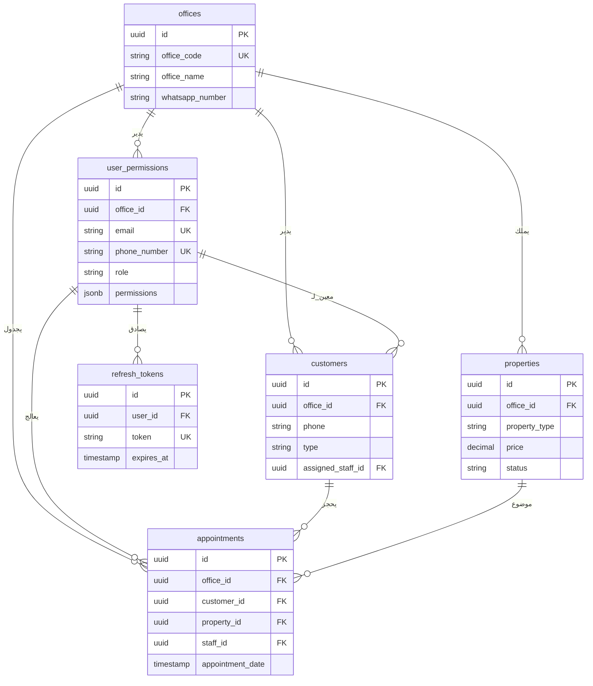

# وثيقة تصميم المعمارية (ADD)

- **تاريخ التوليد**: 2025-11-09 19:56 UTC
- **النطاق**: توثق طبقات المعمارية والاعتماديات والجوانب المشتركة في نظام إدارة العقارات.

## طبوغرافية البيئات (تحديث 2025-11-09)

```
┌──────────────────────┐        ┌──────────────────────────┐
│ بيئة الإنتاج         │        │ بيئة التجارب (Staging)   │
│ - الفرع: main         │        │ - الفرع: develop          │
│ - PM2: api-prod        │        │ - PM2: api-staging        │
│         web-prod       │        │         web-staging       │
│ - ملفات env: .env.production │ │ - ملفات env: .env.staging │
│ - النطاقات: api.example.com / │ - النطاقات: api-staging.example.com /
│             app.example.com    │             staging.example.com       │
└──────────────────────┘        └──────────────────────────┘
```

- **استراتيجية التهيئة**: يعتمد التبديل على المتغير `APP_ENV` ومعاملات PM2 وملفات `api/config/env` و `Web/config/env`، وفق ما ورد في CIP §1.3.  
- **التدفق التشغيلي**: دمج الفروع المشتقة من `feature/*` إلى `develop` يؤدي إلى نشر فوري على بيئة التجارب، بينما يُروَّج الإصدار المستقر إلى `main` للإنتاج.  
- **المراقبة**: تُطبق نفس مؤشرات الرصد (Lighthouse، Bundle Analyzer، سجلات Supabase) على البيئتين لضمان عدم انتقال المشكلة إلى الإنتاج.  
- **الوصول للبيانات**: لكل بيئة مفاتيح خدمة (Service Role) منفصلة في Supabase، ولا يُسمح باستخدام أسرار الإنتاج داخل التجارب.

## نظرة عامة على النظام
يعتمد الحل على واجهة خلفية مبنية بـ NestJS وواجهة أمامية مبنية بـ Next.js مع اعتماد Supabase كمخدم قاعدة بيانات ومصادقة وتخزين ملفات. تُغلف الوحدات المجالات المحددة مثل العقارات والعملاء والمدفوعات.

## التحليلات Module Architecture

- عدد المتحكمات: 1
- عدد الخدمات: 1
- عدد كائنات DTO: 0

### طبقة الخدمات
- `AnalyticsService` (`/workspace/api/src/analytics/analytics.service.ts`) — injects `supabaseService: SupabaseService`
  - الدالة `setCache` (20-20) تنفذ:
      private setCache(key: string, data: any, ms: number) { this.cache.set(key, { data, expiresAt: Date.now() + ms }); }
  - الدالة `dashboard` (22-49) تنفذ:
      async dashboard(officeId: string) {
        const key = `dash:${officeId}`;
        const cached = this.getCache<any>(key);
        if (cached) return cached;

        const supabase = this.supabaseService.getClient();

        const [propsByStatusRes, activeContractsRes, monthlyRevenueRes, pendingPaymentsRes, mntByStatusRes, recentActivityRes] = await Promise.all([
          supabase.rpc('get_properties_by_status', { p_office_id: officeId }),
          supabase.rpc('get_active_contracts_count', { p_office_id: officeId }),
          supabase.rpc('get_monthly_revenue', { p_office_id: officeId }),
          supabase.from('rental_payments').select('*', { count: 'exact', head: true }).eq('office_id', officeId).eq('status', 'pending'),
          supabase.rpc('get_maintenance_by_status', { p_office_id: officeId }),
          supabase.from('maintenance_requests').select('*').eq('office_id', officeId).order('created_at', { ascending: false }).limit(10),
        ]);

        const data = {
          propertiesByStatus: propsByStatusRes.data || [],
          activeContracts: Number(activeContractsRes.data ?? 0),
          monthlyRevenue: Number(monthlyRevenueRes.data ?? 0),
          pendingPayments: Number(pendingPaymentsRes.count ?? 0),
          maintenanceByStatus: mntByStatusRes.data || [],
  - الدالة `propertiesBreakdown` (51-70) تنفذ:
      async propertiesBreakdown(officeId: string) {
        const supabase = this.supabaseService.getClient();

        const [byTypeRes, byStatusRes, byCityRes, priceAggRes, countsRes] = await Promise.all([
          supabase.rpc('get_properties_by_type', { p_office_id: officeId }),
          supabase.rpc('get_properties_by_status', { p_office_id: officeId }),
          supabase.rpc('get_properties_by_city', { p_office_id: officeId }),
          supabase.rpc('get_properties_price_aggregate', { p_office_id: officeId }),
          supabase.rpc('get_properties_occupancy_counts', { p_office_id: officeId }),
        ]);

        const byType = byTypeRes.data || [];
        const byStatus = byStatusRes.data || [];
        const byCity = byCityRes.data || [];
        const priceAgg = priceAggRes.data?.[0] || { avgprice: 0, totalprice: 0 };
        const counts = countsRes.data?.[0] || { available: 0, total: 0 };
        const occupancy = counts.total ? (1 - Number(counts.available) / Number(counts.total)) : 0;

        return { byType, byStatus, byCity, avgPrice: Number(priceAgg.avgprice ?? 0), totalPrice: Number(priceAgg.totalprice ?? 0), occupancyRate: occupancy };
      }
  - الدالة `financials` (72-89) تنفذ:
      async financials(officeId: string, reportPeriod?: string) {
        const supabase = this.supabaseService.getClient();
        let query = supabase.from('financial_analytics').select('*').eq('office_id', officeId);
        
        if (reportPeriod) {
          query = query.eq('report_period', reportPeriod);
        }
        
        const { data: rows } = await query.order('report_period', { ascending: true });
        
        const trends = {
          revenue: (rows || []).map(r => Number(r.revenue)),
          expenses: (rows || []).map(r => Number(r.expenses)),
          profit: (rows || []).map(r => Number(r.profit)),
          periods: (rows || []).map(r => r.report_period),
        };
        return { data: rows || [], trends };
      }
  - الدالة `kpis` (91-99) تنفذ:
      async kpis(officeId: string) {
        const { data: rows } = await this.supabaseService.getClient()
          .from('kpi_tracking')
          .select('*')
          .eq('office_id', officeId);
        
        const data = (rows || []).map(r => ({ name: r.kpi_name, current: Number(r.current_value), target: Number(r.target_value), period: r.report_period }));
        return { data };
      }
  - الدالة `staffPerformance` (101-112) تنفذ:
      async staffPerformance(officeId: string, staffPhone?: string, reportPeriod?: string) {
        let query = this.supabaseService.getClient()
          .from('staff_performance')
          .select('*')
          .eq('office_id', officeId);
        
        if (staffPhone) query = query.eq('staff_phone', staffPhone);
        if (reportPeriod) query = query.eq('report_period', reportPeriod);
        
        const { data: rows } = await query.order('revenue_generated', { ascending: false });
        return { data: rows || [] };
      }

### مسؤوليات المتحكم
- `AnalyticsController` routes requests through `/workspace/api/src/analytics/analytics.controller.ts` باستخدام الحمايات والمقاطعات.
  - `Get` `/analytics/dashboard` → `async dashboard(@Req() req: any) {`
  - `Get` `/analytics/properties` → `async properties(@Req() req: any) {`
  - `Get` `/analytics/financials` → `async financials(@Req() req: any, @Query('report_period') reportPeriod?: string) {`
  - `Get` `/analytics/kpis` → `async kpis(@Req() req: any) {`
  - `Get` `/analytics/staff-performance` → `async staffPerf(@Req() req: any, @Query('staff_phone') staffPhone?: string, @Query('report_period') reportPeriod?: string) {`

---

## app Module Architecture

- عدد المتحكمات: 0
- عدد الخدمات: 0
- عدد كائنات DTO: 0

### نقاط ارتباط الواجهة الأمامية
- المكون `ExecutiveDashboardPage` (default) في `/workspace/Web/src/app/dashboard/analytics/executive/page.tsx` يستدعي واجهات REST.
- المكون `EditAppointmentPage` (default) في `/workspace/Web/src/app/dashboard/appointments/[id]/edit/page.tsx` يستدعي واجهات REST.
- المكون `AppointmentDetailsPage` (default) في `/workspace/Web/src/app/dashboard/appointments/[id]/page.tsx` يستدعي واجهات REST.
- المكون `NewAppointmentPage` (default) في `/workspace/Web/src/app/dashboard/appointments/new/page.tsx` يستدعي واجهات REST.
- المكون `AppointmentsPage` (default) في `/workspace/Web/src/app/dashboard/appointments/page.tsx` يستدعي واجهات REST.
- المكون `ContractsPage` (default) في `/workspace/Web/src/app/dashboard/contracts/page.tsx` يستدعي واجهات REST.
- المكون `EditCustomerPage` (default) في `/workspace/Web/src/app/dashboard/customers/[id]/edit/page.tsx` يستدعي واجهات REST.
- المكون `CustomerDetailsPage` (default) في `/workspace/Web/src/app/dashboard/customers/[id]/page.tsx` يستدعي واجهات REST.
- المكون `CustomersExportPage` (default) في `/workspace/Web/src/app/dashboard/customers/export/page.tsx` يستدعي واجهات REST.
- المكون `NewCustomerPage` (default) في `/workspace/Web/src/app/dashboard/customers/new/page.tsx` يستدعي واجهات REST.
- المكون `CustomersPage` (default) في `/workspace/Web/src/app/dashboard/customers/page.tsx` يستدعي واجهات REST.
- المكون `handleExport` (named) في `/workspace/Web/src/app/dashboard/customers/page.tsx` يستدعي واجهات REST.
- المكون `CustomersTemplatesPage` (default) في `/workspace/Web/src/app/dashboard/customers/templates/page.tsx` يستدعي واجهات REST.
- المكون `FinancePage` (default) في `/workspace/Web/src/app/dashboard/finance/page.tsx` يستدعي واجهات REST.
- المكون `DashboardLayout` (default) في `/workspace/Web/src/app/dashboard/layout.tsx` يستدعي واجهات REST.
- المكون `MaintenancePage` (default) في `/workspace/Web/src/app/dashboard/maintenance/page.tsx` يستدعي واجهات REST.
- المكون `DashboardPage` (default) في `/workspace/Web/src/app/dashboard/page.tsx` يستدعي واجهات REST.
- المكون `PaymentsPage` (default) في `/workspace/Web/src/app/dashboard/payments/page.tsx` يستدعي واجهات REST.
- المكون `PropertyDetailsPage` (default) في `/workspace/Web/src/app/dashboard/properties/[id]/page.tsx` يستدعي واجهات REST.
- المكون `ExportPropertiesPage` (default) في `/workspace/Web/src/app/dashboard/properties/export/page.tsx` يستدعي واجهات REST.
- المكون `ImportPropertiesPage` (default) في `/workspace/Web/src/app/dashboard/properties/import/page.tsx` يستدعي واجهات REST.
- المكون `NewPropertyPage` (default) في `/workspace/Web/src/app/dashboard/properties/new/page.tsx` يستدعي واجهات REST.
- المكون `PropertiesPage` (default) في `/workspace/Web/src/app/dashboard/properties/page.tsx` يستدعي واجهات REST.
- المكون `SettingsPage` (default) في `/workspace/Web/src/app/dashboard/settings/page.tsx` يستدعي واجهات REST.
- المكون `metadata` (named) في `/workspace/Web/src/app/layout.tsx` يستدعي واجهات REST.
- المكون `RootLayout` (default) في `/workspace/Web/src/app/layout.tsx` يستدعي واجهات REST.
- المكون `LoginPage` (default) في `/workspace/Web/src/app/login/page.tsx` يستدعي واجهات REST.
- المكون `Home` (default) في `/workspace/Web/src/app/page.tsx` يستدعي واجهات REST.
- المكون `PublicMaintenancePage` (default) في `/workspace/Web/src/app/public/maintenance/page.tsx` يستدعي واجهات REST.

---

## المواعيد Module Architecture

- عدد المتحكمات: 1
- عدد الخدمات: 1
- عدد كائنات DTO: 7

### طبقة الخدمات
- `AppointmentsService` (`/workspace/api/src/appointments/appointments.service.ts`) — injects `supabase: SupabaseService`
  - الدالة `create` (33-57) تنفذ:
      async create(officeId: string, userId: string, dto: CreateAppointmentDto) {
        const { data, error } = await this.supabase.getClient()
          .from('appointments')
          .insert({
            office_id: officeId,
            title: dto.title,
            description: dto.description,
            type: dto.type,
            status: 'scheduled',
            date: dto.date,
            start_time: dto.startTime,
            end_time: dto.endTime,
            property_id: dto.propertyId,
            customer_id: dto.customerId,
            assigned_staff_id: dto.assignedStaffId,
            location: dto.location,
            meeting_link: dto.meetingLink,
            notes: dto.notes,
            created_by: userId,
          })
          .select()
          .single();
  - الدالة `findAll` (59-92) تنفذ:
      async findAll(officeId: string, filters?: any) {
        // Pagination
        const page: number = Math.max(1, Number(filters?.page ?? 1));
        const limit: number = Math.min(100, Math.max(1, Number(filters?.limit ?? 50)));
        const start = (page - 1) * limit;
        const end = start + limit - 1;

        // Base query with total count
        let query = this.supabase
          .getClient()
          .from('appointments')
          .select('*', { count: 'exact' })
          .eq('office_id', officeId);
        
        // Filters
        if (filters?.status && filters.status !== 'all') query = query.eq('status', filters.status);
        if (filters?.date) query = query.eq('date', filters.date);
        if (filters?.type && filters.type !== 'all') query = query.eq('type', filters.type);
        if (filters?.assigned_staff_id) query = query.eq('assigned_staff_id', filters.assigned_staff_id);
        if (filters?.property_id) query = query.eq('property_id', filters.property_id);
        if (filters?.customer_id) query = query.eq('customer_id', filters.customer_id);
  - الدالة `findOne` (94-103) تنفذ:
      async findOne(officeId: string, id: string) {
        const { data, error } = await this.supabase.getClient()
          .from('appointments')
          .select('*')
          .eq('id', id)
          .eq('office_id', officeId)
          .single();
        if (error) throw new NotFoundException();
        return data;
      }
  - الدالة `update` (105-120) تنفذ:
      async update(officeId: string, id: string, dto: UpdateAppointmentDto) {
        const updates: any = { updated_at: new Date().toISOString() };
        if (dto.title) updates.title = dto.title;
        if (dto.startTime) updates.start_time = dto.startTime;
        if (dto.endTime) updates.end_time = dto.endTime;

        const { data, error } = await this.supabase.getClient()
          .from('appointments')
          .update(updates)
          .eq('id', id)
          .eq('office_id', officeId)
          .select()
          .single();
        if (error) throw error;
        return data;
      }
  - الدالة `remove` (122-130) تنفذ:
      async remove(officeId: string, id: string) {
        const { error } = await this.supabase.getClient()
          .from('appointments')
          .delete()
          .eq('id', id)
          .eq('office_id', officeId);
        if (error) throw error;
        return { message: 'Appointment deleted' };
      }
  - الدالة `getStats` (132-134) تنفذ:
      async getStats(officeId: string) {
        return { total: 0, today: 0, upcoming: 0 };
      }
  - الدالة `getCalendar` (136-138) تنفذ:
      async getCalendar(officeId: string, startDate: string, endDate: string) {
        return [];
      }
  - الدالة `getToday` (140-142) تنفذ:
      async getToday(officeId: string) {
        return [];
      }
  - الدالة `getUpcoming` (144-146) تنفذ:
      async getUpcoming(officeId: string, limit?: number) {
        return [];
      }
  - الدالة `updateStatus` (148-150) تنفذ:
      async updateStatus(officeId: string, id: string, userId: string, dto: any) {
        return {};
      }
  - الدالة `cancel` (152-154) تنفذ:
      async cancel(officeId: string, id: string, userId: string, dto: any) {
        return {};
      }
  - الدالة `complete` (156-158) تنفذ:
      async complete(officeId: string, id: string, dto: any) {
        return {};
      }
  - الدالة `sendReminder` (160-162) تنفذ:
      async sendReminder(officeId: string, id: string) {
        return { message: 'Reminder sent' };
      }
  - الدالة `checkAvailability` (164-166) تنفذ:
      async checkAvailability(officeId: string, dto: any) {
        return { available: true };
      }

### مسؤوليات المتحكم
- `AppointmentsController` routes requests through `/workspace/api/src/appointments/appointments.controller.ts` باستخدام الحمايات والمقاطعات.
  - `Get` `/appointments` → `async findAll(@Req() req: any, @Query() filters: FilterAppointmentsDto) {`
  - `Get` `/appointments/stats` → `async getStats(@Req() req: any) {`
  - `Get` `/appointments/today` → `async getToday(@Req() req: any) {`
  - `Get` `/appointments/upcoming` → `async getUpcoming(@Req() req: any, @Query('limit') limit?: number) {`
  - `Get` `/appointments/:id` → `async findOne(@Req() req: any, @Param('id') id: string) {`
  - `Post` `/appointments` → `async create(@Req() req: any, @Body() dto: CreateAppointmentDto) {`
  - `Patch` `/appointments/:id` → `async update(@Req() req: any, @Param('id') id: string, @Body() dto: UpdateAppointmentDto) {`
  - `Delete` `/appointments/:id` → `async remove(@Req() req: any, @Param('id') id: string) {`
  - `Patch` `/appointments/:id/status` → `async updateStatus(@Req() req: any, @Param('id') id: string, @Body() dto: UpdateStatusDto) {`
  - `Patch` `/appointments/:id/cancel` → `async cancel(@Req() req: any, @Param('id') id: string, @Body() dto: CancelAppointmentDto) {`
  - `Patch` `/appointments/:id/complete` → `async complete(@Req() req: any, @Param('id') id: string, @Body() dto: CompleteAppointmentDto) {`
  - `Post` `/appointments/:id/remind` → `async sendReminder(@Req() req: any, @Param('id') id: string) {`
  - `Post` `/appointments/check-availability` → `async checkAvailability(@Req() req: any, @Body() dto: CheckAvailabilityDto) {`

### عقود البيانات
- `CancelAppointmentDto` يحتوي على 1 حقول (المصدر: `/workspace/api/src/appointments/dto/cancel-appointment.dto.ts`).
- `CheckAvailabilityDto` يحتوي على 4 حقول (المصدر: `/workspace/api/src/appointments/dto/check-availability.dto.ts`).
- `CompleteAppointmentDto` يحتوي على 1 حقول (المصدر: `/workspace/api/src/appointments/dto/complete-appointment.dto.ts`).
- `CreateAppointmentDto` يحتوي على 0 حقول (المصدر: `/workspace/api/src/appointments/dto/create-appointment.dto.ts`).
- `FilterAppointmentsDto` يحتوي على 13 حقول (المصدر: `/workspace/api/src/appointments/dto/filter-appointments.dto.ts`).
- `UpdateAppointmentDto` يحتوي على 0 حقول (المصدر: `/workspace/api/src/appointments/dto/update-appointment.dto.ts`).
- `UpdateStatusDto` يحتوي على 2 حقول (المصدر: `/workspace/api/src/appointments/dto/update-status.dto.ts`).

---

## components Module Architecture

- عدد المتحكمات: 0
- عدد الخدمات: 0
- عدد كائنات DTO: 0

### نقاط ارتباط الواجهة الأمامية
- المكون `GoalsTracking` (named) في `/workspace/Web/src/components/analytics/executive/GoalsTracking.tsx` يستدعي واجهات REST.
- المكون `KPIsGrid` (named) في `/workspace/Web/src/components/analytics/executive/KPIsGrid.tsx` يستدعي واجهات REST.
- المكون `MarketInsights` (named) في `/workspace/Web/src/components/analytics/executive/MarketInsights.tsx` يستدعي واجهات REST.
- المكون `RevenueBreakdown` (named) في `/workspace/Web/src/components/analytics/executive/RevenueBreakdown.tsx` يستدعي واجهات REST.
- المكون `SalesFunnel` (named) في `/workspace/Web/src/components/analytics/executive/SalesFunnel.tsx` يستدعي واجهات REST.
- المكون `SummaryCards` (named) في `/workspace/Web/src/components/analytics/executive/SummaryCards.tsx` يستدعي واجهات REST.
- المكون `TopPerformers` (named) في `/workspace/Web/src/components/analytics/executive/TopPerformers.tsx` يستدعي واجهات REST.
- المكون `AppointmentCalendar` (named) في `/workspace/Web/src/components/appointments/AppointmentCalendar.tsx` يستدعي واجهات REST.
- المكون `AppointmentCard` (named) في `/workspace/Web/src/components/appointments/AppointmentCard.tsx` يستدعي واجهات REST.
- المكون `AppointmentDetailsCard` (named) في `/workspace/Web/src/components/appointments/AppointmentDetailsCard.tsx` يستدعي واجهات REST.
- المكون `AppointmentForm` (named) في `/workspace/Web/src/components/appointments/AppointmentForm.tsx` يستدعي واجهات REST.
- المكون `AppointmentStats` (named) في `/workspace/Web/src/components/appointments/AppointmentStats.tsx` يستدعي واجهات REST.
- المكون `AppointmentsFilters` (named) في `/workspace/Web/src/components/appointments/AppointmentsFilters.tsx` يستدعي واجهات REST.
- المكون `AppointmentsList` (named) في `/workspace/Web/src/components/appointments/AppointmentsList.tsx` يستدعي واجهات REST.
- المكون `CancelDialog` (named) في `/workspace/Web/src/components/appointments/CancelDialog.tsx` يستدعي واجهات REST.
- المكون `CompleteDialog` (named) في `/workspace/Web/src/components/appointments/CompleteDialog.tsx` يستدعي واجهات REST.
- المكون `QuickAddDialog` (named) في `/workspace/Web/src/components/appointments/QuickAddDialog.tsx` يستدعي واجهات REST.
- المكون `StatusUpdateDialog` (named) في `/workspace/Web/src/components/appointments/StatusUpdateDialog.tsx` يستدعي واجهات REST.
- المكون `ContractCard` (named) في `/workspace/Web/src/components/contracts/ContractCard.tsx` يستدعي واجهات REST.
- المكون `ContractsFilters` (named) في `/workspace/Web/src/components/contracts/ContractsFilters.tsx` يستدعي واجهات REST.
- المكون `ContractsTable` (named) في `/workspace/Web/src/components/contracts/ContractsTable.tsx` يستدعي واجهات REST.
- المكون `StatsCards` (named) في `/workspace/Web/src/components/contracts/StatsCards.tsx` يستدعي واجهات REST.
- المكون `AddInteractionDialog` (named) في `/workspace/Web/src/components/customers/AddInteractionDialog.tsx` يستدعي واجهات REST.
- المكون `AddNoteDialog` (named) في `/workspace/Web/src/components/customers/AddNoteDialog.tsx` يستدعي واجهات REST.
- المكون `CustomerCard` (named) في `/workspace/Web/src/components/customers/CustomerCard.tsx` يستدعي واجهات REST.
- المكون `CustomerContractsList` (named) في `/workspace/Web/src/components/customers/CustomerContractsList.tsx` يستدعي واجهات REST.
- المكون `CustomerFilters` (named) في `/workspace/Web/src/components/customers/CustomerFilters.tsx` يستدعي واجهات REST.
- المكون `CustomerForm` (named) في `/workspace/Web/src/components/customers/CustomerForm.tsx` يستدعي واجهات REST.
- المكون `CustomerInfoCard` (named) في `/workspace/Web/src/components/customers/CustomerInfoCard.tsx` يستدعي واجهات REST.
- المكون `CustomerInteractionsList` (named) في `/workspace/Web/src/components/customers/CustomerInteractionsList.tsx` يستدعي واجهات REST.
- المكون `CustomerNotesList` (named) في `/workspace/Web/src/components/customers/CustomerNotesList.tsx` يستدعي واجهات REST.
- المكون `CustomerPagination` (named) في `/workspace/Web/src/components/customers/CustomerPagination.tsx` يستدعي واجهات REST.
- المكون `CustomerPropertiesList` (named) في `/workspace/Web/src/components/customers/CustomerPropertiesList.tsx` يستدعي واجهات REST.
- المكون `CustomerStats` (named) في `/workspace/Web/src/components/customers/CustomerStats.tsx` يستدعي واجهات REST.
- المكون `ColumnSelector` (named) في `/workspace/Web/src/components/customers/export/ColumnSelector.tsx` يستدعي واجهات REST.
- المكون `ExportHistory` (named) في `/workspace/Web/src/components/customers/export/ExportHistory.tsx` يستدعي واجهات REST.
- المكون `ExportOptions` (named) في `/workspace/Web/src/components/customers/export/ExportOptions.tsx` يستدعي واجهات REST.
- المكون `ExportPreview` (named) في `/workspace/Web/src/components/customers/export/ExportPreview.tsx` يستدعي واجهات REST.
- المكون `ExportProgress` (named) في `/workspace/Web/src/components/customers/export/ExportProgress.tsx` يستدعي واجهات REST.
- المكون `FormatOptions` (named) في `/workspace/Web/src/components/customers/export/FormatOptions.tsx` يستدعي واجهات REST.
- المكون `CustomTemplateCreator` (named) في `/workspace/Web/src/components/customers/templates/CustomTemplateCreator.tsx` يستدعي واجهات REST.
- المكون `MyTemplates` (named) في `/workspace/Web/src/components/customers/templates/MyTemplates.tsx` يستدعي واجهات REST.
- المكون `TemplateCard` (named) في `/workspace/Web/src/components/customers/templates/TemplateCard.tsx` يستدعي واجهات REST.
- المكون `TemplatesGallery` (named) في `/workspace/Web/src/components/customers/templates/TemplatesGallery.tsx` يستدعي واجهات REST.
- المكون `Header` (named) في `/workspace/Web/src/components/dashboard/Header.tsx` يستدعي واجهات REST.
- المكون `Sidebar` (named) في `/workspace/Web/src/components/dashboard/Sidebar.tsx` يستدعي واجهات REST.
- المكون `ActiveContractsTable` (named) في `/workspace/Web/src/components/finance/ActiveContractsTable.tsx` يستدعي واجهات REST.
- المكون `BudgetSection` (named) في `/workspace/Web/src/components/finance/BudgetSection.tsx` يستدعي واجهات REST.
- المكون `CashFlowChart` (named) في `/workspace/Web/src/components/finance/CashFlowChart.tsx` يستدعي واجهات REST.
- المكون `DateRangeFilter` (named) في `/workspace/Web/src/components/finance/DateRangeFilter.tsx` يستدعي واجهات REST.
- المكون `ExpensesDonutChart` (named) في `/workspace/Web/src/components/finance/ExpensesDonutChart.tsx` يستدعي واجهات REST.
- المكون `KPICards` (named) في `/workspace/Web/src/components/finance/KPICards.tsx` يستدعي واجهات REST.
- المكون `ProfitLossStatementComponent` (named) في `/workspace/Web/src/components/finance/ProfitLossStatement.tsx` يستدعي واجهات REST.
- المكون `ReportGenerator` (named) في `/workspace/Web/src/components/finance/ReportGenerator.tsx` يستدعي واجهات REST.
- المكون `RevenueChart` (named) في `/workspace/Web/src/components/finance/RevenueChart.tsx` يستدعي واجهات REST.
- المكون `RevenuePieChart` (named) في `/workspace/Web/src/components/finance/RevenuePieChart.tsx` يستدعي واجهات REST.
- المكون `TopPropertiesTable` (named) في `/workspace/Web/src/components/finance/TopPropertiesTable.tsx` يستدعي واجهات REST.
- المكون `NotificationsPanel` (named) في `/workspace/Web/src/components/layout/NotificationsPanel.tsx` يستدعي واجهات REST.
- المكون `MaintenanceStats` (named) في `/workspace/Web/src/components/maintenance/MaintenanceStats.tsx` يستدعي واجهات REST.
- المكون `RequestsTable` (named) في `/workspace/Web/src/components/maintenance/RequestsTable.tsx` يستدعي واجهات REST.
- المكون `BulkActions` (named) في `/workspace/Web/src/components/payments/BulkActions.tsx` يستدعي واجهات REST.
- المكون `OverdueAlerts` (named) في `/workspace/Web/src/components/payments/OverdueAlerts.tsx` يستدعي واجهات REST.
- المكون `PaymentCharts` (named) في `/workspace/Web/src/components/payments/PaymentCharts.tsx` يستدعي واجهات REST.
- المكون `PaymentFiltersComponent` (named) في `/workspace/Web/src/components/payments/PaymentFilters.tsx` يستدعي واجهات REST.
- المكون `PaymentStats` (named) في `/workspace/Web/src/components/payments/PaymentStats.tsx` يستدعي واجهات REST.
- المكون `PaymentsTable` (named) في `/workspace/Web/src/components/payments/PaymentsTable.tsx` يستدعي واجهات REST.
- المكون `QuickActions` (named) في `/workspace/Web/src/components/payments/QuickActions.tsx` يستدعي واجهات REST.
- المكون `StatsCards` (named) في `/workspace/Web/src/components/payments/StatsCards.tsx` يستدعي واجهات REST.
- المكون `PropertiesFilters` (named) في `/workspace/Web/src/components/properties/PropertiesFilters.tsx` يستدعي واجهات REST.
- المكون `PropertiesPagination` (named) في `/workspace/Web/src/components/properties/PropertiesPagination.tsx` يستدعي واجهات REST.
- المكون `PropertyCard` (named) في `/workspace/Web/src/components/properties/PropertyCard.tsx` يستدعي واجهات REST.
- المكون `ColumnMapper` (named) في `/workspace/Web/src/components/properties/import/ColumnMapper.tsx` يستدعي واجهات REST.
- المكون `DataPreview` (named) في `/workspace/Web/src/components/properties/import/DataPreview.tsx` يستدعي واجهات REST.
- المكون `ExcelUploader` (named) في `/workspace/Web/src/components/properties/import/ExcelUploader.tsx` يستدعي واجهات REST.
- المكون `ImportProgress` (named) في `/workspace/Web/src/components/properties/import/ImportProgress.tsx` يستدعي واجهات REST.
- المكون `ValidationSummary` (named) في `/workspace/Web/src/components/properties/import/ValidationSummary.tsx` يستدعي واجهات REST.

---

## العملاء Module Architecture

- عدد المتحكمات: 2
- عدد الخدمات: 2
- عدد كائنات DTO: 13

### طبقة الخدمات
- `CustomersService` (`/workspace/api/src/customers/customers.service.ts`) — injects `supabase: SupabaseService`
  - الدالة `create` (33-57) تنفذ:
      async create(officeId: string, userId: string, dto: CreateCustomerDto) {
        const { data, error } = await this.supabase.getClient()
          .from('customers')
          .insert({
            office_id: officeId,
            name: dto.name,
            phone: dto.phone,
            email: dto.email || null,
            national_id: dto.nationalId || null,
            type: dto.type,
            status: dto.status || 'potential',
            address: dto.address || null,
            city: dto.city || null,
            preferred_contact_method: dto.preferredContactMethod || 'phone',
            notes: dto.notes || null,
            tags: dto.tags || [],
            source: dto.source || null,
            rating: dto.rating || null,
            created_by: userId,
          })
          .select()
          .single();
  - الدالة `findAll` (59-98) تنفذ:
      async findAll(officeId: string, filters?: any) {
        // Pagination
        const page: number = Math.max(1, Number(filters?.page ?? 1));
        const limit: number = Math.min(100, Math.max(1, Number(filters?.limit ?? 20)));
        const start = (page - 1) * limit;
        const end = start + limit - 1;

        // Base query with total count
        let query = this.supabase
          .getClient()
          .from('customers')
          .select('*', { count: 'exact' })
          .eq('office_id', officeId);

        // Filters (minimal useful subset; extend as needed)
        if (filters?.type && filters.type !== 'all') query = query.eq('type', filters.type);
        if (filters?.status && filters.status !== 'all') query = query.eq('status', filters.status);
        if (filters?.city) query = query.eq('city', filters.city);
        if (filters?.assigned_staff_id) query = query.eq('assigned_staff_id', filters.assigned_staff_id);
        if (filters?.search) {
          const term = String(filters.search).trim();
          if (term) {
  - الدالة `findOne` (100-109) تنفذ:
      async findOne(officeId: string, id: string) {
        const { data, error } = await this.supabase.getClient()
          .from('customers')
          .select('*')
          .eq('id', id)
          .eq('office_id', officeId)
          .single();
        if (error) throw new NotFoundException();
        return data;
      }
  - الدالة `update` (111-130) تنفذ:
      async update(officeId: string, id: string, dto: UpdateCustomerDto) {
        const updates: any = { updated_at: new Date().toISOString() };
        if (dto.name) updates.name = dto.name;
        if (dto.phone) updates.phone = dto.phone;
        if (dto.email) updates.email = dto.email;
        if (dto.nationalId) updates.national_id = dto.nationalId;
        if (dto.type) updates.type = dto.type;
        if (dto.status) updates.status = dto.status;
        if (dto.preferredContactMethod) updates.preferred_contact_method = dto.preferredContactMethod;

        const { data, error } = await this.supabase.getClient()
          .from('customers')
          .update(updates)
          .eq('id', id)
          .eq('office_id', officeId)
          .select()
          .single();
        if (error) throw error;
        return data;
      }
  - الدالة `remove` (132-140) تنفذ:
      async remove(officeId: string, id: string) {
        const { error } = await this.supabase.getClient()
          .from('customers')
          .delete()
          .eq('id', id)
          .eq('office_id', officeId);
        if (error) throw error;
        return { message: 'Customer deleted' };
      }
  - الدالة `getStats` (142-144) تنفذ:
      async getStats(officeId: string) {
        return { total: 0, active: 0, potential: 0 };
      }
  - الدالة `search` (146-153) تنفذ:
      async search(officeId: string, term: string) {
        const { data } = await this.supabase.getClient()
          .from('customers')
          .select('*')
          .eq('office_id', officeId)
          .or(`name.ilike.%${term}%,phone.ilike.%${term}%`);
        return data || [];
      }
  - الدالة `exportExcel` (155-157) تنفذ:
      async exportExcel(officeId: string) {
        return [];
      }
  - الدالة `getNotes` (159-161) تنفذ:
      async getNotes(officeId: string, customerId: string) {
        return [];
      }
  - الدالة `createNote` (163-165) تنفذ:
      async createNote(officeId: string, customerId: string, userId: string, dto: any) {
        return {};
      }
  - الدالة `updateNote` (167-169) تنفذ:
      async updateNote(officeId: string, customerId: string, noteId: string, dto: any) {
        return {};
      }
  - الدالة `removeNote` (171-173) تنفذ:
      async removeNote(officeId: string, customerId: string, noteId: string) {
        return { message: 'Note deleted' };
      }
  - الدالة `getInteractions` (175-177) تنفذ:
      async getInteractions(officeId: string, customerId: string) {
        return [];
      }
  - الدالة `createInteraction` (179-181) تنفذ:
      async createInteraction(officeId: string, customerId: string, userId: string, dto: any) {
        return {};
      }
  - الدالة `linkProperty` (183-185) تنفذ:
      async linkProperty(officeId: string, customerId: string, dto: any) {
        return {};
      }
  - الدالة `unlinkProperty` (187-189) تنفذ:
      async unlinkProperty(officeId: string, customerId: string, propertyId: string) {
        return { message: 'Property unlinked' };
      }
- `ExcelService` (`/workspace/api/src/customers/excel.service.ts`) — stateless service

### مسؤوليات المتحكم
- `CustomersController` routes requests through `/workspace/api/src/customers/customers.controller.ts` باستخدام الحمايات والمقاطعات.
  - `Get` `/customers` → `async findAll(@Req() req: any, @Query() filters: FilterCustomersDto) {`
  - `Get` `/customers/stats` → `async getStats(@Req() req: any) {`
  - `Get` `/customers/search` → `async search(@Req() req: any, @Query('q') searchTerm: string) {`
  - `Get` `/customers/export` → `async exportExcel(@Req() req: any, @Res({ passthrough: true }) res: Response) {`
  - `Get` `/customers/:id` → `async findOne(@Req() req: any, @Param('id') id: string) {`
  - `Post` `/customers` → `async create(@Req() req: any, @Body() dto: CreateCustomerDto) {`
  - `Patch` `/customers/:id` → `async update(@Req() req: any, @Param('id') id: string, @Body() dto: UpdateCustomerDto) {`
  - `Delete` `/customers/:id` → `async remove(@Req() req: any, @Param('id') id: string) {`
  - `Get` `/customers/:id/notes` → `async getNotes(@Req() req: any, @Param('id') customerId: string) {`
  - `Post` `/customers/:id/notes` → `async createNote(@Req() req: any, @Param('id') customerId: string, @Body() dto: CreateCustomerNoteDto) {`
  - `Delete` `/customers/:id/notes/:noteId` → `async removeNote(@Req() req: any, @Param('id') customerId: string, @Param('noteId') noteId: string) {`
  - `Get` `/customers/:id/interactions` → `async getInteractions(@Req() req: any, @Param('id') customerId: string) {`
  - `Post` `/customers/:id/properties` → `async linkProperty(@Req() req: any, @Param('id') customerId: string, @Body() dto: LinkPropertyDto) {`
- `ExcelController` routes requests through `/workspace/api/src/customers/excel.controller.ts` باستخدام الحمايات والمقاطعات.
  - `Get` `/customers/excel/templates` → `async getTemplates() {`
  - `Post` `/customers/excel/validate-file` → `async validateFile(@UploadedFile() file: Express.Multer.File) {`
  - `Get` `/customers/excel/import-stats` → `async getImportStats() {`

### عقود البيانات
- `CreateCustomerInteractionDto` يحتوي على 8 حقول (المصدر: `/workspace/api/src/customers/dto/create-customer-interaction.dto.ts`).
- `CreateCustomerNoteDto` يحتوي على 3 حقول (المصدر: `/workspace/api/src/customers/dto/create-customer-note.dto.ts`).
- `CreateCustomerDto` يحتوي على 0 حقول (المصدر: `/workspace/api/src/customers/dto/create-customer.dto.ts`).
- `CustomerFiltersDto` يحتوي على 8 حقول (المصدر: `/workspace/api/src/customers/dto/export-customers.dto.ts`).
- `ExportCustomersDto` يحتوي على 6 حقول (المصدر: `/workspace/api/src/customers/dto/export-customers.dto.ts`).
- `ExportTemplateDto` يحتوي على 4 حقول (المصدر: `/workspace/api/src/customers/dto/export-customers.dto.ts`).
- `FilterCustomersDto` يحتوي على 11 حقول (المصدر: `/workspace/api/src/customers/dto/filter-customers.dto.ts`).
- `ColumnMappingDto` يحتوي على 4 حقول (المصدر: `/workspace/api/src/customers/dto/import-customers.dto.ts`).
- `ImportCustomersDto` يحتوي على 5 حقول (المصدر: `/workspace/api/src/customers/dto/import-customers.dto.ts`).
- `PreviewImportDto` يحتوي على 2 حقول (المصدر: `/workspace/api/src/customers/dto/import-customers.dto.ts`).
- `LinkPropertyDto` يحتوي على 4 حقول (المصدر: `/workspace/api/src/customers/dto/link-property.dto.ts`).
- `UpdateCustomerNoteDto` يحتوي على 0 حقول (المصدر: `/workspace/api/src/customers/dto/update-customer-note.dto.ts`).
- `UpdateCustomerDto` يحتوي على 0 حقول (المصدر: `/workspace/api/src/customers/dto/update-customer.dto.ts`).

---

## الصحة Module Architecture

- عدد المتحكمات: 1
- عدد الخدمات: 0
- عدد كائنات DTO: 0

### مسؤوليات المتحكم
- `HealthController` routes requests through `/workspace/api/src/health/health.controller.ts` باستخدام الحمايات والمقاطعات.

---

## التكاملات Module Architecture

- عدد المتحكمات: 0
- عدد الخدمات: 1
- عدد كائنات DTO: 0

### طبقة الخدمات
- `N8nService` (`/workspace/api/src/integrations/n8n/n8n.service.ts`) — injects `supabase: SupabaseService`

---

## الصيانة Module Architecture

- عدد المتحكمات: 1
- عدد الخدمات: 1
- عدد كائنات DTO: 5

### طبقة الخدمات
- `MaintenanceService` (`/workspace/api/src/maintenance/maintenance.service.ts`) — injects `supabase: SupabaseService`, `n8n: N8nService`
  - الدالة `list` (16-35) تنفذ:
      async list(officeId: string, filters: any) {
        let query = this.supabase.getClient()
          .from('maintenance_requests')
          .select('*, property:properties(*)')
          .eq('office_id', officeId);

        if (filters.status) query = query.eq('status', filters.status);
        if (filters.priority) query = query.eq('priority', filters.priority);
        if (filters.issue_type) query = query.eq('issue_type', filters.issue_type);
        if (filters.property_id) query = query.eq('property_id', filters.property_id);
        if (filters.tenant_phone) query = query.eq('tenant_phone', filters.tenant_phone);
        if (filters.assigned_technician) query = query.eq('assigned_technician', filters.assigned_technician);

        query = query.order('created_at', { ascending: false });

        const { data, error } = await query;
        if (error) throw error;

        return data || [];
      }
  - الدالة `getOne` (37-47) تنفذ:
      async getOne(officeId: string, id: string) {
        const { data, error } = await this.supabase.getClient()
          .from('maintenance_requests')
          .select('*, property:properties(*)')
          .eq('id', id)
          .eq('office_id', officeId)
          .single();

        if (error || !data) throw new NotFoundException('سجل الصيانة غير موجود');
        return data;
      }
  - الدالة `createInternal` (49-88) تنفذ:
      async createInternal(officeId: string, officeCode: string, userId: string | null, dto: CreateMaintenanceDto) {
        const cleanedPhone = sanitizePhone(dto.tenant_phone);
        const requestNumber = await this.generateRequestNumber(officeCode);

        const { data: saved, error } = await this.supabase.getClient()
          .from('maintenance_requests')
          .insert({
            office_id: officeId,
            property_id: dto.property_id ?? null,
            tenant_phone: cleanedPhone ?? null,
            tenant_name: dto.tenant_name ?? null,
            issue_type: dto.issue_type,
            priority: dto.priority,
            description: dto.description ?? null,
            before_images: dto.before_images ?? null,
            status: 'new',
            request_number: requestNumber,
          })
          .select()
          .single();

        if (error) throw error;
  - الدالة `createPublic` (90-132) تنفذ:
      async createPublic(officeId: string, officeCode: string, dto: PublicCreateMaintenanceDto) {
        if (!dto.property_id && !dto.title) {
          throw new BadRequestException('يجب تحديد العقار أو عنوان البلاغ');
        }
        const cleanedPhone = sanitizePhone(dto.tenant_phone);
        const requestNumber = await this.generateRequestNumber(officeCode);

        const { data: saved, error } = await this.supabase.getClient()
          .from('maintenance_requests')
          .insert({
            office_id: officeId,
            property_id: dto.property_id ?? null,
            tenant_phone: cleanedPhone ?? null,
            tenant_name: dto.tenant_name ?? null,
            issue_type: dto.issue_type,
            priority: dto.priority,
            description: dto.description ?? dto.title ?? null,
            before_images: dto.before_images ?? null,
            status: 'new',
            request_number: requestNumber,
          })
          .select()
  - الدالة `update` (134-162) تنفذ:
      async update(officeId: string, id: string, dto: UpdateMaintenanceDto) {
        const item = await this.getOne(officeId, id);

        const nextStatus = dto.status ?? item.status;
        if (!isValidTransition(item.status, nextStatus)) {
          throw new BadRequestException('انتقال حالة غير مسموح');
        }

        const updates: any = { status: nextStatus };
        if (dto.assigned_technician) updates.assigned_technician = dto.assigned_technician;
        if (dto.technician_name) updates.technician_name = dto.technician_name;
        if (dto.scheduled_date) updates.scheduled_date = new Date(dto.scheduled_date).toISOString();
        if (dto.estimated_cost) updates.estimated_cost = dto.estimated_cost;
        if (dto.actual_cost) updates.actual_cost = dto.actual_cost;
        if (dto.who_pays) updates.who_pays = dto.who_pays;
        if (dto.before_images) updates.before_images = dto.before_images;
        if (dto.after_images) updates.after_images = dto.after_images;
        if (dto.technician_notes) updates.technician_notes = dto.technician_notes;

        const { data: saved, error } = await this.supabase.getClient()
          .from('maintenance_requests')
          .update(updates)
  - الدالة `complete` (164-186) تنفذ:
      async complete(officeId: string, id: string, dto: CompleteMaintenanceDto) {
        const item = await this.getOne(officeId, id);
        
        const updates: any = {
          status: 'completed',
          completed_at: new Date().toISOString(),
          actual_cost: dto.actual_cost,
        };
        if (dto.after_images) updates.after_images = dto.after_images;
        if (dto.technician_notes) updates.technician_notes = dto.technician_notes;
        if (dto.tenant_rating) updates.tenant_rating = Number(dto.tenant_rating);
        if (dto.tenant_feedback) updates.tenant_feedback = dto.tenant_feedback;

        const { data: saved, error } = await this.supabase.getClient()
          .from('maintenance_requests')
          .update(updates)
          .eq('id', id)
          .select()
          .single();

        if (error) throw error;
        return saved;

### مسؤوليات المتحكم
- `MaintenanceController` routes requests through `/workspace/api/src/maintenance/maintenance.controller.ts` باستخدام الحمايات والمقاطعات.
  - `Get` `/maintenance` → `async list(@Req() req: any, @Query() filters: FilterMaintenanceDto) {`
  - `Get` `/maintenance/:id` → `async getOne(@Req() req: any, @Param('id') id: string) {`
  - `Post` `/maintenance` → `async create(@Req() req: any, @Body() dto: CreateMaintenanceDto) {`
  - `Post` `/public/maintenance` → `async createPublic(@Req() req: any, @Body() dto: PublicCreateMaintenanceDto) {`
  - `Patch` `/maintenance/:id` → `async update(@Req() req: any, @Param('id') id: string, @Body() dto: UpdateMaintenanceDto) {`
  - `Post` `/maintenance/:id/complete` → `async complete(@Req() req: any, @Param('id') id: string, @Body() dto: CompleteMaintenanceDto) {`

### عقود البيانات
- `CompleteMaintenanceDto` يحتوي على 0 حقول (المصدر: `/workspace/api/src/maintenance/dto/complete-maintenance.dto.ts`).
- `CreateMaintenanceDto` يحتوي على 2 حقول (المصدر: `/workspace/api/src/maintenance/dto/create-maintenance.dto.ts`).
- `FilterMaintenanceDto` يحتوي على 0 حقول (المصدر: `/workspace/api/src/maintenance/dto/filter-maintenance.dto.ts`).
- `PublicCreateMaintenanceDto` يحتوي على 2 حقول (المصدر: `/workspace/api/src/maintenance/dto/public-create-maintenance.dto.ts`).
- `UpdateMaintenanceDto` يحتوي على 0 حقول (المصدر: `/workspace/api/src/maintenance/dto/update-maintenance.dto.ts`).

---

## التهيئة Module Architecture

- عدد المتحكمات: 1
- عدد الخدمات: 1
- عدد كائنات DTO: 0

### طبقة الخدمات
- `OnboardingService` (`/workspace/api/src/onboarding/onboarding.service.ts`) — injects `supabase: SupabaseService`
  - الدالة `verifyCodeAvailable` (9-17) تنفذ:
      async verifyCodeAvailable(code: string) {
        const { data } = await this.supabase.getClient()
          .from('offices')
          .select('id')
          .eq('office_code', code)
          .single();

        return { available: !data };
      }
  - الدالة `createOffice` (24-73) تنفذ:
      async createOffice(body: { office_name: string; manager_name: string; manager_phone: string; manager_email: string; whatsapp_number?: string }) {
        if (!body.office_name || !body.manager_email) throw new BadRequestException('بيانات المكتب غير مكتملة');
        const code = this.generateOfficeCode(body.office_name);
        const available = await this.verifyCodeAvailable(code);
        if (!available.available) throw new BadRequestException('رمز المكتب مستخدم');

        const { data: savedOffice, error: officeError } = await this.supabase.getClient()
          .from('offices')
          .insert({
            office_code: code,
            office_name: body.office_name,
            max_properties: 1000,
            max_users: 50,
            subscription_plan: 'free',
            whatsapp_phone_number: body.whatsapp_number ?? null,
          })
          .select()
          .single();

        if (officeError) throw officeError;

        const { data: manager, error: managerError } = await this.supabase.getClient()
  - الدالة `complete` (75-100) تنفذ:
      async complete(body: { office_id: string; whatsapp_config?: any; subscription_plan?: string }) {
        const { data: office } = await this.supabase.getClient()
          .from('offices')
          .select('*')
          .eq('id', body.office_id)
          .single();

        if (!office) throw new BadRequestException('المكتب غير موجود');

        const updates: any = { onboarding_completed: true };
        if (body.subscription_plan) updates.subscription_plan = body.subscription_plan;
        if (body.whatsapp_config?.access_token) {
          updates.whatsapp_api_token = encrypt(body.whatsapp_config.access_token);
        }
        if (body.whatsapp_config?.api_base_url) updates.whatsapp_api_url = body.whatsapp_config.api_base_url;
        if (body.whatsapp_config?.phone_number) updates.whatsapp_phone_number = body.whatsapp_config.phone_number;
        if (body.whatsapp_config?.phone_number_id) updates.whatsapp_phone_number_id = body.whatsapp_config.phone_number_id;

        const { error } = await this.supabase.getClient()
          .from('offices')
          .update(updates)
          .eq('id', body.office_id);

### مسؤوليات المتحكم
- `OnboardingController` routes requests through `/workspace/api/src/onboarding/onboarding.controller.ts` باستخدام الحمايات والمقاطعات.
  - `Post` `/onboarding/office` → `async createOffice(@Body() body: { office_name: string; manager_name: string; manager_phone: string; manager_email: string; whatsapp_number?: string }) {`
  - `Get` `/onboarding/verify-code` → `async verify(@Query('office_code') officeCode: string) {`
  - `Post` `/onboarding/complete` → `async complete(@Body() body: { office_id: string; whatsapp_config?: any; subscription_plan?: string }) {`

---

## المدفوعات Module Architecture

- عدد المتحكمات: 1
- عدد الخدمات: 1
- عدد كائنات DTO: 3

### طبقة الخدمات
- `PaymentsService` (`/workspace/api/src/payments/payments.service.ts`) — injects `supabase: SupabaseService`
  - الدالة `findPayments` (10-33) تنفذ:
      async findPayments(officeId: string, filters: FilterPaymentsDto & { page?: number; limit?: number }) {
        const page: number = Math.max(1, Number(filters?.page ?? 1));
        const limit: number = Math.min(100, Math.max(1, Number(filters?.limit ?? 50)));
        const start = (page - 1) * limit;
        const end = start + limit - 1;

        let query = this.supabase.getClient()
          .from('rental_payments')
          .select('*, contract:rental_contracts(*)', { count: 'exact' })
          .eq('office_id', officeId);

        if (filters.status) query = query.eq('status', filters.status);
        if (filters.contract_id) query = query.eq('contract_id', filters.contract_id);
        if (filters.tenant_phone) query = query.eq('tenant_phone', filters.tenant_phone);
        if (filters.due_from) query = query.gte('due_date', filters.due_from);
        if (filters.due_to) query = query.lt('due_date', filters.due_to);

        query = query.order('due_date', { ascending: true }).range(start, end);

        const { data, error, count } = await query;
        if (error) throw error;
  - الدالة `findByContract` (35-45) تنفذ:
      async findByContract(officeId: string, contractId: string) {
        const { data, error } = await this.supabase.getClient()
          .from('rental_payments')
          .select('*, contract:rental_contracts(*)')
          .eq('office_id', officeId)
          .eq('contract_id', contractId)
          .order('due_date', { ascending: true });

        if (error) throw error;
        return data || [];
      }
  - الدالة `markPaid` (47-89) تنفذ:
      async markPaid(officeId: string, id: string, dto: MarkPaidDto) {
        const { data: payment } = await this.supabase.getClient()
          .from('rental_payments')
          .select('*, contract:rental_contracts(*)')
          .eq('id', id)
          .eq('office_id', officeId)
          .single();

        if (!payment) throw new NotFoundException('الدفعة غير موجودة');
        if (payment.status === 'paid') throw new BadRequestException('تم سداد هذه الدفعة مسبقاً');

        const contract = payment.contract;
        const rate = Number(contract?.office_commission_rate ?? 0) / 100;
        const amountPaid = Number(dto.amount_paid);
        if (isNaN(amountPaid) || amountPaid <= 0) throw new BadRequestException('قيمة السداد غير صحيحة');

        const officeCommission = round2(amountPaid * rate);
        const ownerAmount = round2(amountPaid - officeCommission);

        const { data: saved, error } = await this.supabase.getClient()
          .from('rental_payments')
          .update({
  - الدالة `getOverdue` (91-148) تنفذ:
      async getOverdue(officeId: string) {
        const today = new Date().toISOString().slice(0, 10);
        
        const { data: items, error } = await this.supabase.getClient()
          .from('rental_payments')
          .select('*, contract:rental_contracts(*)')
          .eq('office_id', officeId)
          .eq('status', 'pending')
          .lt('due_date', today);

        if (error) throw error;

        for (const p of items || []) {
          const days = daysBetween(p.due_date, today);
          const { alertType, level } = classifyAlert(days);
          if (!alertType) continue;

          const { data: existing } = await this.supabase.getClient()
            .from('payment_alerts')
            .select('*')
            .eq('payment_id', p.id)
            .eq('alert_type', alertType)
  - الدالة `sendReminder` (150-198) تنفذ:
      async sendReminder(officeId: string, paymentId: string, message?: string) {
        const { data: payment } = await this.supabase.getClient()
          .from('rental_payments')
          .select('*, contract:rental_contracts(*)')
          .eq('id', paymentId)
          .eq('office_id', officeId)
          .single();

        if (!payment) throw new NotFoundException('الدفعة غير موجودة');

        await this.supabase.getClient()
          .from('payment_alerts')
          .insert({
            office_id: officeId,
            contract_id: payment.contract_id,
            payment_id: payment.id,
            alert_type: 'manual_reminder',
            alert_level: 0,
            due_date: payment.due_date,
            amount: payment.amount_due,
            days_overdue: null,
            is_sent: true,

### مسؤوليات المتحكم
- `PaymentsController` routes requests through `/workspace/api/src/payments/payments.controller.ts` باستخدام الحمايات والمقاطعات.
  - `Get` `/payments` → `async list(@Req() req: any, @Query() filters: FilterPaymentsDto) {`
  - `Get` `/contracts/:contractId/payments` → `async byContract(@Req() req: any, @Param('contractId') contractId: string) {`
  - `Patch` `/payments/:id/mark-paid` → `async markPaid(@Req() req: any, @Param('id') id: string, @Body() dto: MarkPaidDto) {`
  - `Get` `/payments/overdue` → `async overdue(@Req() req: any) {`
  - `Post` `/payments/:id/send-reminder` → `async sendReminder(@Req() req: any, @Param('id') id: string, @Body() body: SendReminderDto) {`

### عقود البيانات
- `FilterPaymentsDto` يحتوي على 5 حقول (المصدر: `/workspace/api/src/payments/dto/filter-payments.dto.ts`).
- `MarkPaidDto` يحتوي على 2 حقول (المصدر: `/workspace/api/src/payments/dto/mark-paid.dto.ts`).
- `SendReminderDto` يحتوي على 1 حقول (المصدر: `/workspace/api/src/payments/dto/send-reminder.dto.ts`).

---

## العقارات Module Architecture

- عدد المتحكمات: 4
- عدد الخدمات: 1
- عدد كائنات DTO: 5

### طبقة الخدمات
- `PropertiesService` (`/workspace/api/src/properties/properties.service.ts`) — injects `supabase: SupabaseService`
  - الدالة `findAll` (11-49) تنفذ:
      async findAll(officeId: string, filters: FilterPropertiesDto) {
        let query = this.supabase.getClient()
          .from('properties')
          .select('*, images:property_images(*)', { count: 'exact' })
          .eq('office_id', officeId);

        if (filters.type) query = query.eq('property_type', filters.type);
        if (filters.status) query = query.eq('status', filters.status);
        if (filters.city) query = query.eq('location_city', filters.city);
        if (filters.district) query = query.eq('location_district', filters.district);
        if (typeof filters.is_featured === 'boolean') query = query.eq('is_featured', filters.is_featured);

        if (filters.min_price) query = query.gte('price', Number(filters.min_price));
        if (filters.max_price) query = query.lte('price', Number(filters.max_price));
        if (filters.min_area) query = query.gte('area_sqm', Number(filters.min_area));
        if (filters.max_area) query = query.lte('area_sqm', Number(filters.max_area));
        if (typeof filters.bedrooms === 'number') query = query.eq('bedrooms', filters.bedrooms);
        if (typeof filters.bathrooms === 'number') query = query.eq('bathrooms', filters.bathrooms);

        if (filters.search) {
          query = query.or(`title.ilike.%${filters.search}%,description.ilike.%${filters.search}%`);
        }
  - الدالة `findOneWithImages` (51-61) تنفذ:
      async findOneWithImages(officeId: string, id: string) {
        const { data, error } = await this.supabase.getClient()
          .from('properties')
          .select('*, images:property_images(*)')
          .eq('id', id)
          .eq('office_id', officeId)
          .single();

        if (error || !data) throw new NotFoundException('العقار غير موجود');
        return data;
      }
  - الدالة `create` (63-105) تنفذ:
      async create(officeId: string, userId: string, dto: CreatePropertyDto) {
        const { data: exists } = await this.supabase.getClient()
          .from('properties')
          .select('id')
          .eq('property_code', dto.property_code)
          .single();

        if (exists) throw new BadRequestException('رمز العقار مستخدم مسبقاً');

        const { data, error } = await this.supabase.getClient()
          .from('properties')
          .insert({
            office_id: officeId,
            property_code: dto.property_code,
            property_type: dto.property_type,
            listing_type: dto.listing_type,
            location_city: dto.location_city ?? null,
            location_district: dto.location_district ?? null,
            location_street: dto.location_street ?? null,
            price: dto.price ?? null,
            currency: dto.currency ?? null,
            area_sqm: dto.area_sqm ?? null,
  - الدالة `update` (107-152) تنفذ:
      async update(officeId: string, id: string, dto: UpdatePropertyDto) {
        const { data: property } = await this.supabase.getClient()
          .from('properties')
          .select('*')
          .eq('id', id)
          .eq('office_id', officeId)
          .single();

        if (!property) throw new NotFoundException('العقار غير موجود');

        const updates: any = {};
        if (dto.property_code) updates.property_code = dto.property_code;
        if (dto.property_type) updates.property_type = dto.property_type;
        if (dto.listing_type) updates.listing_type = dto.listing_type;
        if (dto.location_city) updates.location_city = dto.location_city;
        if (dto.location_district) updates.location_district = dto.location_district;
        if (dto.location_street) updates.location_street = dto.location_street;
        if (dto.price) updates.price = dto.price;
        if (dto.currency) updates.currency = dto.currency;
        if (dto.area_sqm) updates.area_sqm = dto.area_sqm;
        if (typeof dto.bedrooms === 'number') updates.bedrooms = dto.bedrooms;
        if (typeof dto.bathrooms === 'number') updates.bathrooms = dto.bathrooms;
  - الدالة `softDelete` (154-163) تنفذ:
      async softDelete(officeId: string, id: string) {
        const { error } = await this.supabase.getClient()
          .from('properties')
          .update({ status: 'deleted' })
          .eq('id', id)
          .eq('office_id', officeId);

        if (error) throw error;
        return { success: true };
      }
  - الدالة `getPublicListings` (165-167) تنفذ:
      async getPublicListings(officeCode: string, filters: FilterPropertiesDto) {
        return this.findAll(officeCode, { ...filters, status: 'available' });
      }
  - الدالة `getPublicBySlug` (169-185) تنفذ:
      async getPublicBySlug(officeCode: string, slug: string) {
        const { data, error } = await this.supabase.getClient()
          .from('properties')
          .select('*, images:property_images(*)')
          .eq('slug', slug)
          .eq('office_id', officeCode)
          .single();

        if (error || !data) throw new NotFoundException('العقار غير موجود');

        await this.supabase.getClient()
          .from('properties')
          .update({ view_count: (data.view_count ?? 0) + 1 })
          .eq('id', data.id);

        return data;
      }
  - الدالة `addImage` (187-238) تنفذ:
      async addImage(propertyId: string, url: string, userId?: string, fileName?: string, fileSize?: number, isFeatured?: boolean) {
        const { data: property } = await this.supabase.getClient()
          .from('properties')
          .select('id')
          .eq('id', propertyId)
          .single();

        if (!property) throw new NotFoundException('العقار غير موجود');

        const { data: image, error } = await this.supabase.getClient()
          .from('property_images')
          .insert({
            property_id: propertyId,
            image_url: url,
            uploaded_by: userId ?? null,
            file_name: fileName ?? null,
            file_size: fileSize ?? null,
            is_featured: Boolean(isFeatured),
          })
          .select()
          .single();
  - الدالة `setFeaturedImage` (240-266) تنفذ:
      async setFeaturedImage(propertyId: string, imageId: string) {
        const { data: image } = await this.supabase.getClient()
          .from('property_images')
          .select('*')
          .eq('id', imageId)
          .eq('property_id', propertyId)
          .single();

        if (!image) throw new NotFoundException('الصورة غير موجودة');

        await this.supabase.getClient()
          .from('property_images')
          .update({ is_featured: false })
          .eq('property_id', propertyId);

        await this.supabase.getClient()
          .from('property_images')
          .update({ is_featured: true })
          .eq('id', imageId);

        await this.supabase.getClient()
          .from('properties')
  - الدالة `removeImage` (268-288) تنفذ:
      async removeImage(propertyId: string, imageId: string) {
        const { error } = await this.supabase.getClient()
          .from('property_images')
          .delete()
          .eq('id', imageId)
          .eq('property_id', propertyId);

        if (error) throw error;

        const { count } = await this.supabase.getClient()
          .from('property_images')
          .select('*', { count: 'exact', head: true })
          .eq('property_id', propertyId);

        await this.supabase.getClient()
          .from('properties')
          .update({ image_count: count || 0 })
          .eq('id', propertyId);

        return { success: true };
      }

### مسؤوليات المتحكم
- `ExcelController` routes requests through `/workspace/api/src/properties/excel.controller.ts` باستخدام الحمايات والمقاطعات.
  - `Post` `/properties/import` → `async importExcel(@Req() req: any, @UploadedFile() file?: any) {`
  - `Post` `/properties/import/confirm` → `async importConfirm(@Req() req: any, @Body() body: { rows: any[] }) {`
  - `Get` `/properties/export` → `async exportExcel(@Req() req: any, @Query() filters: FilterPropertiesDto, @Res({ passthrough: true }) res: Response) {`
- `MediaController` routes requests through `/workspace/api/src/properties/media.controller.ts` باستخدام الحمايات والمقاطعات.
  - `Post` `/media/signed-url` → `async signedUrl(@Req() req: any, @Body() body: { property_id: string; filename: string; contentType: string }) {`
  - `Post` `/properties/:id/images` → `async addImage(@Req() req: any, @Param('id') id: string, @Body() body: { url: string; fileName?: string; fileSize?: number; isFeatured?: boolean }) {`
  - `Patch` `/properties/:propertyId/images/:imageId` → `async setFeatured(@Param('propertyId') propertyId: string, @Param('imageId') imageId: string) {`
  - `Delete` `/properties/:propertyId/images/:imageId` → `async removeImage(@Param('propertyId') propertyId: string, @Param('imageId') imageId: string) {`
- `PropertiesController` routes requests through `/workspace/api/src/properties/properties.controller.ts` باستخدام الحمايات والمقاطعات.
  - `Get` `/properties` → `async list(@Req() req: any, @Query() query: FilterPropertiesDto) {`
  - `Get` `/properties/:id` → `async getOne(@Req() req: any, @Param('id') id: string) {`
  - `Post` `/properties` → `async create(@Req() req: any, @Body() dto: CreatePropertyDto) {`
  - `Patch` `/properties/:id` → `async update(@Req() req: any, @Param('id') id: string, @Body() dto: UpdatePropertyDto) {`
  - `Delete` `/properties/:id` → `async softDelete(@Req() req: any, @Param('id') id: string) {`
- `PublicController` routes requests through `/workspace/api/src/properties/public.controller.ts` باستخدام الحمايات والمقاطعات.
  - `Get` `/public/offices/:officeCode/listings` → `async listings(@Param('officeCode') officeCode: string, @Query() query: FilterPropertiesDto) {`
  - `Get` `/public/offices/:officeCode/properties/:slug` → `async bySlug(@Param('officeCode') officeCode: string, @Param('slug') slug: string) {`

### عقود البيانات
- `CreatePropertyDto` يحتوي على 19 حقول (المصدر: `/workspace/api/src/properties/dto/create-property.dto.ts`).
- `FilterPropertiesDto` يحتوي على 16 حقول (المصدر: `/workspace/api/src/properties/dto/filter-properties.dto.ts`).
- `ImportRowDto` يحتوي على 0 حقول (المصدر: `/workspace/api/src/properties/dto/import-excel.dto.ts`).
- `ImportExcelDto` يحتوي على 0 حقول (المصدر: `/workspace/api/src/properties/dto/import-excel.dto.ts`).
- `UpdatePropertyDto` يحتوي على 0 حقول (المصدر: `/workspace/api/src/properties/dto/update-property.dto.ts`).

---

## وصول Supabase Module Architecture

- عدد المتحكمات: 0
- عدد الخدمات: 1
- عدد كائنات DTO: 0

### طبقة الخدمات
- `SupabaseService` (`/workspace/api/src/supabase/supabase.service.ts`) — stateless service

---

## واتساب Module Architecture

- عدد المتحكمات: 1
- عدد الخدمات: 1
- عدد كائنات DTO: 0

### طبقة الخدمات
- `MetaApiService` (`/workspace/api/src/whatsapp/meta-api.service.ts`) — injects `supabaseService: SupabaseService`
  - الدالة `sendTemplate` (38-69) تنفذ:
      async sendTemplate(officeId: string, payload: SendTemplatePayload) {
        const { data: office, error } = await this.supabaseService.getClient()
          .from('offices')
          .select('*')
          .eq('id', officeId)
          .single();
        
        if (error || !office?.whatsapp_api_url || !office?.whatsapp_api_token || !office?.whatsapp_phone_number_id) {
          throw new Error('إعدادات واتساب غير مكتملة');
        }

        const url = `${office.whatsapp_api_url}/${office.whatsapp_phone_number_id}/messages`;
        const body = {
          messaging_product: 'whatsapp',
          to: payload.to,
          type: 'template',
          template: {
            name: payload.template_name,
            language: { code: payload.language },
            components: payload.components ?? [],
          },
        };
  - الدالة `fetchTemplates` (71-97) تنفذ:
      async fetchTemplates(officeId: string) {
        const { data: office, error } = await this.supabaseService.getClient()
          .from('offices')
          .select('*')
          .eq('id', officeId)
          .single();
        
        if (error || !office?.whatsapp_api_url || !office?.whatsapp_api_token || !office?.whatsapp_phone_number_id) {
          throw new Error('إعدادات واتساب غير مكتملة');
        }

        const cacheKey = `${officeId}:templates`;
        const cached = this.templatesCache.get(cacheKey);
        const now = Date.now();
        if (cached && cached.expiresAt > now) return cached.data;

        const url = `${office.whatsapp_api_url}/${office.whatsapp_phone_number_id}/message_templates`;
        const res = await this.requestWithRetry(url, {
          method: 'GET',
          headers: {
            'Authorization': `Bearer ${decrypt(office.whatsapp_api_token)}`,
          },

### مسؤوليات المتحكم
- `WhatsAppController` routes requests through `/workspace/api/src/whatsapp/whatsapp.controller.ts` باستخدام الحمايات والمقاطعات.
  - `Get` `/whatsapp/webhook` → `async verify(@Query('hub.mode') mode: string, @Query('hub.verify_token') token: string, @Query('hub.challenge') challenge: string) {`
  - `Post` `/whatsapp/webhook` → `async webhook(@Body() payload: any) {`
  - `Post` `/whatsapp/connect` → `async connect(@Req() req: any, @Body() body: { phone_number_id: string; access_token: string; api_base_url?: string; phone_display?: string }) {`
  - `Post` `/whatsapp/send-template` → `async sendTemplate(@Req() req: any, @Body() body: { to: string; template_name: string; language: string; components?: any[] }) {`
  - `Get` `/whatsapp/templates` → `async templates(@Req() req: any) {`

---

---

## الملحق أ: مخطط قاعدة البيانات التفصيلي

> **تاريخ الإنشاء**: 2025-11-11  
> **الطريقة**: هندسة عكسية من قاعدة بيانات Supabase PostgreSQL الإنتاجية  
> **مصدر الحقيقة**: يمثل هذا القسم المخطط **الدقيق 100%** لقاعدة البيانات

### نظرة عامة على المخطط

تطبق قاعدة البيانات معمارية متعددة المستأجرين حيث يتم عزل جميع البيانات بواسطة `office_id`. يستخدم النظام PostgreSQL مع Supabase كمزود قاعدة البيانات، مستفيداً من ميزات PostgreSQL الأصلية بما في ذلك:

- **مفاتيح أساسية UUID**: جميع الجداول تستخدم UUID لقابلية التوسع والأمان
- **أعمدة JSONB**: مخطط مرن للميزات والصلاحيات والبيانات الوصفية
- **أعمدة المصفوفات**: مصفوفات PostgreSQL الأصلية للوسوم والصور والكلمات المفتاحية
- **تضمينات المتجهات**: إضافة pgvector للبحث الدلالي
- **الطوابع الزمنية**: جميع الجداول تتضمن `created_at` و `updated_at` لمسارات التدقيق

### جداول قاعدة البيانات

#### 1. `offices` (المكاتب)

**الوصف**: الجدول المركزي لتخزين مكاتب/شركات إدارة العقارات. كل مكتب يمثل مستأجراً معزولاً في المعمارية متعددة المستأجرين.

| اسم العمود | نوع البيانات | قابل للـ NULL | القيود | الوصف |
|:---|:---|:---:|:---|:---|
| `id` | `uuid` | لا | PRIMARY KEY | المعرف الفريد |
| `office_code` | `character varying` | لا | UNIQUE | رمز المكتب الفريد |
| `office_name` | `character varying` | لا | | اسم المكتب/الشركة |
| `whatsapp_number` | `character varying` | لا | | رقم واتساب الأساسي (إلزامي) |
| `whatsapp_phone_number` | `character varying` | نعم | | رقم واتساب بديل |
| `subscription_plan` | `character varying` | نعم | | الخطة الحالية: free, basic, premium, enterprise |
| `subscription_status` | `character varying` | نعم | | الحالة: active, inactive, expired, trial |
| `monthly_messages_used` | `integer` | نعم | | رسائل واتساب المرسلة هذا الشهر |
| `monthly_messages_limit` | `integer` | نعم | | حد الرسائل حسب الخطة |
| `location_city` | `character varying` | نعم | | المدينة التي يقع فيها المكتب |
| `manager_name` | `character varying` | نعم | | اسم مدير/مالك المكتب |
| `contact_email` | `character varying` | نعم | | البريد الإلكتروني الرئيسي |
| `whatsapp_api_token` | `character varying` | نعم | | رمز API واتساب المشفر |
| `whatsapp_api_url` | `character varying` | نعم | | عنوان API واتساب الأساسي |
| `logo_url` | `text` | نعم | | رابط شعار المكتب |
| `website_url` | `text` | نعم | | رابط موقع المكتب |
| `office_address` | `text` | نعم | | عنوان المكتب الفعلي |
| `created_at` | `timestamp without time zone` | نعم | | طابع زمني للإنشاء |
| `updated_at` | `timestamp without time zone` | نعم | | طابع زمني لآخر تحديث |

**الفهارس**:
- أساسي: `id`
- فريد: `office_code`
- قياسي: `subscription_plan`, `subscription_status`

**قواعد العمل**:
- `whatsapp_number` مطلوب لتكامل واتساب
- `office_code` يجب أن يكون فريداً عبر جميع المكاتب
- `subscription_plan` يحدد الوصول للميزات وحدود الرسائل

---

#### 2. `user_permissions` (صلاحيات المستخدمين)

**الوصف**: يخزن حسابات المستخدمين، بيانات المصادقة، الأدوار، والصلاحيات التفصيلية. ينفذ RBAC (التحكم بالوصول حسب الدور) مع تعدد المستأجرين.

| اسم العمود | نوع البيانات | قابل للـ NULL | القيود | الوصف |
|:---|:---|:---:|:---|:---|
| `id` | `uuid` | لا | PRIMARY KEY | معرف المستخدم الفريد |
| `office_id` | `uuid` | لا | FK → offices(id) ON DELETE CASCADE | عزل المستأجر |
| `user_id` | `uuid` | نعم | | مرجع اختياري لمعرف مستخدم خارجي |
| `name` | `character varying` | لا | | الاسم الكامل للمستخدم |
| `phone_number` | `character varying` | لا | UNIQUE | رقم الهاتف (فريد على مستوى النظام) |
| `email` | `character varying` | لا | UNIQUE | البريد الإلكتروني (فريد على مستوى النظام) |
| `role` | `character varying` | لا | | الدور: system_admin, office_admin, staff, viewer |
| `password_hash` | `text` | نعم | | كلمة المرور المشفرة بـ bcrypt (10 دورات تمليح) |
| `is_active` | `boolean` | لا | DEFAULT true | حالة تفعيل الحساب |
| `status` | `character varying` | نعم | | الحالة: active, pending, suspended, deleted |
| `permissions` | `jsonb` | نعم | | كائن الصلاحيات التفصيلية |
| `last_login` | `timestamp without time zone` | نعم | | طابع زمني لآخر تسجيل دخول ناجح |
| `created_at` | `timestamp without time zone` | لا | DEFAULT NOW() | طابع زمني لإنشاء الحساب |
| `updated_at` | `timestamp without time zone` | لا | DEFAULT NOW() | طابع زمني لآخر تحديث للملف الشخصي |

**الفهارس**:
- أساسي: `id`
- فريد: `email`, `phone_number`
- مفتاح أجنبي: `office_id` → `offices(id)`
- قياسي: `role`, `is_active`, `office_id`

**مخطط الصلاحيات** (`permissions` JSONB):
```json
{
  "all": true,                    // علامة مدير النظام
  "system_admin": true,           // مدير على مستوى النظام
  "properties": {
    "view": true,
    "create": true,
    "edit": true,
    "delete": false
  },
  "customers": { "...": true },
  "reports": { "...": true }
}
```

**قواعد العمل**:
- `phone_number` و `email` يجب أن يكونا فريدين عالمياً
- `password_hash` يستخدم bcrypt بـ 10 دورات تمليح
- دور `system_admin` له وصول لجميع المكاتب
- الأدوار الأخرى محددة النطاق بـ `office_id`
- حذف مكتب ينتقل تتالياً لجميع المستخدمين المرتبطين

---

#### 3. `properties` (العقارات)

**الوصف**: يخزن قوائم العقارات مع تفاصيل شاملة، بيانات الموقع، الوسائط، وتحسين البحث.

| اسم العمود | نوع البيانات | قابل للـ NULL | القيود | الوصف |
|:---|:---|:---:|:---|:---|
| `id` | `uuid` | لا | PRIMARY KEY | معرف العقار الفريد |
| `office_id` | `uuid` | نعم | FK → offices(id) | المكتب المدير |
| `property_code` | `character varying` | نعم | | رمز العقار الداخلي |
| `property_type` | `character varying` | لا | | نوع: شقة، فيلا، تجاري، أرض، إلخ |
| `listing_type` | `character varying` | نعم | | نوع الإعلان: بيع، إيجار، تأجير، كلاهما |
| `title` | `character varying` | نعم | | عنوان العقار |
| `description` | `text` | نعم | | وصف تفصيلي للعقار |
| `price` | `numeric` | لا | | سعر البيع أو الإيجار الشهري |
| `currency` | `character varying` | نعم | DEFAULT 'SAR' | رمز العملة |
| `area_sqm` | `numeric` | نعم | | مساحة العقار بالمتر المربع |
| `bedrooms` | `integer` | نعم | | عدد غرف النوم |
| `bathrooms` | `integer` | نعم | | عدد دورات المياه |
| `location_city` | `character varying` | نعم | | المدينة |
| `location_district` | `character varying` | نعم | | الحي/المنطقة |
| `location_street` | `character varying` | نعم | | عنوان الشارع |
| `latitude` | `numeric(10,8)` | نعم | | خط العرض GPS |
| `longitude` | `numeric(11,8)` | نعم | | خط الطول GPS |
| `google_maps_link` | `text` | نعم | | رابط خرائط جوجل |
| `features` | `jsonb` | نعم | | كائن ميزات/مرافق العقار |
| `images` | `text[]` | نعم | | مصفوفة روابط الصور |
| `featured_image` | `character varying` | نعم | | رابط الصورة الرئيسية |
| `image_count` | `integer` | نعم | | العدد الكلي للصور |
| `status` | `character varying` | نعم | | الحالة: متاح، مباع، مؤجر، خارج السوق، معلق |
| `contact_person` | `character varying` | نعم | | اسم جهة الاتصال للاستفسارات |
| `contact_phone` | `character varying` | نعم | | رقم هاتف الاتصال |
| `slug` | `text` | نعم | UNIQUE | معرف صديق لمحركات البحث |
| `view_count` | `integer` | نعم | DEFAULT 0 | عدد مشاهدات العقار |
| `is_featured` | `boolean` | نعم | DEFAULT false | علامة الإعلان المميز |
| `vector_synced` | `boolean` | نعم | DEFAULT false | حالة مزامنة البحث الدلالي |
| `search_keywords` | `text[]` | نعم | | مصفوفة الكلمات المفتاحية للبحث |
| `nearby_landmarks` | `text[]` | نعم | | المواقع البارزة القريبة |
| `embedding` | `vector(1536)` | نعم | | تضمين المتجهات للبحث الدلالي |
| `created_at` | `timestamp without time zone` | نعم | DEFAULT NOW() | طابع زمني لإنشاء الإعلان |
| `updated_at` | `timestamp without time zone` | نعم | DEFAULT NOW() | طابع زمني لآخر تحديث |

**الفهارس**:
- أساسي: `id`
- فريد: `slug`
- مفتاح أجنبي: `office_id` → `offices(id)`
- قياسي: `property_type`, `status`, `location_city`, `listing_type`
- مكاني: فهرس GiST على `(latitude, longitude)` لاستعلامات الموقع
- متجهات: `embedding` للبحث الدلالي

**مخطط الميزات** (`features` JSONB):
```json
{
  "parking": true,
  "elevator": true,
  "furnished": "semi",
  "air_conditioning": true,
  "garden": false,
  "swimming_pool": false,
  "security": true,
  "balcony": 2,
  "kitchen": "modern",
  "view": "city"
}
```

**قواعد العمل**:
- `property_type` و `price` مطلوبان
- `slug` يجب أن يكون فريداً لعناوين URL صديقة لمحركات البحث
- `embedding` يتم إنشاؤه تلقائياً عند تغيير `description`
- روابط الصور مخزنة في Supabase Storage
- حذف `office_id` لا ينتشر تتالياً (يحفظ البيانات التاريخية)

---

#### 4. `customers` (العملاء)

**الوصف**: إدارة العملاء/الزبائن مع معلومات الاتصال، التقسيم، وتتبع العلاقات.

| اسم العمود | نوع البيانات | قابل للـ NULL | القيود | الوصف |
|:---|:---|:---:|:---|:---|
| `id` | `uuid` | لا | PRIMARY KEY | معرف العميل الفريد |
| `office_id` | `uuid` | لا | FK → offices(id) ON DELETE CASCADE | المكتب المالك |
| `name` | `text` | لا | | الاسم الكامل للعميل |
| `phone` | `character varying` | لا | | رقم الهاتف الأساسي |
| `email` | `character varying` | نعم | | عنوان البريد الإلكتروني |
| `national_id` | `character varying` | نعم | | رقم الهوية الوطنية/جواز السفر |
| `type` | `character varying` | لا | | نوع العميل: مشتري، بائع، مستأجر، مالك، كلاهما |
| `status` | `character varying` | لا | DEFAULT 'active' | الحالة: نشط، غير نشط، محظور |
| `address` | `text` | نعم | | العنوان الكامل |
| `city` | `text` | نعم | | المدينة |
| `preferred_contact_method` | `character varying` | نعم | | طريقة الاتصال المفضلة: هاتف، بريد، واتساب، SMS |
| `notes` | `text` | نعم | | ملاحظات داخلية |
| `tags` | `jsonb` | نعم | | مصفوفة الوسوم المخصصة |
| `source` | `character varying` | نعم | | مصدر العميل (موقع ويب، إحالة، إلخ) |
| `rating` | `integer` | نعم | CHECK (1-5) | تقييم العميل (1-5 نجوم) |
| `total_spent` | `decimal(15,2)` | نعم | DEFAULT 0 | إجمالي مبلغ الشراء |
| `total_earned` | `decimal(15,2)` | نعم | DEFAULT 0 | إجمالي المكتسب من العميل |
| `outstanding_balance` | `decimal(15,2)` | نعم | DEFAULT 0 | الرصيد غير المدفوع |
| `assigned_staff_id` | `uuid` | نعم | FK → user_permissions(id) | عضو الفريق المعين |
| `last_contact_date` | `timestamp` | نعم | | طابع زمني لآخر تفاعل |
| `created_at` | `timestamp` | نعم | DEFAULT NOW() | إنشاء سجل العميل |
| `updated_at` | `timestamp` | نعم | DEFAULT NOW() | آخر تحديث |

**الفهارس**:
- أساسي: `id`
- فريد: `(phone, office_id)` - رقم الهاتف فريد لكل مكتب
- مفاتيح أجنبية: `office_id`, `assigned_staff_id`
- قياسي: `type`, `status`, `city`, `office_id`

**قواعد العمل**:
- `phone` + `office_id` يجب أن يكونا فريدين (نفس الهاتف يمكن أن يكون في مكاتب مختلفة)
- `type` يحدد دورة حياة العميل والإجراءات المتاحة
- `rating` مقيد بين 1-5
- الأعمدة المالية تتبع تاريخ المعاملات

---

#### 5. `appointments` (المواعيد)

**الوصف**: المواعيد المجدولة لمعاينة العقارات، الاجتماعات، والاستشارات.

| اسم العمود | نوع البيانات | قابل للـ NULL | القيود | الوصف |
|:---|:---|:---:|:---|:---|
| `id` | `uuid` | لا | PRIMARY KEY | معرف الموعد الفريد |
| `office_id` | `uuid` | لا | FK → offices(id) ON DELETE CASCADE | المكتب المالك |
| `customer_id` | `uuid` | لا | FK → customers(id) ON DELETE CASCADE | العميل الحاضر |
| `property_id` | `uuid` | نعم | FK → properties(id) ON DELETE SET NULL | العقار المرتبط (اختياري) |
| `staff_id` | `uuid` | نعم | FK → user_permissions(id) | عضو الفريق المعين |
| `appointment_date` | `timestamp` | لا | | التاريخ/الوقت المجدول |
| `type` | `character varying` | لا | | النوع: معاينة، استشارة، توقيع، تفتيش |
| `status` | `character varying` | لا | DEFAULT 'scheduled' | الحالة: مجدول، مؤكد، مكتمل، ملغي، لم يحضر |
| `notes` | `text` | نعم | | ملاحظات الموعد |
| `reminder_sent` | `boolean` | نعم | DEFAULT false | ما إذا تم إرسال التذكير |
| `created_at` | `timestamp` | نعم | DEFAULT NOW() | إنشاء الموعد |
| `updated_at` | `timestamp` | نعم | DEFAULT NOW() | آخر تحديث |

**الفهارس**:
- أساسي: `id`
- مفاتيح أجنبية: `office_id`, `customer_id`, `property_id`, `staff_id`
- قياسي: `appointment_date`, `status`, `office_id`
- مركب: `(office_id, appointment_date)` لاستعلامات التقويم

**قواعد العمل**:
- `appointment_date` يجب أن يكون في المستقبل عند الإنشاء
- حذف `customer` ينتقل تتالياً للمواعيد
- حذف `property` يضع `property_id` كـ NULL (يحفظ سجل الموعد)
- التذكيرات ترسل قبل 24 ساعة من `appointment_date`

---

#### 6. `refresh_tokens` (رموز التحديث)

**الوصف**: تخزين رموز تحديث JWT للمصادقة الآمنة مع دوران الرموز.

| اسم العمود | نوع البيانات | قابل للـ NULL | القيود | الوصف |
|:---|:---|:---:|:---|:---|
| `id` | `uuid` | لا | PRIMARY KEY | معرف سجل الرمز الفريد |
| `user_id` | `uuid` | لا | FK → user_permissions(id) | مالك الرمز |
| `token` | `text` | لا | UNIQUE | رمز التحديث المشفر |
| `expires_at` | `timestamp` | لا | | طابع زمني لانتهاء الرمز |
| `created_at` | `timestamp` | لا | DEFAULT NOW() | طابع زمني لإصدار الرمز |

**الفهارس**:
- أساسي: `id`
- فريد: `token`
- مفتاح أجنبي: `user_id`
- قياسي: `user_id`, `expires_at`

**قواعد العمل**:
- `token` يُخزن كـ SHA-256 hash للأمان
- `expires_at` يُعين إلى 7 أيام من الإصدار
- الرموز المنتهية تُنظف تلقائياً بواسطة مهمة cron
- دوران الرموز: الرمز القديم يُلغى عند إصدار جديد
- تسجيل الخروج يُلغي جميع رموز تحديث المستخدم

---

### علاقات الجداول

#### مخطط علاقات الكيانات



---

### أنماط الوصول للبيانات

#### استعلامات تعدد المستأجرين

يجب أن تتضمن جميع الاستعلامات فلتر `office_id` باستثناء دور `system_admin`:

```sql
-- ✅ صحيح: استعلام محدد النطاق للمستأجر
SELECT * FROM properties 
WHERE office_id = $1 
  AND status = 'available';

-- ❌ خطأ: فلتر المستأجر مفقود (تسريب بيانات!)
SELECT * FROM properties 
WHERE status = 'available';

-- ✅ صحيح: مدير النظام يمكنه الاستعلام عبر المكاتب
SELECT * FROM properties 
WHERE status = 'available';  -- فقط إذا role = 'system_admin'
```

---

### أمان قاعدة البيانات

#### أمان مستوى الصف (RLS)

سياسات RLS في Supabase تفرض عزل المستأجرين:

```sql
-- مثال على سياسة RLS للعقارات
CREATE POLICY "المستخدمون يمكنهم الوصول فقط لعقارات مكتبهم"
ON properties
FOR ALL
USING (
  office_id IN (
    SELECT office_id FROM user_permissions 
    WHERE id = auth.uid()
  )
);
```

#### حماية البيانات الحساسة

**مشفرة في حالة السكون**:
- `password_hash` (bcrypt)
- `whatsapp_api_token` (AES-256)

**مقنعة في السجلات**:
- أرقام الهواتف
- عناوين البريد الإلكتروني
- رموز API

**الامتثال للائحة GDPR**:
- البيانات الشخصية مخزنة في `customers` و `user_permissions`
- API تصدير البيانات متاحة
- الحق في المحو منفذ عبر حذف تتالي

---

**آخر تحديث**: 2025-11-11  
**إصدار المخطط**: 1.2.0  
**المسؤول عنه**: فريق معمارية قاعدة البيانات

