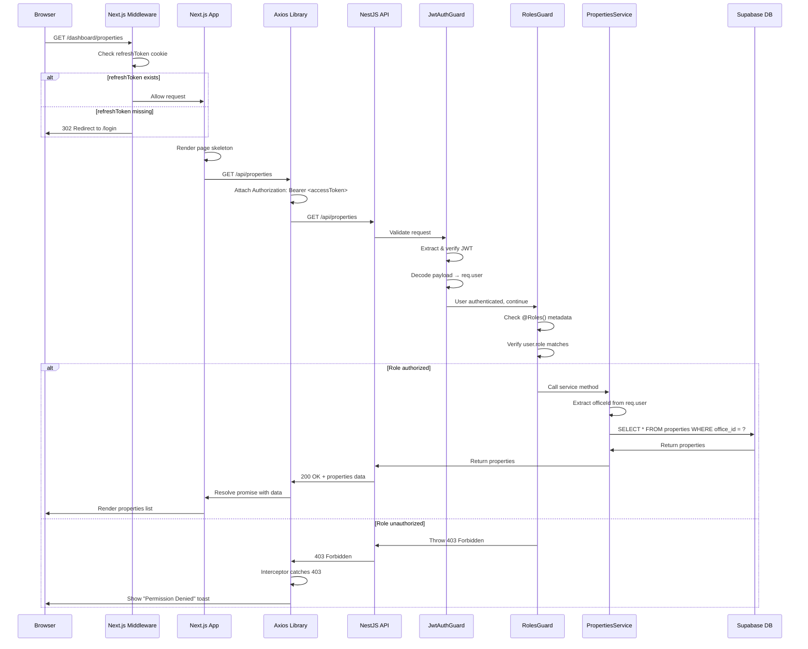
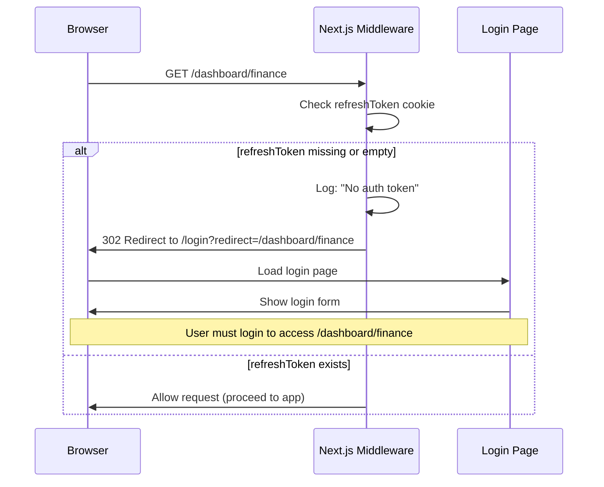
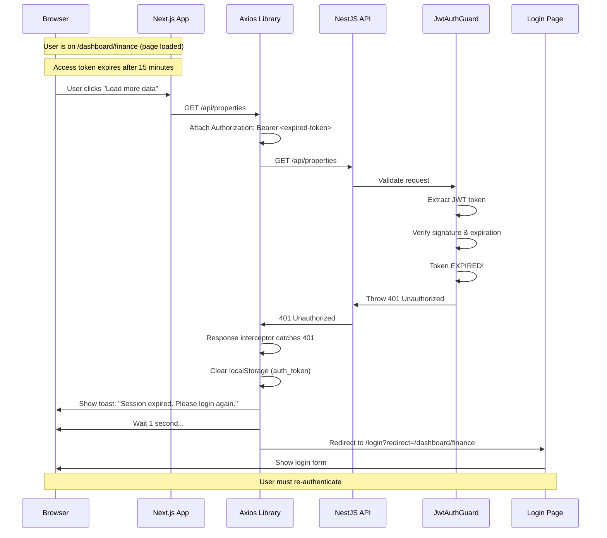
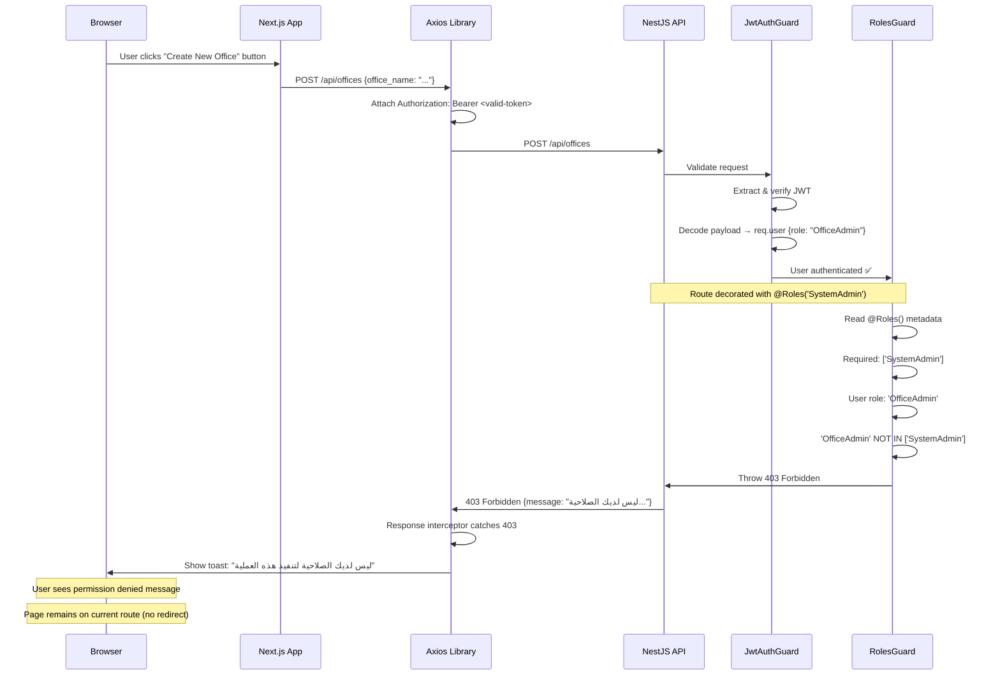

# Architecture Design Document (ADD)

- **Generated**: 2025-11-09 19:56 UTC
- **Scope**: Captures architectural layers, dependencies, and cross-cutting concerns of the Real Estate Management System.

## Environment Topology (2025-11-09 Update)

```
┌───────────────────────┐        ┌────────────────────────┐
│  Production Tier       │        │  Staging Tier           │
│  - Branch: main        │        │  - Branch: develop      │
│  - PM2: api-prod       │        │  - PM2: api-staging     │
│          web-prod      │        │          web-staging    │
│  - Env: .env.production│        │  - Env: .env.staging    │
│  - Hosts: api.example.com /     │  - Hosts: api-staging.example.com /
│           app.example.com       │           staging.example.com      │
└───────────────────────┘        └────────────────────────┘
```

- **Config strategy**: Both tiers share the same codebase; switching is governed by `APP_ENV`, PM2 interpreter args, and environment files under `api/config/env` & `Web/config/env` (see CIP §1.3).  
- **Deployment flow**: feature branches merge into `develop` → auto-deploy staging; release candidates are promoted to `main` → production.  
- **Observability**: staging mirrors production logging, bundle analyzer reports, and Lighthouse budgets before promotion.  
- **Data access**: Supabase service-role keys are segregated per environment; staging never reuses production credentials.

## System Overview
The solution adopts a modular NestJS backend paired with a Next.js frontend. Supabase provides database, authentication, and file storage. Domain modules encapsulate bounded contexts such as Properties, Customers, and Payments.

---

## Security Architecture

### Overview

The Real Estate Management System implements a **Zero Trust** security model with **JWT-based authentication** using Access/Refresh token rotation and **Role-Based Access Control (RBAC)**. The architecture ensures:

1. **Authentication**: All users must prove their identity via JWT tokens
2. **Authorization**: All resources require explicit role-based permissions
3. **Multi-Tenancy**: All data queries are scoped by `office_id` to prevent cross-tenant data leaks
4. **HttpOnly Cookies**: Refresh tokens are stored securely, protected from XSS attacks
5. **Token Rotation**: Refresh tokens are rotated on each use to detect theft

### Security Model: Access Token + Refresh Token

#### Token Types

| Token Type | Purpose | Storage | Lifespan | Vulnerable to XSS | Revocable |
|-----------|---------|---------|----------|-------------------|-----------|
| **Access Token** | Authenticates API requests | `localStorage` | 15 minutes | ⚠️ Yes | No (expires quickly) |
| **Refresh Token** | Issues new access tokens | `HttpOnly Cookie` | 7 days | ✅ No | ✅ Yes (database-backed) |

#### Why This Model?

- **Short-lived access tokens** limit damage if stolen (only 15 min window)
- **Long-lived refresh tokens** provide convenience without compromising security
- **HttpOnly cookies** protect refresh tokens from JavaScript access (XSS mitigation)
- **Database-backed refresh tokens** enable instant revocation (logout from all devices)
- **Token rotation** detects theft (concurrent use invalidates all tokens)

### Security Components

#### Backend Components (NestJS API)

##### 1. JwtAuthGuard (`api/src/auth/guards/jwt-auth.guard.ts`)

**Purpose**: Global authentication guard applied to ALL API endpoints by default.

**How it works**:
1. Applied globally in `main.ts` via `app.useGlobalGuards(new JwtAuthGuard(reflector))`
2. Checks every incoming request for `Authorization: Bearer <token>` header
3. Validates token signature using `JWT_SECRET`
4. Decodes token payload and attaches `user` object to `req.user`
5. Throws `401 Unauthorized` if token is missing, expired, or invalid

**Exemptions**: Routes marked with `@Public()` decorator (e.g., `/auth/login`, `/auth/refresh`)

**Key Code**:
```typescript
@Injectable()
export class JwtAuthGuard extends AuthGuard('jwt') {
  constructor(private reflector: Reflector) {
    super();
  }

  canActivate(context: ExecutionContext) {
    // Check if route is marked @Public()
    const isPublic = this.reflector.getAllAndOverride<boolean>(IS_PUBLIC_KEY, [
      context.getHandler(),
      context.getClass(),
    ]);

    if (isPublic) {
      return true; // Skip auth for public routes
    }

    // Otherwise, validate JWT token
    return super.canActivate(context);
  }
}
```

---

##### 2. RolesGuard (`api/src/auth/roles.guard.ts`)

**Purpose**: Enforces Role-Based Access Control (RBAC) on protected endpoints.

**How it works**:
1. Runs AFTER `JwtAuthGuard` (user is already authenticated)
2. Reads `@Roles()` decorator metadata from route handler
3. Compares user's role (from JWT payload) with required roles
4. Allows access if user's role matches, otherwise throws `403 Forbidden`

**Supported Roles** (hierarchy):
- `SystemAdmin` - Full system access, can manage all offices
- `OfficeAdmin` - Office-level administrator
- `Manager` - Office manager
- `Staff` - Regular office staff
- `Accountant` - Financial operations
- `Technician` - Maintenance operations
- `Owner` - Property owner (external)
- `Tenant` - Property tenant (external)

**Key Code**:
```typescript
@Injectable()
export class RolesGuard implements CanActivate {
  constructor(private readonly reflector: Reflector) {}

  canActivate(context: ExecutionContext): boolean {
    const requiredRoles = this.reflector.getAllAndOverride<AppRole[]>(ROLES_KEY, [
      context.getHandler(),
      context.getClass(),
    ]);

    if (!requiredRoles || requiredRoles.length === 0) {
      return true; // No specific roles required
    }

    const request: any = context.switchToHttp().getRequest();
    const userRole = request?.user?.role;

    if (!userRole || !requiredRoles.includes(userRole)) {
      throw new ForbiddenException('ليس لديك الصلاحية اللازمة لتنفيذ هذه العملية');
    }

    return true;
  }
}
```

---

##### 3. JwtStrategy (`api/src/auth/strategies/jwt.strategy.ts`)

**Purpose**: Passport.js strategy for validating and decoding JWT access tokens.

**How it works**:
1. Extracts token from `Authorization: Bearer <token>` header
2. Verifies token signature using `JWT_SECRET`
3. Decodes payload (contains `sub`, `email`, `role`, `officeId`)
4. Returns user object, which is attached to `req.user` by Passport

**Key Code**:
```typescript
@Injectable()
export class JwtStrategy extends PassportStrategy(Strategy, 'jwt') {
  constructor() {
    super({
      jwtFromRequest: ExtractJwt.fromAuthHeaderAsBearerToken(),
      ignoreExpiration: false,
      secretOrKey: process.env.JWT_SECRET || 'default-secret-change-in-production',
    });
  }

  async validate(payload: any) {
    if (!payload.sub || !payload.email) {
      throw new UnauthorizedException('رمز الدخول غير صالح');
    }

    return {
      id: payload.sub,
      email: payload.email,
      role: payload.role,
      officeId: payload.officeId,
    };
  }
}
```

---

##### 4. RefreshTokenStrategy (`api/src/auth/strategies/refresh.strategy.ts`)

**Purpose**: Passport.js strategy for validating refresh tokens (from cookies or body).

**How it works**:
1. Extracts refresh token from HttpOnly cookie OR request body
2. Verifies token signature using `JWT_REFRESH_SECRET`
3. Validates that token hasn't been revoked in database
4. Returns user object for issuing new token pair

**Key Code**:
```typescript
@Injectable()
export class RefreshTokenStrategy extends PassportStrategy(Strategy, 'jwt-refresh') {
  constructor() {
    super({
      jwtFromRequest: ExtractJwt.fromExtractors([
        (request: Request) => {
          // Try HttpOnly cookie first
          return request?.cookies?.refreshToken || request?.body?.refreshToken;
        },
      ]),
      ignoreExpiration: false,
      secretOrKey: process.env.JWT_REFRESH_SECRET || 'refresh-secret-change-in-production',
    });
  }

  async validate(payload: any) {
    // TODO: Check if token is revoked in database
    return {
      id: payload.sub,
      email: payload.email,
    };
  }
}
```

---

##### 5. @Public() Decorator (`api/src/auth/decorators/public.decorator.ts`)

**Purpose**: Marks routes as public (exempt from global `JwtAuthGuard`).

**Usage**:
```typescript
@Public()
@Post('login')
async login() {
  // Public endpoint - no auth required
}
```

---

##### 6. @Roles() Decorator (`api/src/auth/roles.decorator.ts`)

**Purpose**: Declares which roles are allowed to access a route.

**Usage**:
```typescript
@Roles('SystemAdmin', 'OfficeAdmin', 'Manager')
@Post('properties')
async createProperty() {
  // Only SystemAdmin, OfficeAdmin, and Manager can create properties
}
```

---

#### Frontend Components (Next.js App)

##### 1. Next.js Middleware (`Web/src/middleware.ts`)

**Purpose**: Route protection at the edge - runs before every page request.

**How it works**:
1. Intercepts ALL incoming requests (except public routes and assets)
2. Checks for `refreshToken` HttpOnly cookie
3. If missing → Redirects to `/login?redirect=<current-path>`
4. If present → Allows request to proceed

**Protected Routes**: All routes except `/login`, `/register`, and static assets.

**Key Code**:
```typescript
export function middleware(request: NextRequest) {
  const { pathname } = request.nextUrl;

  // Allow public routes
  if (isPublicPath(pathname)) {
    return NextResponse.next();
  }

  // Check for refresh token cookie
  const refreshToken = request.cookies.get('refreshToken');

  if (!refreshToken || !refreshToken.value) {
    // No token → Redirect to login
    const loginUrl = new URL('/login', request.url);
    loginUrl.searchParams.set('redirect', pathname);
    return NextResponse.redirect(loginUrl);
  }

  // Token exists → Allow request
  return NextResponse.next();
}
```

**Result**: Unauthenticated users cannot access protected pages, even if they manually type URLs.

---

##### 2. Axios Interceptor (`Web/src/lib/api.ts`)

**Purpose**: Handles API authentication and error responses globally.

**Request Interceptor**:
- Attaches `Authorization: Bearer <token>` header to every API request
- Retrieves access token from `localStorage`

**Response Interceptor**:
- **401 Unauthorized**: Clears auth state, shows toast, redirects to login
- **403 Forbidden**: Shows "Permission Denied" toast
- **5xx Server Errors**: Shows generic error toast
- **Network Errors**: Shows connection error toast

**Key Code**:
```typescript
// Response interceptor
api.interceptors.response.use(
  (response) => response,
  (error: AxiosError) => {
    const status = error.response?.status;

    if (typeof window !== 'undefined') {
      switch (status) {
        case 401:
          // Token expired - redirect to login
          localStorage.removeItem('auth_token');
          toast.error('انتهت صلاحية جلستك. يرجى تسجيل الدخول مرة أخرى');
          window.location.href = `/login?redirect=${window.location.pathname}`;
          break;

        case 403:
          // Insufficient permissions
          toast.error('ليس لديك الصلاحية لتنفيذ هذه العملية');
          break;

        // Other error cases...
      }
    }

    return Promise.reject(error);
  }
);
```

**Result**: Users always receive clear feedback for authentication/authorization failures.

---

### Multi-Tenancy: Tenant-Aware Queries

**Core Principle**: Every database query MUST filter by `officeId` to prevent cross-tenant data leaks.

**Pattern**:
```typescript
// Controller: Extract officeId from JWT
@Get('properties')
@Roles('Manager', 'Staff')
async list(@Req() req: any) {
  const officeId = req.user.officeId; // From JWT payload
  return this.propertiesService.findAll(officeId);
}

// Service: Always filter by officeId
async findAll(officeId: string, filters: FilterDto) {
  return await this.supabase.getClient()
    .from('properties')
    .select('*')
    .eq('office_id', officeId) // Critical security filter
    .eq('status', filters.status);
}
```

**Security**: Even if a user knows another office's property UUID, they cannot access it because the `officeId` filter prevents it.

**Documentation**: See `/workspace/api/src/auth/TENANT_AWARE_PATTERN.md` for comprehensive patterns and anti-patterns.

---

### Security Scenario Flows

The following sequence diagrams illustrate end-to-end security flows for different scenarios.

#### Scenario 1: Successful Authenticated Request

**Narrative**: A user navigates to `/dashboard/properties` and successfully loads the properties list.



---

#### Scenario 2: Access with Expired/Invalid Token (Middleware Level)

**Narrative**: A user tries to access `/dashboard/finance` but their refresh token cookie has expired or is missing. The Next.js middleware catches this immediately.



**Key Point**: This happens BEFORE the React app even loads, making it extremely fast and secure.

---

#### Scenario 3: API Call with Expired/Invalid Token (API Level)

**Narrative**: A user is already on a page, but their access token expires while browsing. They trigger an API call, and the NestJS API rejects it with 401 Unauthorized. The Axios interceptor handles the error gracefully.



**Key Point**: Even if the middleware allows the page to load (refresh token valid), the API still validates the access token on every request. This provides defense-in-depth.

---

#### Scenario 4: Insufficient Permissions (RBAC Failure)

**Narrative**: An `OfficeAdmin` user tries to access a `SystemAdmin`-only endpoint (`POST /offices`). The request passes authentication but fails authorization.



**Key Point**: The user is authenticated (valid token) but not authorized (wrong role). This demonstrates the separation between authentication and authorization.

---

### Security Checklist for New Features

When implementing a new feature, verify:

**Backend (NestJS)**:
- [ ] Controller method has `@Roles()` decorator with appropriate roles
- [ ] Service method requires `officeId` as first parameter
- [ ] Database query filters by `officeId` (tenant isolation)
- [ ] Public endpoints are marked with `@Public()` decorator
- [ ] JWT payload is accessed via `req.user` (never from request body)

**Frontend (Next.js)**:
- [ ] Page is protected by middleware (not in public routes list)
- [ ] API calls wrapped in try-catch-finally
- [ ] Loading states set before API call
- [ ] Loading states reset in finally block
- [ ] Success toast shown for mutations (create, update, delete)
- [ ] Error logging to console for debugging

---

### Security Documentation References

**Backend Patterns**:
- Tenant-aware queries: `/workspace/api/src/auth/TENANT_AWARE_PATTERN.md`
- Authentication guards: `/workspace/api/src/auth/guards/`
- Role definitions: `/workspace/api/src/auth/roles.decorator.ts`

**Frontend Patterns**:
- API error handling: `/workspace/Web/src/lib/API_ERROR_HANDLING_PATTERN.md`
- Middleware protection: `/workspace/Web/src/middleware.ts`
- Axios interceptor: `/workspace/Web/src/lib/api.ts`

---

### Security Metrics & Monitoring

**Recommended Monitoring** (to be implemented):
- Failed login attempts (rate limiting)
- Concurrent refresh token usage (potential theft detection)
- 401/403 error rates per endpoint
- Token refresh frequency per user
- Cross-tenant data access attempts (should be 0)

**Audit Logging** (to be implemented):
- User login/logout events
- Role changes
- Permission denied events
- Token revocation events
- Sensitive data access (SystemAdmin viewing all offices)

---

## Analytics Module Architecture

- Controllers: 1
- Services: 1
- DTOs: 0

### Service Layer
- `AnalyticsService` (`/workspace/api/src/analytics/analytics.service.ts`) — injects `supabaseService: SupabaseService`
  - Method `setCache` (20-20) orchestrates:
      private setCache(key: string, data: any, ms: number) { this.cache.set(key, { data, expiresAt: Date.now() + ms }); }
  - Method `dashboard` (22-49) orchestrates:
      async dashboard(officeId: string) {
        const key = `dash:${officeId}`;
        const cached = this.getCache<any>(key);
        if (cached) return cached;

        const supabase = this.supabaseService.getClient();

        const [propsByStatusRes, activeContractsRes, monthlyRevenueRes, pendingPaymentsRes, mntByStatusRes, recentActivityRes] = await Promise.all([
          supabase.rpc('get_properties_by_status', { p_office_id: officeId }),
          supabase.rpc('get_active_contracts_count', { p_office_id: officeId }),
          supabase.rpc('get_monthly_revenue', { p_office_id: officeId }),
          supabase.from('rental_payments').select('*', { count: 'exact', head: true }).eq('office_id', officeId).eq('status', 'pending'),
          supabase.rpc('get_maintenance_by_status', { p_office_id: officeId }),
          supabase.from('maintenance_requests').select('*').eq('office_id', officeId).order('created_at', { ascending: false }).limit(10),
        ]);

        const data = {
          propertiesByStatus: propsByStatusRes.data || [],
          activeContracts: Number(activeContractsRes.data ?? 0),
          monthlyRevenue: Number(monthlyRevenueRes.data ?? 0),
          pendingPayments: Number(pendingPaymentsRes.count ?? 0),
          maintenanceByStatus: mntByStatusRes.data || [],
  - Method `propertiesBreakdown` (51-70) orchestrates:
      async propertiesBreakdown(officeId: string) {
        const supabase = this.supabaseService.getClient();

        const [byTypeRes, byStatusRes, byCityRes, priceAggRes, countsRes] = await Promise.all([
          supabase.rpc('get_properties_by_type', { p_office_id: officeId }),
          supabase.rpc('get_properties_by_status', { p_office_id: officeId }),
          supabase.rpc('get_properties_by_city', { p_office_id: officeId }),
          supabase.rpc('get_properties_price_aggregate', { p_office_id: officeId }),
          supabase.rpc('get_properties_occupancy_counts', { p_office_id: officeId }),
        ]);

        const byType = byTypeRes.data || [];
        const byStatus = byStatusRes.data || [];
        const byCity = byCityRes.data || [];
        const priceAgg = priceAggRes.data?.[0] || { avgprice: 0, totalprice: 0 };
        const counts = countsRes.data?.[0] || { available: 0, total: 0 };
        const occupancy = counts.total ? (1 - Number(counts.available) / Number(counts.total)) : 0;

        return { byType, byStatus, byCity, avgPrice: Number(priceAgg.avgprice ?? 0), totalPrice: Number(priceAgg.totalprice ?? 0), occupancyRate: occupancy };
      }
  - Method `financials` (72-89) orchestrates:
      async financials(officeId: string, reportPeriod?: string) {
        const supabase = this.supabaseService.getClient();
        let query = supabase.from('financial_analytics').select('*').eq('office_id', officeId);
        
        if (reportPeriod) {
          query = query.eq('report_period', reportPeriod);
        }
        
        const { data: rows } = await query.order('report_period', { ascending: true });
        
        const trends = {
          revenue: (rows || []).map(r => Number(r.revenue)),
          expenses: (rows || []).map(r => Number(r.expenses)),
          profit: (rows || []).map(r => Number(r.profit)),
          periods: (rows || []).map(r => r.report_period),
        };
        return { data: rows || [], trends };
      }
  - Method `kpis` (91-99) orchestrates:
      async kpis(officeId: string) {
        const { data: rows } = await this.supabaseService.getClient()
          .from('kpi_tracking')
          .select('*')
          .eq('office_id', officeId);
        
        const data = (rows || []).map(r => ({ name: r.kpi_name, current: Number(r.current_value), target: Number(r.target_value), period: r.report_period }));
        return { data };
      }
  - Method `staffPerformance` (101-112) orchestrates:
      async staffPerformance(officeId: string, staffPhone?: string, reportPeriod?: string) {
        let query = this.supabaseService.getClient()
          .from('staff_performance')
          .select('*')
          .eq('office_id', officeId);
        
        if (staffPhone) query = query.eq('staff_phone', staffPhone);
        if (reportPeriod) query = query.eq('report_period', reportPeriod);
        
        const { data: rows } = await query.order('revenue_generated', { ascending: false });
        return { data: rows || [] };
      }

### Controller Responsibilities
- `AnalyticsController` routes requests through `/workspace/api/src/analytics/analytics.controller.ts` leveraging guards/interceptors.
  - `Get` `/analytics/dashboard` → `async dashboard(@Req() req: any) {`
  - `Get` `/analytics/properties` → `async properties(@Req() req: any) {`
  - `Get` `/analytics/financials` → `async financials(@Req() req: any, @Query('report_period') reportPeriod?: string) {`
  - `Get` `/analytics/kpis` → `async kpis(@Req() req: any) {`
  - `Get` `/analytics/staff-performance` → `async staffPerf(@Req() req: any, @Query('staff_phone') staffPhone?: string, @Query('report_period') reportPeriod?: string) {`

---

## App Module Architecture

- Controllers: 0
- Services: 0
- DTOs: 0

### Frontend Touchpoints
- Component `ExecutiveDashboardPage` (default) in `/workspace/Web/src/app/dashboard/analytics/executive/page.tsx` bridges REST endpoints.
- Component `EditAppointmentPage` (default) in `/workspace/Web/src/app/dashboard/appointments/[id]/edit/page.tsx` bridges REST endpoints.
- Component `AppointmentDetailsPage` (default) in `/workspace/Web/src/app/dashboard/appointments/[id]/page.tsx` bridges REST endpoints.
- Component `NewAppointmentPage` (default) in `/workspace/Web/src/app/dashboard/appointments/new/page.tsx` bridges REST endpoints.
- Component `AppointmentsPage` (default) in `/workspace/Web/src/app/dashboard/appointments/page.tsx` bridges REST endpoints.
- Component `ContractsPage` (default) in `/workspace/Web/src/app/dashboard/contracts/page.tsx` bridges REST endpoints.
- Component `EditCustomerPage` (default) in `/workspace/Web/src/app/dashboard/customers/[id]/edit/page.tsx` bridges REST endpoints.
- Component `CustomerDetailsPage` (default) in `/workspace/Web/src/app/dashboard/customers/[id]/page.tsx` bridges REST endpoints.
- Component `CustomersExportPage` (default) in `/workspace/Web/src/app/dashboard/customers/export/page.tsx` bridges REST endpoints.
- Component `NewCustomerPage` (default) in `/workspace/Web/src/app/dashboard/customers/new/page.tsx` bridges REST endpoints.
- Component `CustomersPage` (default) in `/workspace/Web/src/app/dashboard/customers/page.tsx` bridges REST endpoints.
- Component `handleExport` (named) in `/workspace/Web/src/app/dashboard/customers/page.tsx` bridges REST endpoints.
- Component `CustomersTemplatesPage` (default) in `/workspace/Web/src/app/dashboard/customers/templates/page.tsx` bridges REST endpoints.
- Component `FinancePage` (default) in `/workspace/Web/src/app/dashboard/finance/page.tsx` bridges REST endpoints.
- Component `DashboardLayout` (default) in `/workspace/Web/src/app/dashboard/layout.tsx` bridges REST endpoints.
- Component `MaintenancePage` (default) in `/workspace/Web/src/app/dashboard/maintenance/page.tsx` bridges REST endpoints.
- Component `DashboardPage` (default) in `/workspace/Web/src/app/dashboard/page.tsx` bridges REST endpoints.
- Component `PaymentsPage` (default) in `/workspace/Web/src/app/dashboard/payments/page.tsx` bridges REST endpoints.
- Component `PropertyDetailsPage` (default) in `/workspace/Web/src/app/dashboard/properties/[id]/page.tsx` bridges REST endpoints.
- Component `ExportPropertiesPage` (default) in `/workspace/Web/src/app/dashboard/properties/export/page.tsx` bridges REST endpoints.
- Component `ImportPropertiesPage` (default) in `/workspace/Web/src/app/dashboard/properties/import/page.tsx` bridges REST endpoints.
- Component `NewPropertyPage` (default) in `/workspace/Web/src/app/dashboard/properties/new/page.tsx` bridges REST endpoints.
- Component `PropertiesPage` (default) in `/workspace/Web/src/app/dashboard/properties/page.tsx` bridges REST endpoints.
- Component `SettingsPage` (default) in `/workspace/Web/src/app/dashboard/settings/page.tsx` bridges REST endpoints.
- Component `metadata` (named) in `/workspace/Web/src/app/layout.tsx` bridges REST endpoints.
- Component `RootLayout` (default) in `/workspace/Web/src/app/layout.tsx` bridges REST endpoints.
- Component `LoginPage` (default) in `/workspace/Web/src/app/login/page.tsx` bridges REST endpoints.
- Component `Home` (default) in `/workspace/Web/src/app/page.tsx` bridges REST endpoints.
- Component `PublicMaintenancePage` (default) in `/workspace/Web/src/app/public/maintenance/page.tsx` bridges REST endpoints.

---

## Appointments Module Architecture

- Controllers: 1
- Services: 1
- DTOs: 7

### Service Layer
- `AppointmentsService` (`/workspace/api/src/appointments/appointments.service.ts`) — injects `supabase: SupabaseService`
  - Method `create` (33-57) orchestrates:
      async create(officeId: string, userId: string, dto: CreateAppointmentDto) {
        const { data, error } = await this.supabase.getClient()
          .from('appointments')
          .insert({
            office_id: officeId,
            title: dto.title,
            description: dto.description,
            type: dto.type,
            status: 'scheduled',
            date: dto.date,
            start_time: dto.startTime,
            end_time: dto.endTime,
            property_id: dto.propertyId,
            customer_id: dto.customerId,
            assigned_staff_id: dto.assignedStaffId,
            location: dto.location,
            meeting_link: dto.meetingLink,
            notes: dto.notes,
            created_by: userId,
          })
          .select()
          .single();
  - Method `findAll` (59-92) orchestrates:
      async findAll(officeId: string, filters?: any) {
        // Pagination
        const page: number = Math.max(1, Number(filters?.page ?? 1));
        const limit: number = Math.min(100, Math.max(1, Number(filters?.limit ?? 50)));
        const start = (page - 1) * limit;
        const end = start + limit - 1;

        // Base query with total count
        let query = this.supabase
          .getClient()
          .from('appointments')
          .select('*', { count: 'exact' })
          .eq('office_id', officeId);
        
        // Filters
        if (filters?.status && filters.status !== 'all') query = query.eq('status', filters.status);
        if (filters?.date) query = query.eq('date', filters.date);
        if (filters?.type && filters.type !== 'all') query = query.eq('type', filters.type);
        if (filters?.assigned_staff_id) query = query.eq('assigned_staff_id', filters.assigned_staff_id);
        if (filters?.property_id) query = query.eq('property_id', filters.property_id);
        if (filters?.customer_id) query = query.eq('customer_id', filters.customer_id);
  - Method `findOne` (94-103) orchestrates:
      async findOne(officeId: string, id: string) {
        const { data, error } = await this.supabase.getClient()
          .from('appointments')
          .select('*')
          .eq('id', id)
          .eq('office_id', officeId)
          .single();
        if (error) throw new NotFoundException();
        return data;
      }
  - Method `update` (105-120) orchestrates:
      async update(officeId: string, id: string, dto: UpdateAppointmentDto) {
        const updates: any = { updated_at: new Date().toISOString() };
        if (dto.title) updates.title = dto.title;
        if (dto.startTime) updates.start_time = dto.startTime;
        if (dto.endTime) updates.end_time = dto.endTime;

        const { data, error } = await this.supabase.getClient()
          .from('appointments')
          .update(updates)
          .eq('id', id)
          .eq('office_id', officeId)
          .select()
          .single();
        if (error) throw error;
        return data;
      }
  - Method `remove` (122-130) orchestrates:
      async remove(officeId: string, id: string) {
        const { error } = await this.supabase.getClient()
          .from('appointments')
          .delete()
          .eq('id', id)
          .eq('office_id', officeId);
        if (error) throw error;
        return { message: 'Appointment deleted' };
      }
  - Method `getStats` (132-134) orchestrates:
      async getStats(officeId: string) {
        return { total: 0, today: 0, upcoming: 0 };
      }
  - Method `getCalendar` (136-138) orchestrates:
      async getCalendar(officeId: string, startDate: string, endDate: string) {
        return [];
      }
  - Method `getToday` (140-142) orchestrates:
      async getToday(officeId: string) {
        return [];
      }
  - Method `getUpcoming` (144-146) orchestrates:
      async getUpcoming(officeId: string, limit?: number) {
        return [];
      }
  - Method `updateStatus` (148-150) orchestrates:
      async updateStatus(officeId: string, id: string, userId: string, dto: any) {
        return {};
      }
  - Method `cancel` (152-154) orchestrates:
      async cancel(officeId: string, id: string, userId: string, dto: any) {
        return {};
      }
  - Method `complete` (156-158) orchestrates:
      async complete(officeId: string, id: string, dto: any) {
        return {};
      }
  - Method `sendReminder` (160-162) orchestrates:
      async sendReminder(officeId: string, id: string) {
        return { message: 'Reminder sent' };
      }
  - Method `checkAvailability` (164-166) orchestrates:
      async checkAvailability(officeId: string, dto: any) {
        return { available: true };
      }

### Controller Responsibilities
- `AppointmentsController` routes requests through `/workspace/api/src/appointments/appointments.controller.ts` leveraging guards/interceptors.
  - `Get` `/appointments` → `async findAll(@Req() req: any, @Query() filters: FilterAppointmentsDto) {`
  - `Get` `/appointments/stats` → `async getStats(@Req() req: any) {`
  - `Get` `/appointments/today` → `async getToday(@Req() req: any) {`
  - `Get` `/appointments/upcoming` → `async getUpcoming(@Req() req: any, @Query('limit') limit?: number) {`
  - `Get` `/appointments/:id` → `async findOne(@Req() req: any, @Param('id') id: string) {`
  - `Post` `/appointments` → `async create(@Req() req: any, @Body() dto: CreateAppointmentDto) {`
  - `Patch` `/appointments/:id` → `async update(@Req() req: any, @Param('id') id: string, @Body() dto: UpdateAppointmentDto) {`
  - `Delete` `/appointments/:id` → `async remove(@Req() req: any, @Param('id') id: string) {`
  - `Patch` `/appointments/:id/status` → `async updateStatus(@Req() req: any, @Param('id') id: string, @Body() dto: UpdateStatusDto) {`
  - `Patch` `/appointments/:id/cancel` → `async cancel(@Req() req: any, @Param('id') id: string, @Body() dto: CancelAppointmentDto) {`
  - `Patch` `/appointments/:id/complete` → `async complete(@Req() req: any, @Param('id') id: string, @Body() dto: CompleteAppointmentDto) {`
  - `Post` `/appointments/:id/remind` → `async sendReminder(@Req() req: any, @Param('id') id: string) {`
  - `Post` `/appointments/check-availability` → `async checkAvailability(@Req() req: any, @Body() dto: CheckAvailabilityDto) {`

### Data Contracts
- `CancelAppointmentDto` defines 1 fields (source: `/workspace/api/src/appointments/dto/cancel-appointment.dto.ts`).
- `CheckAvailabilityDto` defines 4 fields (source: `/workspace/api/src/appointments/dto/check-availability.dto.ts`).
- `CompleteAppointmentDto` defines 1 fields (source: `/workspace/api/src/appointments/dto/complete-appointment.dto.ts`).
- `CreateAppointmentDto` defines 0 fields (source: `/workspace/api/src/appointments/dto/create-appointment.dto.ts`).
- `FilterAppointmentsDto` defines 13 fields (source: `/workspace/api/src/appointments/dto/filter-appointments.dto.ts`).
- `UpdateAppointmentDto` defines 0 fields (source: `/workspace/api/src/appointments/dto/update-appointment.dto.ts`).
- `UpdateStatusDto` defines 2 fields (source: `/workspace/api/src/appointments/dto/update-status.dto.ts`).

---

## Components Module Architecture

- Controllers: 0
- Services: 0
- DTOs: 0

### Frontend Touchpoints
- Component `GoalsTracking` (named) in `/workspace/Web/src/components/analytics/executive/GoalsTracking.tsx` bridges REST endpoints.
- Component `KPIsGrid` (named) in `/workspace/Web/src/components/analytics/executive/KPIsGrid.tsx` bridges REST endpoints.
- Component `MarketInsights` (named) in `/workspace/Web/src/components/analytics/executive/MarketInsights.tsx` bridges REST endpoints.
- Component `RevenueBreakdown` (named) in `/workspace/Web/src/components/analytics/executive/RevenueBreakdown.tsx` bridges REST endpoints.
- Component `SalesFunnel` (named) in `/workspace/Web/src/components/analytics/executive/SalesFunnel.tsx` bridges REST endpoints.
- Component `SummaryCards` (named) in `/workspace/Web/src/components/analytics/executive/SummaryCards.tsx` bridges REST endpoints.
- Component `TopPerformers` (named) in `/workspace/Web/src/components/analytics/executive/TopPerformers.tsx` bridges REST endpoints.
- Component `AppointmentCalendar` (named) in `/workspace/Web/src/components/appointments/AppointmentCalendar.tsx` bridges REST endpoints.
- Component `AppointmentCard` (named) in `/workspace/Web/src/components/appointments/AppointmentCard.tsx` bridges REST endpoints.
- Component `AppointmentDetailsCard` (named) in `/workspace/Web/src/components/appointments/AppointmentDetailsCard.tsx` bridges REST endpoints.
- Component `AppointmentForm` (named) in `/workspace/Web/src/components/appointments/AppointmentForm.tsx` bridges REST endpoints.
- Component `AppointmentStats` (named) in `/workspace/Web/src/components/appointments/AppointmentStats.tsx` bridges REST endpoints.
- Component `AppointmentsFilters` (named) in `/workspace/Web/src/components/appointments/AppointmentsFilters.tsx` bridges REST endpoints.
- Component `AppointmentsList` (named) in `/workspace/Web/src/components/appointments/AppointmentsList.tsx` bridges REST endpoints.
- Component `CancelDialog` (named) in `/workspace/Web/src/components/appointments/CancelDialog.tsx` bridges REST endpoints.
- Component `CompleteDialog` (named) in `/workspace/Web/src/components/appointments/CompleteDialog.tsx` bridges REST endpoints.
- Component `QuickAddDialog` (named) in `/workspace/Web/src/components/appointments/QuickAddDialog.tsx` bridges REST endpoints.
- Component `StatusUpdateDialog` (named) in `/workspace/Web/src/components/appointments/StatusUpdateDialog.tsx` bridges REST endpoints.
- Component `ContractCard` (named) in `/workspace/Web/src/components/contracts/ContractCard.tsx` bridges REST endpoints.
- Component `ContractsFilters` (named) in `/workspace/Web/src/components/contracts/ContractsFilters.tsx` bridges REST endpoints.
- Component `ContractsTable` (named) in `/workspace/Web/src/components/contracts/ContractsTable.tsx` bridges REST endpoints.
- Component `StatsCards` (named) in `/workspace/Web/src/components/contracts/StatsCards.tsx` bridges REST endpoints.
- Component `AddInteractionDialog` (named) in `/workspace/Web/src/components/customers/AddInteractionDialog.tsx` bridges REST endpoints.
- Component `AddNoteDialog` (named) in `/workspace/Web/src/components/customers/AddNoteDialog.tsx` bridges REST endpoints.
- Component `CustomerCard` (named) in `/workspace/Web/src/components/customers/CustomerCard.tsx` bridges REST endpoints.
- Component `CustomerContractsList` (named) in `/workspace/Web/src/components/customers/CustomerContractsList.tsx` bridges REST endpoints.
- Component `CustomerFilters` (named) in `/workspace/Web/src/components/customers/CustomerFilters.tsx` bridges REST endpoints.
- Component `CustomerForm` (named) in `/workspace/Web/src/components/customers/CustomerForm.tsx` bridges REST endpoints.
- Component `CustomerInfoCard` (named) in `/workspace/Web/src/components/customers/CustomerInfoCard.tsx` bridges REST endpoints.
- Component `CustomerInteractionsList` (named) in `/workspace/Web/src/components/customers/CustomerInteractionsList.tsx` bridges REST endpoints.
- Component `CustomerNotesList` (named) in `/workspace/Web/src/components/customers/CustomerNotesList.tsx` bridges REST endpoints.
- Component `CustomerPagination` (named) in `/workspace/Web/src/components/customers/CustomerPagination.tsx` bridges REST endpoints.
- Component `CustomerPropertiesList` (named) in `/workspace/Web/src/components/customers/CustomerPropertiesList.tsx` bridges REST endpoints.
- Component `CustomerStats` (named) in `/workspace/Web/src/components/customers/CustomerStats.tsx` bridges REST endpoints.
- Component `ColumnSelector` (named) in `/workspace/Web/src/components/customers/export/ColumnSelector.tsx` bridges REST endpoints.
- Component `ExportHistory` (named) in `/workspace/Web/src/components/customers/export/ExportHistory.tsx` bridges REST endpoints.
- Component `ExportOptions` (named) in `/workspace/Web/src/components/customers/export/ExportOptions.tsx` bridges REST endpoints.
- Component `ExportPreview` (named) in `/workspace/Web/src/components/customers/export/ExportPreview.tsx` bridges REST endpoints.
- Component `ExportProgress` (named) in `/workspace/Web/src/components/customers/export/ExportProgress.tsx` bridges REST endpoints.
- Component `FormatOptions` (named) in `/workspace/Web/src/components/customers/export/FormatOptions.tsx` bridges REST endpoints.
- Component `CustomTemplateCreator` (named) in `/workspace/Web/src/components/customers/templates/CustomTemplateCreator.tsx` bridges REST endpoints.
- Component `MyTemplates` (named) in `/workspace/Web/src/components/customers/templates/MyTemplates.tsx` bridges REST endpoints.
- Component `TemplateCard` (named) in `/workspace/Web/src/components/customers/templates/TemplateCard.tsx` bridges REST endpoints.
- Component `TemplatesGallery` (named) in `/workspace/Web/src/components/customers/templates/TemplatesGallery.tsx` bridges REST endpoints.
- Component `Header` (named) in `/workspace/Web/src/components/dashboard/Header.tsx` bridges REST endpoints.
- Component `Sidebar` (named) in `/workspace/Web/src/components/dashboard/Sidebar.tsx` bridges REST endpoints.
- Component `ActiveContractsTable` (named) in `/workspace/Web/src/components/finance/ActiveContractsTable.tsx` bridges REST endpoints.
- Component `BudgetSection` (named) in `/workspace/Web/src/components/finance/BudgetSection.tsx` bridges REST endpoints.
- Component `CashFlowChart` (named) in `/workspace/Web/src/components/finance/CashFlowChart.tsx` bridges REST endpoints.
- Component `DateRangeFilter` (named) in `/workspace/Web/src/components/finance/DateRangeFilter.tsx` bridges REST endpoints.
- Component `ExpensesDonutChart` (named) in `/workspace/Web/src/components/finance/ExpensesDonutChart.tsx` bridges REST endpoints.
- Component `KPICards` (named) in `/workspace/Web/src/components/finance/KPICards.tsx` bridges REST endpoints.
- Component `ProfitLossStatementComponent` (named) in `/workspace/Web/src/components/finance/ProfitLossStatement.tsx` bridges REST endpoints.
- Component `ReportGenerator` (named) in `/workspace/Web/src/components/finance/ReportGenerator.tsx` bridges REST endpoints.
- Component `RevenueChart` (named) in `/workspace/Web/src/components/finance/RevenueChart.tsx` bridges REST endpoints.
- Component `RevenuePieChart` (named) in `/workspace/Web/src/components/finance/RevenuePieChart.tsx` bridges REST endpoints.
- Component `TopPropertiesTable` (named) in `/workspace/Web/src/components/finance/TopPropertiesTable.tsx` bridges REST endpoints.
- Component `NotificationsPanel` (named) in `/workspace/Web/src/components/layout/NotificationsPanel.tsx` bridges REST endpoints.
- Component `MaintenanceStats` (named) in `/workspace/Web/src/components/maintenance/MaintenanceStats.tsx` bridges REST endpoints.
- Component `RequestsTable` (named) in `/workspace/Web/src/components/maintenance/RequestsTable.tsx` bridges REST endpoints.
- Component `BulkActions` (named) in `/workspace/Web/src/components/payments/BulkActions.tsx` bridges REST endpoints.
- Component `OverdueAlerts` (named) in `/workspace/Web/src/components/payments/OverdueAlerts.tsx` bridges REST endpoints.
- Component `PaymentCharts` (named) in `/workspace/Web/src/components/payments/PaymentCharts.tsx` bridges REST endpoints.
- Component `PaymentFiltersComponent` (named) in `/workspace/Web/src/components/payments/PaymentFilters.tsx` bridges REST endpoints.
- Component `PaymentStats` (named) in `/workspace/Web/src/components/payments/PaymentStats.tsx` bridges REST endpoints.
- Component `PaymentsTable` (named) in `/workspace/Web/src/components/payments/PaymentsTable.tsx` bridges REST endpoints.
- Component `QuickActions` (named) in `/workspace/Web/src/components/payments/QuickActions.tsx` bridges REST endpoints.
- Component `StatsCards` (named) in `/workspace/Web/src/components/payments/StatsCards.tsx` bridges REST endpoints.
- Component `PropertiesFilters` (named) in `/workspace/Web/src/components/properties/PropertiesFilters.tsx` bridges REST endpoints.
- Component `PropertiesPagination` (named) in `/workspace/Web/src/components/properties/PropertiesPagination.tsx` bridges REST endpoints.
- Component `PropertyCard` (named) in `/workspace/Web/src/components/properties/PropertyCard.tsx` bridges REST endpoints.
- Component `ColumnMapper` (named) in `/workspace/Web/src/components/properties/import/ColumnMapper.tsx` bridges REST endpoints.
- Component `DataPreview` (named) in `/workspace/Web/src/components/properties/import/DataPreview.tsx` bridges REST endpoints.
- Component `ExcelUploader` (named) in `/workspace/Web/src/components/properties/import/ExcelUploader.tsx` bridges REST endpoints.
- Component `ImportProgress` (named) in `/workspace/Web/src/components/properties/import/ImportProgress.tsx` bridges REST endpoints.
- Component `ValidationSummary` (named) in `/workspace/Web/src/components/properties/import/ValidationSummary.tsx` bridges REST endpoints.

---

## Customers Module Architecture

- Controllers: 2
- Services: 2
- DTOs: 13

### Service Layer
- `CustomersService` (`/workspace/api/src/customers/customers.service.ts`) — injects `supabase: SupabaseService`
  - Method `create` (33-57) orchestrates:
      async create(officeId: string, userId: string, dto: CreateCustomerDto) {
        const { data, error } = await this.supabase.getClient()
          .from('customers')
          .insert({
            office_id: officeId,
            name: dto.name,
            phone: dto.phone,
            email: dto.email || null,
            national_id: dto.nationalId || null,
            type: dto.type,
            status: dto.status || 'potential',
            address: dto.address || null,
            city: dto.city || null,
            preferred_contact_method: dto.preferredContactMethod || 'phone',
            notes: dto.notes || null,
            tags: dto.tags || [],
            source: dto.source || null,
            rating: dto.rating || null,
            created_by: userId,
          })
          .select()
          .single();
  - Method `findAll` (59-98) orchestrates:
      async findAll(officeId: string, filters?: any) {
        // Pagination
        const page: number = Math.max(1, Number(filters?.page ?? 1));
        const limit: number = Math.min(100, Math.max(1, Number(filters?.limit ?? 20)));
        const start = (page - 1) * limit;
        const end = start + limit - 1;

        // Base query with total count
        let query = this.supabase
          .getClient()
          .from('customers')
          .select('*', { count: 'exact' })
          .eq('office_id', officeId);

        // Filters (minimal useful subset; extend as needed)
        if (filters?.type && filters.type !== 'all') query = query.eq('type', filters.type);
        if (filters?.status && filters.status !== 'all') query = query.eq('status', filters.status);
        if (filters?.city) query = query.eq('city', filters.city);
        if (filters?.assigned_staff_id) query = query.eq('assigned_staff_id', filters.assigned_staff_id);
        if (filters?.search) {
          const term = String(filters.search).trim();
          if (term) {
  - Method `findOne` (100-109) orchestrates:
      async findOne(officeId: string, id: string) {
        const { data, error } = await this.supabase.getClient()
          .from('customers')
          .select('*')
          .eq('id', id)
          .eq('office_id', officeId)
          .single();
        if (error) throw new NotFoundException();
        return data;
      }
  - Method `update` (111-130) orchestrates:
      async update(officeId: string, id: string, dto: UpdateCustomerDto) {
        const updates: any = { updated_at: new Date().toISOString() };
        if (dto.name) updates.name = dto.name;
        if (dto.phone) updates.phone = dto.phone;
        if (dto.email) updates.email = dto.email;
        if (dto.nationalId) updates.national_id = dto.nationalId;
        if (dto.type) updates.type = dto.type;
        if (dto.status) updates.status = dto.status;
        if (dto.preferredContactMethod) updates.preferred_contact_method = dto.preferredContactMethod;

        const { data, error } = await this.supabase.getClient()
          .from('customers')
          .update(updates)
          .eq('id', id)
          .eq('office_id', officeId)
          .select()
          .single();
        if (error) throw error;
        return data;
      }
  - Method `remove` (132-140) orchestrates:
      async remove(officeId: string, id: string) {
        const { error } = await this.supabase.getClient()
          .from('customers')
          .delete()
          .eq('id', id)
          .eq('office_id', officeId);
        if (error) throw error;
        return { message: 'Customer deleted' };
      }
  - Method `getStats` (142-144) orchestrates:
      async getStats(officeId: string) {
        return { total: 0, active: 0, potential: 0 };
      }
  - Method `search` (146-153) orchestrates:
      async search(officeId: string, term: string) {
        const { data } = await this.supabase.getClient()
          .from('customers')
          .select('*')
          .eq('office_id', officeId)
          .or(`name.ilike.%${term}%,phone.ilike.%${term}%`);
        return data || [];
      }
  - Method `exportExcel` (155-157) orchestrates:
      async exportExcel(officeId: string) {
        return [];
      }
  - Method `getNotes` (159-161) orchestrates:
      async getNotes(officeId: string, customerId: string) {
        return [];
      }
  - Method `createNote` (163-165) orchestrates:
      async createNote(officeId: string, customerId: string, userId: string, dto: any) {
        return {};
      }
  - Method `updateNote` (167-169) orchestrates:
      async updateNote(officeId: string, customerId: string, noteId: string, dto: any) {
        return {};
      }
  - Method `removeNote` (171-173) orchestrates:
      async removeNote(officeId: string, customerId: string, noteId: string) {
        return { message: 'Note deleted' };
      }
  - Method `getInteractions` (175-177) orchestrates:
      async getInteractions(officeId: string, customerId: string) {
        return [];
      }
  - Method `createInteraction` (179-181) orchestrates:
      async createInteraction(officeId: string, customerId: string, userId: string, dto: any) {
        return {};
      }
  - Method `linkProperty` (183-185) orchestrates:
      async linkProperty(officeId: string, customerId: string, dto: any) {
        return {};
      }
  - Method `unlinkProperty` (187-189) orchestrates:
      async unlinkProperty(officeId: string, customerId: string, propertyId: string) {
        return { message: 'Property unlinked' };
      }
- `ExcelService` (`/workspace/api/src/customers/excel.service.ts`) — stateless service

### Controller Responsibilities
- `CustomersController` routes requests through `/workspace/api/src/customers/customers.controller.ts` leveraging guards/interceptors.
  - `Get` `/customers` → `async findAll(@Req() req: any, @Query() filters: FilterCustomersDto) {`
  - `Get` `/customers/stats` → `async getStats(@Req() req: any) {`
  - `Get` `/customers/search` → `async search(@Req() req: any, @Query('q') searchTerm: string) {`
  - `Get` `/customers/export` → `async exportExcel(@Req() req: any, @Res({ passthrough: true }) res: Response) {`
  - `Get` `/customers/:id` → `async findOne(@Req() req: any, @Param('id') id: string) {`
  - `Post` `/customers` → `async create(@Req() req: any, @Body() dto: CreateCustomerDto) {`
  - `Patch` `/customers/:id` → `async update(@Req() req: any, @Param('id') id: string, @Body() dto: UpdateCustomerDto) {`
  - `Delete` `/customers/:id` → `async remove(@Req() req: any, @Param('id') id: string) {`
  - `Get` `/customers/:id/notes` → `async getNotes(@Req() req: any, @Param('id') customerId: string) {`
  - `Post` `/customers/:id/notes` → `async createNote(@Req() req: any, @Param('id') customerId: string, @Body() dto: CreateCustomerNoteDto) {`
  - `Delete` `/customers/:id/notes/:noteId` → `async removeNote(@Req() req: any, @Param('id') customerId: string, @Param('noteId') noteId: string) {`
  - `Get` `/customers/:id/interactions` → `async getInteractions(@Req() req: any, @Param('id') customerId: string) {`
  - `Post` `/customers/:id/properties` → `async linkProperty(@Req() req: any, @Param('id') customerId: string, @Body() dto: LinkPropertyDto) {`
- `ExcelController` routes requests through `/workspace/api/src/customers/excel.controller.ts` leveraging guards/interceptors.
  - `Get` `/customers/excel/templates` → `async getTemplates() {`
  - `Post` `/customers/excel/validate-file` → `async validateFile(@UploadedFile() file: Express.Multer.File) {`
  - `Get` `/customers/excel/import-stats` → `async getImportStats() {`

### Data Contracts
- `CreateCustomerInteractionDto` defines 8 fields (source: `/workspace/api/src/customers/dto/create-customer-interaction.dto.ts`).
- `CreateCustomerNoteDto` defines 3 fields (source: `/workspace/api/src/customers/dto/create-customer-note.dto.ts`).
- `CreateCustomerDto` defines 0 fields (source: `/workspace/api/src/customers/dto/create-customer.dto.ts`).
- `CustomerFiltersDto` defines 8 fields (source: `/workspace/api/src/customers/dto/export-customers.dto.ts`).
- `ExportCustomersDto` defines 6 fields (source: `/workspace/api/src/customers/dto/export-customers.dto.ts`).
- `ExportTemplateDto` defines 4 fields (source: `/workspace/api/src/customers/dto/export-customers.dto.ts`).
- `FilterCustomersDto` defines 11 fields (source: `/workspace/api/src/customers/dto/filter-customers.dto.ts`).
- `ColumnMappingDto` defines 4 fields (source: `/workspace/api/src/customers/dto/import-customers.dto.ts`).
- `ImportCustomersDto` defines 5 fields (source: `/workspace/api/src/customers/dto/import-customers.dto.ts`).
- `PreviewImportDto` defines 2 fields (source: `/workspace/api/src/customers/dto/import-customers.dto.ts`).
- `LinkPropertyDto` defines 4 fields (source: `/workspace/api/src/customers/dto/link-property.dto.ts`).
- `UpdateCustomerNoteDto` defines 0 fields (source: `/workspace/api/src/customers/dto/update-customer-note.dto.ts`).
- `UpdateCustomerDto` defines 0 fields (source: `/workspace/api/src/customers/dto/update-customer.dto.ts`).

---

## Health Module Architecture

- Controllers: 1
- Services: 0
- DTOs: 0

### Controller Responsibilities
- `HealthController` routes requests through `/workspace/api/src/health/health.controller.ts` leveraging guards/interceptors.

---

## Integrations Module Architecture

- Controllers: 0
- Services: 1
- DTOs: 0

### Service Layer
- `N8nService` (`/workspace/api/src/integrations/n8n/n8n.service.ts`) — injects `supabase: SupabaseService`

---

## Maintenance Module Architecture

- Controllers: 1
- Services: 1
- DTOs: 5

### Service Layer
- `MaintenanceService` (`/workspace/api/src/maintenance/maintenance.service.ts`) — injects `supabase: SupabaseService`, `n8n: N8nService`
  - Method `list` (16-35) orchestrates:
      async list(officeId: string, filters: any) {
        let query = this.supabase.getClient()
          .from('maintenance_requests')
          .select('*, property:properties(*)')
          .eq('office_id', officeId);

        if (filters.status) query = query.eq('status', filters.status);
        if (filters.priority) query = query.eq('priority', filters.priority);
        if (filters.issue_type) query = query.eq('issue_type', filters.issue_type);
        if (filters.property_id) query = query.eq('property_id', filters.property_id);
        if (filters.tenant_phone) query = query.eq('tenant_phone', filters.tenant_phone);
        if (filters.assigned_technician) query = query.eq('assigned_technician', filters.assigned_technician);

        query = query.order('created_at', { ascending: false });

        const { data, error } = await query;
        if (error) throw error;

        return data || [];
      }
  - Method `getOne` (37-47) orchestrates:
      async getOne(officeId: string, id: string) {
        const { data, error } = await this.supabase.getClient()
          .from('maintenance_requests')
          .select('*, property:properties(*)')
          .eq('id', id)
          .eq('office_id', officeId)
          .single();

        if (error || !data) throw new NotFoundException('سجل الصيانة غير موجود');
        return data;
      }
  - Method `createInternal` (49-88) orchestrates:
      async createInternal(officeId: string, officeCode: string, userId: string | null, dto: CreateMaintenanceDto) {
        const cleanedPhone = sanitizePhone(dto.tenant_phone);
        const requestNumber = await this.generateRequestNumber(officeCode);

        const { data: saved, error } = await this.supabase.getClient()
          .from('maintenance_requests')
          .insert({
            office_id: officeId,
            property_id: dto.property_id ?? null,
            tenant_phone: cleanedPhone ?? null,
            tenant_name: dto.tenant_name ?? null,
            issue_type: dto.issue_type,
            priority: dto.priority,
            description: dto.description ?? null,
            before_images: dto.before_images ?? null,
            status: 'new',
            request_number: requestNumber,
          })
          .select()
          .single();

        if (error) throw error;
  - Method `createPublic` (90-132) orchestrates:
      async createPublic(officeId: string, officeCode: string, dto: PublicCreateMaintenanceDto) {
        if (!dto.property_id && !dto.title) {
          throw new BadRequestException('يجب تحديد العقار أو عنوان البلاغ');
        }
        const cleanedPhone = sanitizePhone(dto.tenant_phone);
        const requestNumber = await this.generateRequestNumber(officeCode);

        const { data: saved, error } = await this.supabase.getClient()
          .from('maintenance_requests')
          .insert({
            office_id: officeId,
            property_id: dto.property_id ?? null,
            tenant_phone: cleanedPhone ?? null,
            tenant_name: dto.tenant_name ?? null,
            issue_type: dto.issue_type,
            priority: dto.priority,
            description: dto.description ?? dto.title ?? null,
            before_images: dto.before_images ?? null,
            status: 'new',
            request_number: requestNumber,
          })
          .select()
  - Method `update` (134-162) orchestrates:
      async update(officeId: string, id: string, dto: UpdateMaintenanceDto) {
        const item = await this.getOne(officeId, id);

        const nextStatus = dto.status ?? item.status;
        if (!isValidTransition(item.status, nextStatus)) {
          throw new BadRequestException('انتقال حالة غير مسموح');
        }

        const updates: any = { status: nextStatus };
        if (dto.assigned_technician) updates.assigned_technician = dto.assigned_technician;
        if (dto.technician_name) updates.technician_name = dto.technician_name;
        if (dto.scheduled_date) updates.scheduled_date = new Date(dto.scheduled_date).toISOString();
        if (dto.estimated_cost) updates.estimated_cost = dto.estimated_cost;
        if (dto.actual_cost) updates.actual_cost = dto.actual_cost;
        if (dto.who_pays) updates.who_pays = dto.who_pays;
        if (dto.before_images) updates.before_images = dto.before_images;
        if (dto.after_images) updates.after_images = dto.after_images;
        if (dto.technician_notes) updates.technician_notes = dto.technician_notes;

        const { data: saved, error } = await this.supabase.getClient()
          .from('maintenance_requests')
          .update(updates)
  - Method `complete` (164-186) orchestrates:
      async complete(officeId: string, id: string, dto: CompleteMaintenanceDto) {
        const item = await this.getOne(officeId, id);
        
        const updates: any = {
          status: 'completed',
          completed_at: new Date().toISOString(),
          actual_cost: dto.actual_cost,
        };
        if (dto.after_images) updates.after_images = dto.after_images;
        if (dto.technician_notes) updates.technician_notes = dto.technician_notes;
        if (dto.tenant_rating) updates.tenant_rating = Number(dto.tenant_rating);
        if (dto.tenant_feedback) updates.tenant_feedback = dto.tenant_feedback;

        const { data: saved, error } = await this.supabase.getClient()
          .from('maintenance_requests')
          .update(updates)
          .eq('id', id)
          .select()
          .single();

        if (error) throw error;
        return saved;

### Controller Responsibilities
- `MaintenanceController` routes requests through `/workspace/api/src/maintenance/maintenance.controller.ts` leveraging guards/interceptors.
  - `Get` `/maintenance` → `async list(@Req() req: any, @Query() filters: FilterMaintenanceDto) {`
  - `Get` `/maintenance/:id` → `async getOne(@Req() req: any, @Param('id') id: string) {`
  - `Post` `/maintenance` → `async create(@Req() req: any, @Body() dto: CreateMaintenanceDto) {`
  - `Post` `/public/maintenance` → `async createPublic(@Req() req: any, @Body() dto: PublicCreateMaintenanceDto) {`
  - `Patch` `/maintenance/:id` → `async update(@Req() req: any, @Param('id') id: string, @Body() dto: UpdateMaintenanceDto) {`
  - `Post` `/maintenance/:id/complete` → `async complete(@Req() req: any, @Param('id') id: string, @Body() dto: CompleteMaintenanceDto) {`

### Data Contracts
- `CompleteMaintenanceDto` defines 0 fields (source: `/workspace/api/src/maintenance/dto/complete-maintenance.dto.ts`).
- `CreateMaintenanceDto` defines 2 fields (source: `/workspace/api/src/maintenance/dto/create-maintenance.dto.ts`).
- `FilterMaintenanceDto` defines 0 fields (source: `/workspace/api/src/maintenance/dto/filter-maintenance.dto.ts`).
- `PublicCreateMaintenanceDto` defines 2 fields (source: `/workspace/api/src/maintenance/dto/public-create-maintenance.dto.ts`).
- `UpdateMaintenanceDto` defines 0 fields (source: `/workspace/api/src/maintenance/dto/update-maintenance.dto.ts`).

---

## Onboarding Module Architecture

- Controllers: 1
- Services: 1
- DTOs: 0

### Service Layer
- `OnboardingService` (`/workspace/api/src/onboarding/onboarding.service.ts`) — injects `supabase: SupabaseService`
  - Method `verifyCodeAvailable` (9-17) orchestrates:
      async verifyCodeAvailable(code: string) {
        const { data } = await this.supabase.getClient()
          .from('offices')
          .select('id')
          .eq('office_code', code)
          .single();

        return { available: !data };
      }
  - Method `createOffice` (24-73) orchestrates:
      async createOffice(body: { office_name: string; manager_name: string; manager_phone: string; manager_email: string; whatsapp_number?: string }) {
        if (!body.office_name || !body.manager_email) throw new BadRequestException('بيانات المكتب غير مكتملة');
        const code = this.generateOfficeCode(body.office_name);
        const available = await this.verifyCodeAvailable(code);
        if (!available.available) throw new BadRequestException('رمز المكتب مستخدم');

        const { data: savedOffice, error: officeError } = await this.supabase.getClient()
          .from('offices')
          .insert({
            office_code: code,
            office_name: body.office_name,
            max_properties: 1000,
            max_users: 50,
            subscription_plan: 'free',
            whatsapp_phone_number: body.whatsapp_number ?? null,
          })
          .select()
          .single();

        if (officeError) throw officeError;

        const { data: manager, error: managerError } = await this.supabase.getClient()
  - Method `complete` (75-100) orchestrates:
      async complete(body: { office_id: string; whatsapp_config?: any; subscription_plan?: string }) {
        const { data: office } = await this.supabase.getClient()
          .from('offices')
          .select('*')
          .eq('id', body.office_id)
          .single();

        if (!office) throw new BadRequestException('المكتب غير موجود');

        const updates: any = { onboarding_completed: true };
        if (body.subscription_plan) updates.subscription_plan = body.subscription_plan;
        if (body.whatsapp_config?.access_token) {
          updates.whatsapp_api_token = encrypt(body.whatsapp_config.access_token);
        }
        if (body.whatsapp_config?.api_base_url) updates.whatsapp_api_url = body.whatsapp_config.api_base_url;
        if (body.whatsapp_config?.phone_number) updates.whatsapp_phone_number = body.whatsapp_config.phone_number;
        if (body.whatsapp_config?.phone_number_id) updates.whatsapp_phone_number_id = body.whatsapp_config.phone_number_id;

        const { error } = await this.supabase.getClient()
          .from('offices')
          .update(updates)
          .eq('id', body.office_id);

### Controller Responsibilities
- `OnboardingController` routes requests through `/workspace/api/src/onboarding/onboarding.controller.ts` leveraging guards/interceptors.
  - `Post` `/onboarding/office` → `async createOffice(@Body() body: { office_name: string; manager_name: string; manager_phone: string; manager_email: string; whatsapp_number?: string }) {`
  - `Get` `/onboarding/verify-code` → `async verify(@Query('office_code') officeCode: string) {`
  - `Post` `/onboarding/complete` → `async complete(@Body() body: { office_id: string; whatsapp_config?: any; subscription_plan?: string }) {`

---

## Payments Module Architecture

- Controllers: 1
- Services: 1
- DTOs: 3

### Service Layer
- `PaymentsService` (`/workspace/api/src/payments/payments.service.ts`) — injects `supabase: SupabaseService`
  - Method `findPayments` (10-33) orchestrates:
      async findPayments(officeId: string, filters: FilterPaymentsDto & { page?: number; limit?: number }) {
        const page: number = Math.max(1, Number(filters?.page ?? 1));
        const limit: number = Math.min(100, Math.max(1, Number(filters?.limit ?? 50)));
        const start = (page - 1) * limit;
        const end = start + limit - 1;

        let query = this.supabase.getClient()
          .from('rental_payments')
          .select('*, contract:rental_contracts(*)', { count: 'exact' })
          .eq('office_id', officeId);

        if (filters.status) query = query.eq('status', filters.status);
        if (filters.contract_id) query = query.eq('contract_id', filters.contract_id);
        if (filters.tenant_phone) query = query.eq('tenant_phone', filters.tenant_phone);
        if (filters.due_from) query = query.gte('due_date', filters.due_from);
        if (filters.due_to) query = query.lt('due_date', filters.due_to);

        query = query.order('due_date', { ascending: true }).range(start, end);

        const { data, error, count } = await query;
        if (error) throw error;
  - Method `findByContract` (35-45) orchestrates:
      async findByContract(officeId: string, contractId: string) {
        const { data, error } = await this.supabase.getClient()
          .from('rental_payments')
          .select('*, contract:rental_contracts(*)')
          .eq('office_id', officeId)
          .eq('contract_id', contractId)
          .order('due_date', { ascending: true });

        if (error) throw error;
        return data || [];
      }
  - Method `markPaid` (47-89) orchestrates:
      async markPaid(officeId: string, id: string, dto: MarkPaidDto) {
        const { data: payment } = await this.supabase.getClient()
          .from('rental_payments')
          .select('*, contract:rental_contracts(*)')
          .eq('id', id)
          .eq('office_id', officeId)
          .single();

        if (!payment) throw new NotFoundException('الدفعة غير موجودة');
        if (payment.status === 'paid') throw new BadRequestException('تم سداد هذه الدفعة مسبقاً');

        const contract = payment.contract;
        const rate = Number(contract?.office_commission_rate ?? 0) / 100;
        const amountPaid = Number(dto.amount_paid);
        if (isNaN(amountPaid) || amountPaid <= 0) throw new BadRequestException('قيمة السداد غير صحيحة');

        const officeCommission = round2(amountPaid * rate);
        const ownerAmount = round2(amountPaid - officeCommission);

        const { data: saved, error } = await this.supabase.getClient()
          .from('rental_payments')
          .update({
  - Method `getOverdue` (91-148) orchestrates:
      async getOverdue(officeId: string) {
        const today = new Date().toISOString().slice(0, 10);
        
        const { data: items, error } = await this.supabase.getClient()
          .from('rental_payments')
          .select('*, contract:rental_contracts(*)')
          .eq('office_id', officeId)
          .eq('status', 'pending')
          .lt('due_date', today);

        if (error) throw error;

        for (const p of items || []) {
          const days = daysBetween(p.due_date, today);
          const { alertType, level } = classifyAlert(days);
          if (!alertType) continue;

          const { data: existing } = await this.supabase.getClient()
            .from('payment_alerts')
            .select('*')
            .eq('payment_id', p.id)
            .eq('alert_type', alertType)
  - Method `sendReminder` (150-198) orchestrates:
      async sendReminder(officeId: string, paymentId: string, message?: string) {
        const { data: payment } = await this.supabase.getClient()
          .from('rental_payments')
          .select('*, contract:rental_contracts(*)')
          .eq('id', paymentId)
          .eq('office_id', officeId)
          .single();

        if (!payment) throw new NotFoundException('الدفعة غير موجودة');

        await this.supabase.getClient()
          .from('payment_alerts')
          .insert({
            office_id: officeId,
            contract_id: payment.contract_id,
            payment_id: payment.id,
            alert_type: 'manual_reminder',
            alert_level: 0,
            due_date: payment.due_date,
            amount: payment.amount_due,
            days_overdue: null,
            is_sent: true,

### Controller Responsibilities
- `PaymentsController` routes requests through `/workspace/api/src/payments/payments.controller.ts` leveraging guards/interceptors.
  - `Get` `/payments` → `async list(@Req() req: any, @Query() filters: FilterPaymentsDto) {`
  - `Get` `/contracts/:contractId/payments` → `async byContract(@Req() req: any, @Param('contractId') contractId: string) {`
  - `Patch` `/payments/:id/mark-paid` → `async markPaid(@Req() req: any, @Param('id') id: string, @Body() dto: MarkPaidDto) {`
  - `Get` `/payments/overdue` → `async overdue(@Req() req: any) {`
  - `Post` `/payments/:id/send-reminder` → `async sendReminder(@Req() req: any, @Param('id') id: string, @Body() body: SendReminderDto) {`

### Data Contracts
- `FilterPaymentsDto` defines 5 fields (source: `/workspace/api/src/payments/dto/filter-payments.dto.ts`).
- `MarkPaidDto` defines 2 fields (source: `/workspace/api/src/payments/dto/mark-paid.dto.ts`).
- `SendReminderDto` defines 1 fields (source: `/workspace/api/src/payments/dto/send-reminder.dto.ts`).

---

## Properties Module Architecture

- Controllers: 4
- Services: 1
- DTOs: 5

### Service Layer
- `PropertiesService` (`/workspace/api/src/properties/properties.service.ts`) — injects `supabase: SupabaseService`
  - Method `findAll` (11-49) orchestrates:
      async findAll(officeId: string, filters: FilterPropertiesDto) {
        let query = this.supabase.getClient()
          .from('properties')
          .select('*, images:property_images(*)', { count: 'exact' })
          .eq('office_id', officeId);

        if (filters.type) query = query.eq('property_type', filters.type);
        if (filters.status) query = query.eq('status', filters.status);
        if (filters.city) query = query.eq('location_city', filters.city);
        if (filters.district) query = query.eq('location_district', filters.district);
        if (typeof filters.is_featured === 'boolean') query = query.eq('is_featured', filters.is_featured);

        if (filters.min_price) query = query.gte('price', Number(filters.min_price));
        if (filters.max_price) query = query.lte('price', Number(filters.max_price));
        if (filters.min_area) query = query.gte('area_sqm', Number(filters.min_area));
        if (filters.max_area) query = query.lte('area_sqm', Number(filters.max_area));
        if (typeof filters.bedrooms === 'number') query = query.eq('bedrooms', filters.bedrooms);
        if (typeof filters.bathrooms === 'number') query = query.eq('bathrooms', filters.bathrooms);

        if (filters.search) {
          query = query.or(`title.ilike.%${filters.search}%,description.ilike.%${filters.search}%`);
        }
  - Method `findOneWithImages` (51-61) orchestrates:
      async findOneWithImages(officeId: string, id: string) {
        const { data, error } = await this.supabase.getClient()
          .from('properties')
          .select('*, images:property_images(*)')
          .eq('id', id)
          .eq('office_id', officeId)
          .single();

        if (error || !data) throw new NotFoundException('العقار غير موجود');
        return data;
      }
  - Method `create` (63-105) orchestrates:
      async create(officeId: string, userId: string, dto: CreatePropertyDto) {
        const { data: exists } = await this.supabase.getClient()
          .from('properties')
          .select('id')
          .eq('property_code', dto.property_code)
          .single();

        if (exists) throw new BadRequestException('رمز العقار مستخدم مسبقاً');

        const { data, error } = await this.supabase.getClient()
          .from('properties')
          .insert({
            office_id: officeId,
            property_code: dto.property_code,
            property_type: dto.property_type,
            listing_type: dto.listing_type,
            location_city: dto.location_city ?? null,
            location_district: dto.location_district ?? null,
            location_street: dto.location_street ?? null,
            price: dto.price ?? null,
            currency: dto.currency ?? null,
            area_sqm: dto.area_sqm ?? null,
  - Method `update` (107-152) orchestrates:
      async update(officeId: string, id: string, dto: UpdatePropertyDto) {
        const { data: property } = await this.supabase.getClient()
          .from('properties')
          .select('*')
          .eq('id', id)
          .eq('office_id', officeId)
          .single();

        if (!property) throw new NotFoundException('العقار غير موجود');

        const updates: any = {};
        if (dto.property_code) updates.property_code = dto.property_code;
        if (dto.property_type) updates.property_type = dto.property_type;
        if (dto.listing_type) updates.listing_type = dto.listing_type;
        if (dto.location_city) updates.location_city = dto.location_city;
        if (dto.location_district) updates.location_district = dto.location_district;
        if (dto.location_street) updates.location_street = dto.location_street;
        if (dto.price) updates.price = dto.price;
        if (dto.currency) updates.currency = dto.currency;
        if (dto.area_sqm) updates.area_sqm = dto.area_sqm;
        if (typeof dto.bedrooms === 'number') updates.bedrooms = dto.bedrooms;
        if (typeof dto.bathrooms === 'number') updates.bathrooms = dto.bathrooms;
  - Method `softDelete` (154-163) orchestrates:
      async softDelete(officeId: string, id: string) {
        const { error } = await this.supabase.getClient()
          .from('properties')
          .update({ status: 'deleted' })
          .eq('id', id)
          .eq('office_id', officeId);

        if (error) throw error;
        return { success: true };
      }
  - Method `getPublicListings` (165-167) orchestrates:
      async getPublicListings(officeCode: string, filters: FilterPropertiesDto) {
        return this.findAll(officeCode, { ...filters, status: 'available' });
      }
  - Method `getPublicBySlug` (169-185) orchestrates:
      async getPublicBySlug(officeCode: string, slug: string) {
        const { data, error } = await this.supabase.getClient()
          .from('properties')
          .select('*, images:property_images(*)')
          .eq('slug', slug)
          .eq('office_id', officeCode)
          .single();

        if (error || !data) throw new NotFoundException('العقار غير موجود');

        await this.supabase.getClient()
          .from('properties')
          .update({ view_count: (data.view_count ?? 0) + 1 })
          .eq('id', data.id);

        return data;
      }
  - Method `addImage` (187-238) orchestrates:
      async addImage(propertyId: string, url: string, userId?: string, fileName?: string, fileSize?: number, isFeatured?: boolean) {
        const { data: property } = await this.supabase.getClient()
          .from('properties')
          .select('id')
          .eq('id', propertyId)
          .single();

        if (!property) throw new NotFoundException('العقار غير موجود');

        const { data: image, error } = await this.supabase.getClient()
          .from('property_images')
          .insert({
            property_id: propertyId,
            image_url: url,
            uploaded_by: userId ?? null,
            file_name: fileName ?? null,
            file_size: fileSize ?? null,
            is_featured: Boolean(isFeatured),
          })
          .select()
          .single();
  - Method `setFeaturedImage` (240-266) orchestrates:
      async setFeaturedImage(propertyId: string, imageId: string) {
        const { data: image } = await this.supabase.getClient()
          .from('property_images')
          .select('*')
          .eq('id', imageId)
          .eq('property_id', propertyId)
          .single();

        if (!image) throw new NotFoundException('الصورة غير موجودة');

        await this.supabase.getClient()
          .from('property_images')
          .update({ is_featured: false })
          .eq('property_id', propertyId);

        await this.supabase.getClient()
          .from('property_images')
          .update({ is_featured: true })
          .eq('id', imageId);

        await this.supabase.getClient()
          .from('properties')
  - Method `removeImage` (268-288) orchestrates:
      async removeImage(propertyId: string, imageId: string) {
        const { error } = await this.supabase.getClient()
          .from('property_images')
          .delete()
          .eq('id', imageId)
          .eq('property_id', propertyId);

        if (error) throw error;

        const { count } = await this.supabase.getClient()
          .from('property_images')
          .select('*', { count: 'exact', head: true })
          .eq('property_id', propertyId);

        await this.supabase.getClient()
          .from('properties')
          .update({ image_count: count || 0 })
          .eq('id', propertyId);

        return { success: true };
      }

### Controller Responsibilities
- `ExcelController` routes requests through `/workspace/api/src/properties/excel.controller.ts` leveraging guards/interceptors.
  - `Post` `/properties/import` → `async importExcel(@Req() req: any, @UploadedFile() file?: any) {`
  - `Post` `/properties/import/confirm` → `async importConfirm(@Req() req: any, @Body() body: { rows: any[] }) {`
  - `Get` `/properties/export` → `async exportExcel(@Req() req: any, @Query() filters: FilterPropertiesDto, @Res({ passthrough: true }) res: Response) {`
- `MediaController` routes requests through `/workspace/api/src/properties/media.controller.ts` leveraging guards/interceptors.
  - `Post` `/media/signed-url` → `async signedUrl(@Req() req: any, @Body() body: { property_id: string; filename: string; contentType: string }) {`
  - `Post` `/properties/:id/images` → `async addImage(@Req() req: any, @Param('id') id: string, @Body() body: { url: string; fileName?: string; fileSize?: number; isFeatured?: boolean }) {`
  - `Patch` `/properties/:propertyId/images/:imageId` → `async setFeatured(@Param('propertyId') propertyId: string, @Param('imageId') imageId: string) {`
  - `Delete` `/properties/:propertyId/images/:imageId` → `async removeImage(@Param('propertyId') propertyId: string, @Param('imageId') imageId: string) {`
- `PropertiesController` routes requests through `/workspace/api/src/properties/properties.controller.ts` leveraging guards/interceptors.
  - `Get` `/properties` → `async list(@Req() req: any, @Query() query: FilterPropertiesDto) {`
  - `Get` `/properties/:id` → `async getOne(@Req() req: any, @Param('id') id: string) {`
  - `Post` `/properties` → `async create(@Req() req: any, @Body() dto: CreatePropertyDto) {`
  - `Patch` `/properties/:id` → `async update(@Req() req: any, @Param('id') id: string, @Body() dto: UpdatePropertyDto) {`
  - `Delete` `/properties/:id` → `async softDelete(@Req() req: any, @Param('id') id: string) {`
- `PublicController` routes requests through `/workspace/api/src/properties/public.controller.ts` leveraging guards/interceptors.
  - `Get` `/public/offices/:officeCode/listings` → `async listings(@Param('officeCode') officeCode: string, @Query() query: FilterPropertiesDto) {`
  - `Get` `/public/offices/:officeCode/properties/:slug` → `async bySlug(@Param('officeCode') officeCode: string, @Param('slug') slug: string) {`

### Data Contracts
- `CreatePropertyDto` defines 19 fields (source: `/workspace/api/src/properties/dto/create-property.dto.ts`).
- `FilterPropertiesDto` defines 16 fields (source: `/workspace/api/src/properties/dto/filter-properties.dto.ts`).
- `ImportRowDto` defines 0 fields (source: `/workspace/api/src/properties/dto/import-excel.dto.ts`).
- `ImportExcelDto` defines 0 fields (source: `/workspace/api/src/properties/dto/import-excel.dto.ts`).
- `UpdatePropertyDto` defines 0 fields (source: `/workspace/api/src/properties/dto/update-property.dto.ts`).

---

## Supabase Access Module Architecture

- Controllers: 0
- Services: 1
- DTOs: 0

### Service Layer
- `SupabaseService` (`/workspace/api/src/supabase/supabase.service.ts`) — stateless service

---

## WhatsApp Module Architecture

- Controllers: 1
- Services: 1
- DTOs: 0

### Service Layer
- `MetaApiService` (`/workspace/api/src/whatsapp/meta-api.service.ts`) — injects `supabaseService: SupabaseService`
  - Method `sendTemplate` (38-69) orchestrates:
      async sendTemplate(officeId: string, payload: SendTemplatePayload) {
        const { data: office, error } = await this.supabaseService.getClient()
          .from('offices')
          .select('*')
          .eq('id', officeId)
          .single();
        
        if (error || !office?.whatsapp_api_url || !office?.whatsapp_api_token || !office?.whatsapp_phone_number_id) {
          throw new Error('إعدادات واتساب غير مكتملة');
        }

        const url = `${office.whatsapp_api_url}/${office.whatsapp_phone_number_id}/messages`;
        const body = {
          messaging_product: 'whatsapp',
          to: payload.to,
          type: 'template',
          template: {
            name: payload.template_name,
            language: { code: payload.language },
            components: payload.components ?? [],
          },
        };
  - Method `fetchTemplates` (71-97) orchestrates:
      async fetchTemplates(officeId: string) {
        const { data: office, error } = await this.supabaseService.getClient()
          .from('offices')
          .select('*')
          .eq('id', officeId)
          .single();
        
        if (error || !office?.whatsapp_api_url || !office?.whatsapp_api_token || !office?.whatsapp_phone_number_id) {
          throw new Error('إعدادات واتساب غير مكتملة');
        }

        const cacheKey = `${officeId}:templates`;
        const cached = this.templatesCache.get(cacheKey);
        const now = Date.now();
        if (cached && cached.expiresAt > now) return cached.data;

        const url = `${office.whatsapp_api_url}/${office.whatsapp_phone_number_id}/message_templates`;
        const res = await this.requestWithRetry(url, {
          method: 'GET',
          headers: {
            'Authorization': `Bearer ${decrypt(office.whatsapp_api_token)}`,
          },

### Controller Responsibilities
- `WhatsAppController` routes requests through `/workspace/api/src/whatsapp/whatsapp.controller.ts` leveraging guards/interceptors.
  - `Get` `/whatsapp/webhook` → `async verify(@Query('hub.mode') mode: string, @Query('hub.verify_token') token: string, @Query('hub.challenge') challenge: string) {`
  - `Post` `/whatsapp/webhook` → `async webhook(@Body() payload: any) {`
  - `Post` `/whatsapp/connect` → `async connect(@Req() req: any, @Body() body: { phone_number_id: string; access_token: string; api_base_url?: string; phone_display?: string }) {`
  - `Post` `/whatsapp/send-template` → `async sendTemplate(@Req() req: any, @Body() body: { to: string; template_name: string; language: string; components?: any[] }) {`
  - `Get` `/whatsapp/templates` → `async templates(@Req() req: any) {`

---
